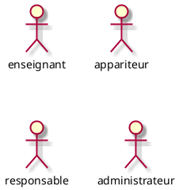
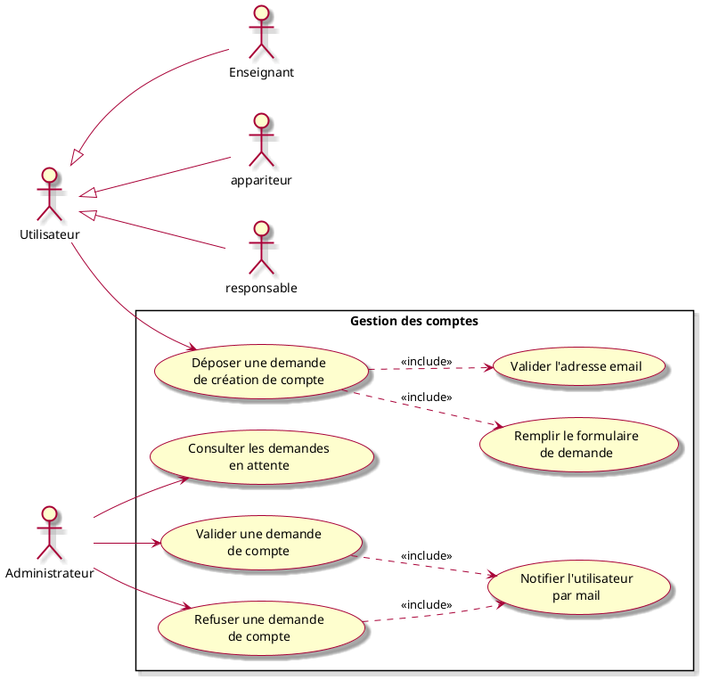
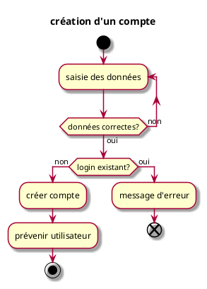
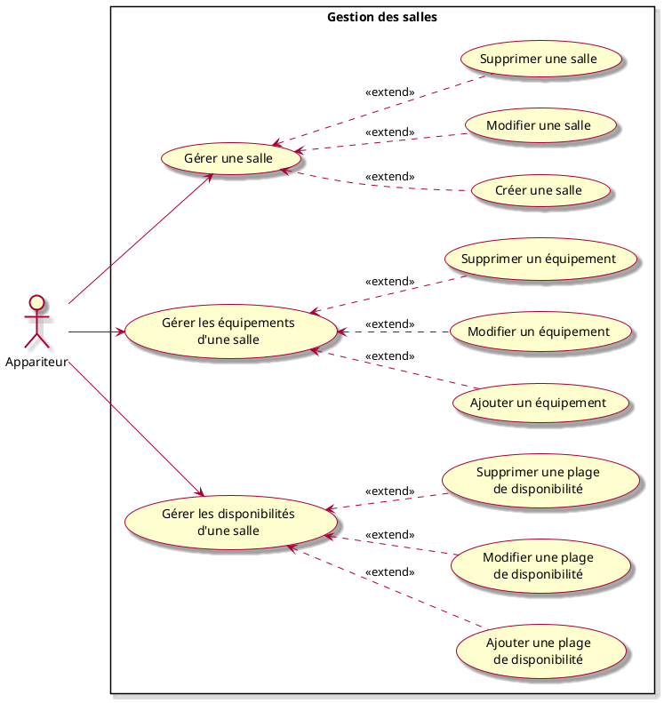
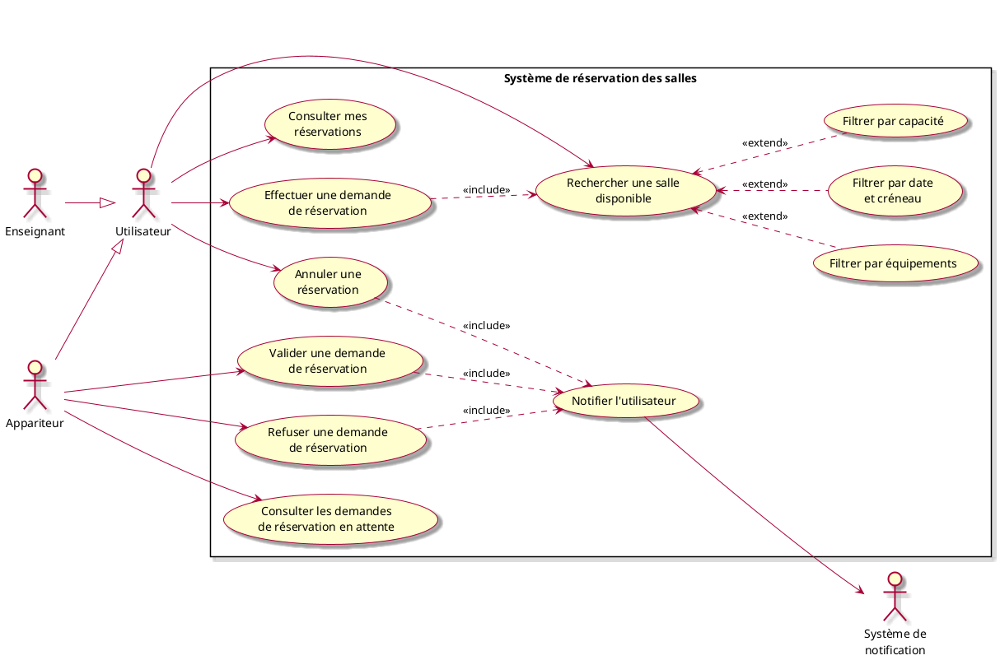

# Projet *Réservation de salles* : Expression des besoins v0.1

## 1. Objectif du document

Ce document contient l'expression des besoins du projet **Réservation de salles**.

Les besoins ont été exprimés selon le langage de modélisation UML. Les différentes catégories d'usagers du système ont été classés en différents types d' « acteurs ». Les interactions entre les usagers et le système ont été découpées en diagrammes de « cas d'utilisation » (use cases), chaque cas d'utilisation ayant à son tour un diagramme « d'activités » qui permet d'en modéliser la dynamique.

## 2. Présentation

### 2.1. Présentation du projet

L'objectif est de concevoir une application de gestion de réservations de salles pour un établissement d'enseignement. Les responsables devront pouvoir gérer les salles qui seront disponibles pour une réservation et les utilisateurs effectueront des réservations.

Il s’agit donc de créer une application permettant :
- aux responsables de créer, modifier ou supprimer des salles en précisant la localisation, la capacité d'accueil, les disponibilités et les équipements présents dans une salle (chaises, tables, ordinateurs, tableaux, rétroprojecteurs etc);
- aux utilisateurs de consulter la liste des salles disponibles selon divers critères comme la date, la capacité ou la présence de certains équipements;
- aux utilisateurs d'effectuer une réservation de salle;
- le responsable précisera pour chaque salle si la réservation est soumis à validation ou non;
- pour le cas d'une réservation sans validation d'un responsable, le premier utilisateur qui effectue une réservation l'emporte, les autres utilisateurs peuvent se mettre en liste d'attente en cas de désistement;
- pour le cas d'une réservation soumise à validation d'un responsable, les utilisateurs déposent une demande de réservation et un administrateur valide une des demandes;
- après avoir déposé une demande de réservation, l'utilisateur reçoit un mail de confirmation lorsque sa demande est validée (en instantané ou après la validation d'un responsable);
- les utilisateurs peuvent modifier ou annuler leurs réservations;
- en cas d'évènements particuliers, une salle peut ne plus être disponible (travaux, maintenances, évènement prioritaire etc), les réservations devront donc être annulées automatiquement et la liste des salles disponibles mise à jour, un mail d'annulation devra être envoyé;
- 

### 2.2. Situation actuelle

N/A

### 2.3. Les contraintes

- Application web

### 2.4. Présentation de la société

N/A

## 3. Acteurs

### 3.1. Utilisateur
Il s’agit d’un utilisateur enregistré de l'application, il peut être un enseignant ou un appariteur. Lors de sa première connexion, l'utilisateur effectue une demande de création de compte avec validation de l'adresse mail. Un administrateur valide la demande de création de compte lorsque le mail est validé.

### 3.2. Responsable
Utilisateur disposant de droits supplémentaires permettant de gérer les salles et les demandes de réservations.

### 3.3. Administrateur
Utilisateur disposant de droits supplémentaires permettant de valider les demandes de création de compte utilisateur et gérer les droits des utilisateurs.

### 3.4. Résumé des Acteurs

## 4. Cas d’utilisation

### 4.1. Groupe 1 : Gestion des comptes

#### 4.1.1. Cas d'utilisation « Demander une création de compte »

##### Résumé
L'utilisateur dépose une demande de création un compte et valide son adresse mail. L'administrateur consulte les demandes de création de compte et valide ou refuse une demande.

##### Acteurs
- un utilisateur
- un administrateur

##### Pré-conditions
- l'administrateur est connecté

##### Description
1. l'utilisateur saisit
    - le login du compte
    - le mot de passe du compte (en double)
    - le mail associé
2. le système vérifie :
    - que le login n'est pas vide ;
    - que les mots de passe ne sont pas vides ;
    - que les deux mots de passe saisis coïncident ;
    - que le mail est bien formé.
3. le système vérifie que le compte n'existe pas déjà
4. si le login n'est pas vide et que le compte n'existe pas déjà, un mail est envoyé à l'utilisateur pour confirmer son mail 
5. l'utilisateur valide son mail grâce au lien reçu
6. l'administrateur consulte la liste des demandes en attente avec un mail valide
7. l'administreur valide ou refuse les demandes
8. l'utilisateur reçoit un mail l'indiquant que son compte est validé

##### Déroulement alternatif : données incorrectes

- 2.1 le login, le mot de passe ou le mail ne sont pas bien formés ;
- 2.2 le système affiche un message et l'utilisateur peut corriger

##### Déroulement alternatif : le compte existe déjà

- 3.1 le compte existe déjà
- 3.2 le système affiche un message

##### Post-conditions
- le compte est créé et l'utilisateur est averti

##### Exceptions

- La sauvegarde de l'utilisateur échoue (par exemple BD non disponible) : le système doit être remis dans l'état antérieur.

##### Diagramme d'activité

##### Remarques

- lors du premier déploiement du serveur de l'application un administrateur et son mot de passe sont définis dans les fichiers de configuration. Le mot de passe peut ensuite être modifié.

#### 4.1.2. Cas d'utilisation « Se connecter »

##### Résumé
Un utilisateur s'authentifie et est connecté

##### Acteurs
un utilisateur quelconque

##### Pré-conditions
L'utilisateur a été créé

##### Description

1. l'utilisateur entre son *login* et son mot de passe
2. le système vérifie que l'utilisateur existe
3. le système vérifie que le mot de passe est correct

##### Déroulement alternatif : utilisateur inexistant

2.1 l'utilisateur n'existe pas
2.2 le système prévient celui-ci qu'il n'a pas pu le connecter (sans plus d'information)

##### Déroulement alternatif : mot de passe incorrect

3.1 le mot de passe est incorrect
3.2 le système prévient l'utilisateur qu'il n'a pas pu le connecter (sans plus d'information)

##### Exceptions

En cas de panne technique, l'utilisateur est averti.

##### Post-conditions

En cas de succès du scénario nominal, l'utilisateur est connecté, avec les droits relatifs à son compte.

##### Remarques

- Il est important de ne pas spécifier à l'utilisateur la raison pour laquelle il n'a pas pu se connecter (compte inexistant **ou** mot de passe incorrect)
- il sera souhaitable (mais non prioritaire) de *logger* les tentatives (sans les mots de passe, bien entendu) pour aider au support et à la sécurité.

#### 4.1.2. Cas d'utilisation « Modifier les droits des utilisateurs »

##### Résumé

Un administrateur s'authentifie et modifie les droits des utilisateurs.

##### Acteurs

- un administrateur
- un utilisateur

##### Pré-conditions

L'utilisateur a été modifié

##### Description

1. l'administrateur consulte la liste des utilisateurs
2. il en choisit un (par mail, identifiant)
3. il modifie les droits (responsable)

##### Post-conditions

L'utilisateur est modifié.

### 4.2. Groupe 2 : Gestion des salles

#### 4.2.1. Créer une salle
##### Résumé

Un appariteur se connecte et crée une salle.

##### Acteurs
- un appariteur.

##### Pré-conditions
L'appariteur est connecté.

##### Description

1. l'appariteur donne un titre à la salle;
2. il renseigne la localisation de la salle;
3. il ajoute une description de la salle;
4. il ajoute la capacité de la salle;
5. il ajoute les équipements présents dans la salle;
6. il définit les disponibilités de la salle;
7. le système vérifie que la salle a un titre, une localisation, une description, une capacité, une liste des équipements et des disponibilités;
8. la salle est enregistrée.

##### Post-conditions

- la salle est enregistrée.

#### 4.2.2. Consulter la liste des salles

##### Résumé
Un utilisateur consulte la liste des salles de l'établissement.

##### Acteurs

Un utilisateur ayant le droit de consulter la liste des salles:

- un enseignant;
- un appariteur;
- un responsable.

##### Pré-conditions
voir acteurs

##### Description

1. le système affiche la liste de salles (disponible ou non à la réservation)
2. l'utilisateur en choisit une
3. le système affiche toutes les informations sur la salle :
    - son titre,
    - sa localisation,
    - sa description,
    - sa capacité,
    - sa liste d'équipement,
    - ses disponibilités,
    - son statut (réservé, disponible, non réservable)

### 4.3. Groupe 3 : Gestion des réservations

#### 4.3.1. Réserver une salle

##### Résumé

Un utilisateur effectue une demade de réservation

##### Acteurs

- un utilisateur
- un responsable

##### Pré-conditions

Il existe une salle à réserver.

##### Description

1. l'utilisateur visualise la liste des salles;
2. il effectue une recherche des salles disponibles (par date, capacité, équipements)
3. il en choisit un; 
4. il consulte sa description; 
5. il choisit le créneau à reserver; 
6. si la réservation de la salle n'est pas soumis à la validation d'un responsable, l'utilisateur reçoit un mail de confirmation et la salle apparait maintenant avec le statut réservé;

##### Post-conditions

La demande de réservation est validé.

##### Déroulement alternatif...

- 5.1 la réservation de la salle est soumise à la validation d'un responsable
- 5.2 les responsables consultent les demandes de réservations en attente
- 5.3 le responsable valide une demande de réservation
- 5.5 l'utilisateur est informé par mail

#### 4.3.2. Modifier une réservation

##### Résumé

Un utilisateur modifie sa réservation.

##### Acteurs

- un utilisateur
- un responsable

##### Pré-conditions

La réservation est modifiée (date). L'utilisateur est notifié par mail lorsque la modification est effective.

##### Description

1. l'utilisateur visualise ses réservations; 
2. il en choisit une; 
3. il modifie les dates de réservations ou ajoute un commentaire; 
4. rl'utilisateur reçoit un mail de confirmation;

##### Post-conditions

La réservation est modifiée.

#### 4.3.2. Annuler une réservation

##### Résumé

Un utilisateur annule sa réservation.

##### Acteurs

- un utilisateur
- un responsable

##### Pré-conditions

La réservation est annulée. L'utilisateur est notifié par mail lorsque l'annulation est effective.

##### Description

1. l'utilisateur visualise ses réservations;
2. il en choisit une;
3. il annule sa demande de réservation;
4. l'utilisateur reçoit un mail de confirmation;

##### Post-conditions

La réservation est annulée.
