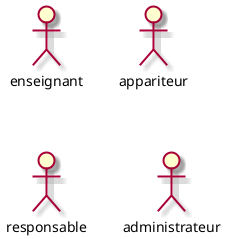
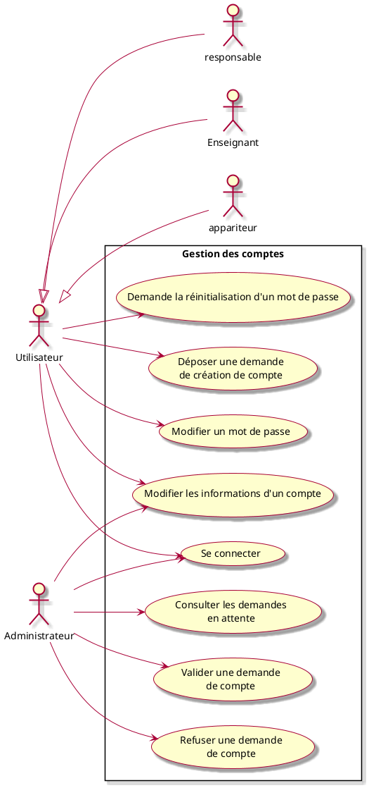
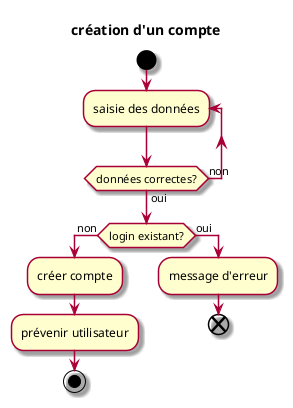
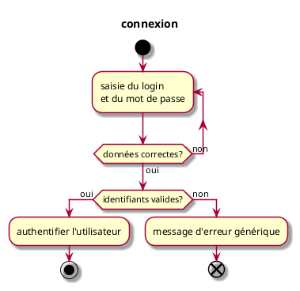
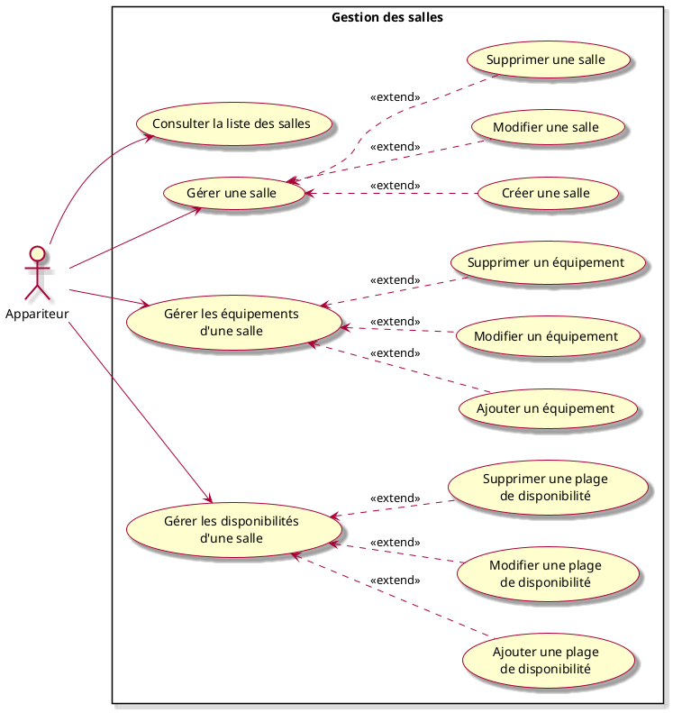
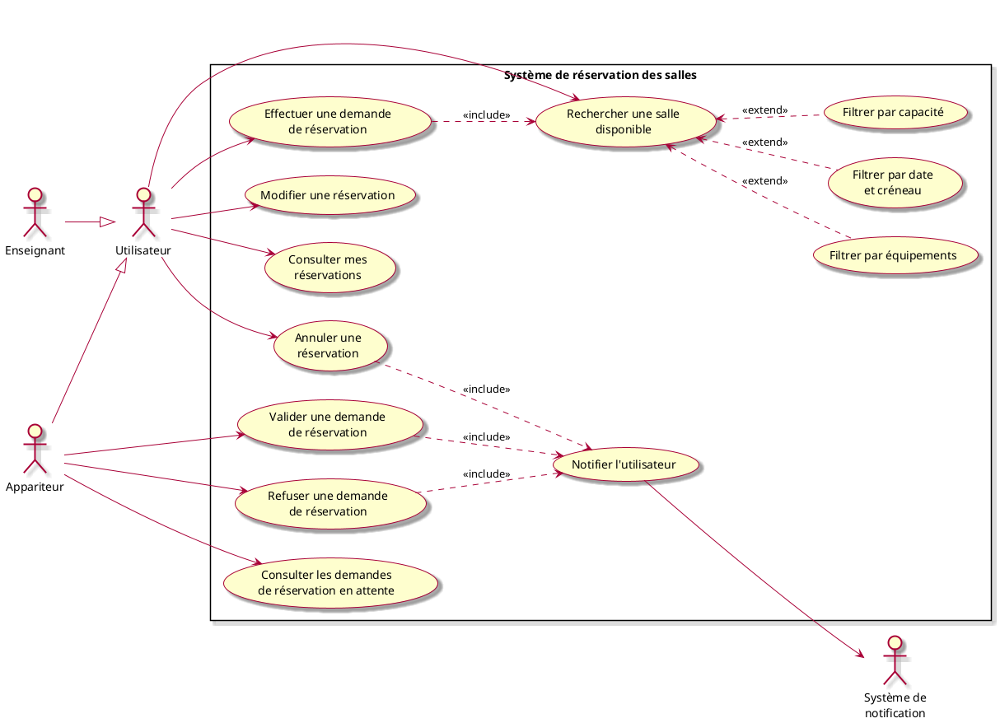

# Projet *Réservation de salles* : Expression des besoins v1.6

## Table des matières

\tableofcontents
\newpage

## 1. Objectif du document

Ce document contient l'expression des besoins du projet **Réservation de salles**.

Les besoins ont été exprimés selon le langage de modélisation UML. Les différentes catégories d'usagers du système ont été classés en différents types d'**acteurs**. Les interactions entre les usagers et le système ont été découpées en diagrammes de "cas d'utilisation" (use cases), chaque cas d'utilisation ayant à son tour un diagramme "d'activités" qui permet d'en modéliser la dynamique.

## 2. Présentation

### 2.1. Présentation du projet

L'objectif est de concevoir une application de gestion de réservations de salles pour un établissement d'enseignement. Les responsables devront pouvoir gérer les salles qui seront disponibles pour une réservation et les utilisateurs effectueront des réservations.

Il s'agit donc de créer une application permettant :
- aux responsables de créer, modifier ou supprimer des salles en précisant la localisation, la capacité d'accueil, les disponibilités et les équipements présents dans une salle (chaises, tables, ordinateurs, tableaux, rétroprojecteurs etc) ;
- aux utilisateurs de consulter la liste des salles disponibles selon divers critères comme la date, la capacité ou la présence de certains équipements ;
- aux utilisateurs d'effectuer une réservation de salle ;
- le responsable précisera pour chaque salle si la réservation est soumis à validation ou non ;
- pour le cas d'une réservation sans validation d'un responsable, le premier utilisateur qui effectue une réservation l'emporte, les autres utilisateurs peuvent se mettre en liste d'attente en cas de désistement ;
- pour le cas d'une réservation soumise à validation d'un responsable, les utilisateurs déposent une demande de réservation et un administrateur valide une des demandes ;
- après avoir déposé une demande de réservation, l'utilisateur reçoit un mail de confirmation lorsque sa demande est validée (en instantané ou après la validation d'un responsable) ;
- les utilisateurs peuvent modifier ou annuler leurs réservations ;
- en cas d'évènements particuliers, une salle peut ne plus être disponible (travaux, maintenances, évènement prioritaire etc), les réservations devront donc être annulées automatiquement et la liste des salles disponibles mise à jour, un mail d'annulation devra être envoyé ;

### 2.2. Situation actuelle

N/A

### 2.3. Les contraintes

- Application web

### 2.4. Présentation de la société

N/A

## 3. Acteurs

### 3.1. Utilisateur
Il s'agit d'un utilisateur enregistré de l'application, il peut être un enseignant ou un appariteur. Lors de sa première connexion, l'utilisateur effectue une demande de création de compte avec validation de l'adresse mail. Un administrateur valide la demande de création de compte lorsque le mail est validé.

### 3.2. Responsable
Utilisateur disposant de droits supplémentaires permettant de gérer les salles et les demandes de réservations.

### 3.3. Administrateur
Utilisateur disposant de droits supplémentaires permettant de valider les demandes de création de compte utilisateur et gérer les droits des utilisateurs.

### 3.4. Résumé des Acteurs

## 4. Cas d'utilisation

### 4.1. Groupe 1 : Gestion des comptes

#### 4.1.1. Cas d'utilisation "Déposer une demande de création de compte"

##### Résumé
L'utilisateur dépose une demande de création un compte et valide son adresse mail.

##### Acteurs
- un utilisateur

##### Pré-conditions
- l'administrateur est connecté

##### Description
1. l'utilisateur saisit
    - le login du compte
    - le mot de passe du compte (en double)
    - le mail associé
2. le système vérifie :
    - que le login n'est pas vide ;
    - que les mots de passe ne sont pas vides ;
    - que les deux mots de passe saisis coïncident ;
    - que le mail est bien formé.
3. le système vérifie que le compte n'existe pas déjà
4. si le login n'est pas vide et que le compte n'existe pas déjà, un mail est envoyé à l'utilisateur pour confirmer son mail
5. l'utilisateur valide son mail grâce au lien reçu

##### Déroulement alternatif : données incorrectes

- 2.1 le login, le mot de passe ou le mail ne sont pas bien formés ;
- 2.2 le système affiche un message et l'utilisateur peut corriger

##### Déroulement alternatif : le compte existe déjà

- 3.1 le compte existe déjà
- 3.2 le système affiche un message

##### Post-conditions
- le compte est créé et l'utilisateur est averti

##### Exceptions

- La sauvegarde de l'utilisateur échoue (par exemple BD non disponible) : le système doit être remis dans l'état antérieur.

##### Diagramme d'activité

##### Remarques

- lors du premier déploiement du serveur de l'application un administrateur et son mot de passe sont définis dans les fichiers de configuration. Le mot de passe peut ensuite être modifié.

#### 4.1.2. Cas d'utilisation "Consulter les demandes de création de compte"

##### Résumé
L'administrateur consulte les demandes de création de compte et valide ou refuse une demande.

##### Acteurs
- un administrateur

##### Pré-conditions
- l'administrateur est connecté

##### Description

1. l'administrateur consulte la liste des demandes en attente avec un mail valide

#### 4.1.3. Valider une demande de création de compte

##### Résumé
Après avoir consulté la liste des demandes de création de compte en attente, l'administrateur valide la demande.

##### Acteurs
- un administrateur

##### Pré-conditions
- l'administrateur est connecté

##### Description

1. l'administrateur valide la demande de création de compte d'un utilisateur
2. l'utilisateur reçoit un mail l'indiquant que son compte est validé

##### Post-conditions
Le compte utilisateur est créé.

#### 4.1.4. Refuser une demande de création de compte

##### Résumé
Après avoir consulté la liste des demandes de création de compte en attente, l'administrateur refuse la demande.

##### Acteurs
- un administrateur

##### Pré-conditions
- l'administrateur est connecté

##### Description

1. l'administrateur refuse la demande de création de compte d'un utilisateur
2. l'utilisateur reçoit un mail l'indiquant que sa demande a été rejetée

#### 4.1.5. Modifier les informations d'un compte

##### Résumé
Un utilisateur peut consulter et modifier les informations concernant son compte. Le système vérifie si le login est disponible, un mail de vérification est envoyé à la nouvelle adresse mail. Un mail d'information est envoyé à l'ancienne adresse mail.

##### Acteurs
- un utilisateur

##### Pré-conditions
- l'utilisateur est connecté

##### Description

1. L'utilisateur rempli le formulaire de modification du login
2. le système vérifie si le login est disponible
3. l'utilisateur peut aussi modifier son adresse mail
4. le système envoie un mail de vérification à la nouvelle adresse mail
5. l'utilisateur valide son adresse grâce au lien reçu
6. les informations de l'utilisateur sont mises à jour

##### Post-conditions
Les données de l'utilisateur sont mises à jour.

#### 4.1.6. Modifier un mot de passe

##### Résumé
Un utilisateur peut modifier son mot de passe actuel.

##### Acteurs
- un utilisateur

##### Pré-conditions
- l'utilisateur est connecté

##### Description

1. l'utilisateur renseigne son ancien mot de passe ainsi que le nouveau mot de passe en double
2. le système vérifie si les données sont correctes

#### 4.1.7. Demander la réinitialisation d'un mot de passe

##### Résumé
En cas d'oubli d'un mot de passe, l'utilisateur peut demander à l'écran de connexion la réinitialisation de son mot de passe.

##### Acteurs
- un utilisateur

##### Pré-conditions
- un compte utilisateur existant

##### Description

1. à l'écran de connexion, l'utilisateur clique sur le lien de réinitialisation de mot de passe
2. l'utilisateur renseigne l'adresse mail liée à son compte utilisateur
3. le système vérifie si l'adresse mail est liée à un compte utilisateur existant
4. le système envoie un lien de réinitialisation à l'adresse mail
5. au clic sur le lien, l'utilisateur est redirigé sur un formulaire et renseigne un nouveau mot de passe en double
6. le système vérifie les données saisies
7. le système informe par mail l'utilisateur

##### Post-conditions
Le nouveau mot de passe est pris en compte.

#### 4.1.8. Se connecter

##### Résumé
Un utilisateur s'authentifie auprès du système pour accéder aux fonctionnalités de l'application.

##### Acteurs
- un utilisateur (enseignant, appariteur, responsable)
- un administrateur

##### Pré-conditions
- le compte existe et a été validé par un administrateur

##### Description
1. l'utilisateur saisit son login et son mot de passe ;
2. le système vérifie que les données sont bien formées ;
3. le système vérifie que le login correspond à un compte existant et validé ;
4. le système vérifie que le mot de passe correspond au compte ;
5. l'utilisateur est authentifié et accède à l'application.

##### Déroulement alternatif : données incorrectes
- 2.1 le login ou le mot de passe est vide ;
- 2.2 le système affiche un message et l'utilisateur peut corriger.

##### Déroulement alternatif : identifiants invalides
- 3.1 le login ne correspond à aucun compte, ou le mot de passe est incorrect ;
- 3.2 le système affiche un message d'erreur générique (sans préciser lequel des deux est incorrect).

##### Post-conditions
- l'utilisateur est authentifié et accède à l'application.

##### Diagramme d'activité

### 4.2. Groupe 2 : Gestion des salles

#### 4.2.1. Créer une salle
##### Résumé

Un appariteur se connecte et crée une salle.

##### Acteurs
- un appariteur.

##### Pré-conditions
L'appariteur est connecté.

##### Description

1. l'appariteur donne un titre à la salle ;
2. il renseigne la localisation de la salle ;
3. il ajoute une description de la salle (type de salle, amphi, tp etc) ;
4. il ajoute la capacité de la salle ;
5. il ajoute les équipements présents dans la salle ;
6. il définit les disponibilités de la salle (créneaux jours et heures pendant lesquelles la salle est reservable si besoin) ;
7. le système vérifie que la salle a un titre, une localisation, une description, une capacité, une liste des équipements et des disponibilités ;
8. la salle est enregistrée.

##### Post-conditions

- la salle est enregistrée.

#### 4.2.2. Créer un équipement

##### Résumé
Un appariteur crée un équipement (chaise, tableau, ordinateur, etc.).

##### Acteurs
- un appariteur

##### Pré-conditions
L'appariteur est connecté.

##### Description

1. l'appariteur renseigne le nom de l'équipement ;
2. il renseigne la description de l'équipement ;
3. le système vérifie que le nom n'est pas vide ;
4. l'équipement est enregistré.

##### Post-conditions

L'équipement est enregistré.

#### 4.2.3. Ajouter une plage de disponibilité d'une salle

##### Résumé
Un appariteur ajoute une plage de disponibilité à une salle pour la rendre réservable sur une période donnée.

##### Acteurs
- un appariteur

##### Pré-conditions
L'appariteur est connecté. La salle existe.

##### Description

1. l'appariteur sélectionne une salle ;
2. il renseigne la date et l'heure de début de la plage ;
3. il renseigne la date et l'heure de fin de la plage ;
4. le système vérifie la cohérence des données saisies ;
5. le système vérifie l'absence de conflit avec les plages existantes de la salle ;
6. la plage de disponibilité est enregistrée.

##### Déroulement alternatif : conflit de disponibilité

- 5.1 une plage existante est en conflit avec la nouvelle plage ;
- 5.2 le système affiche un message d'erreur.

##### Post-conditions

La plage de disponibilité est enregistrée et la salle est réservable sur cette période.

#### 4.2.4. Consulter la liste des salles

##### Résumé
Un utilisateur consulte la liste des salles de l'établissement.

##### Acteurs

Un utilisateur ayant le droit de consulter la liste des salles:

- un enseignant ;
- un appariteur ;
- un responsable.

##### Pré-conditions
voir acteurs

##### Description

1. le système affiche la liste de salles (disponible ou non à la réservation)
2. l'utilisateur en choisit une
3. le système affiche toutes les informations sur la salle :
    - son titre,
    - sa localisation,
    - sa description,
    - sa capacité,
    - sa liste d'équipement,
    - ses disponibilités,
    - son statut (réservé, disponible, non réservable)

#### 4.2.5. Modifier une salle

##### Résumé
Un appariteur modifie les informations d'une salle existante.

##### Acteurs
- un appariteur

##### Pré-conditions
L'appariteur est connecté. La salle existe.

##### Description

1. l'appariteur sélectionne une salle dans la liste ;
2. il modifie un ou plusieurs champs : titre, localisation, description, capacité, type de réservation ;
3. le système vérifie que les données saisies sont valides ;
4. les modifications sont enregistrées.

##### Post-conditions

Les informations de la salle sont mises à jour.

#### 4.2.6. Supprimer une salle

##### Résumé
Un appariteur supprime une salle de l'application.

##### Acteurs
- un appariteur

##### Pré-conditions
L'appariteur est connecté. La salle existe.

##### Description

1. l'appariteur sélectionne une salle dans la liste ;
2. il demande la suppression de la salle ;
3. le système vérifie qu'aucune réservation active n'est associée à la salle ;
4. la salle est supprimée.

##### Déroulement alternatif : réservations actives

- 3.1 la salle possède des réservations actives ;
- 3.2 le système affiche un message d'erreur et annule la suppression.

##### Post-conditions

La salle est supprimée.

#### 4.2.7. Modifier un équipement

##### Résumé
Un appariteur modifie les informations d'un équipement existant.

##### Acteurs
- un appariteur

##### Pré-conditions
L'appariteur est connecté. L'équipement existe.

##### Description

1. l'appariteur sélectionne un équipement ;
2. il modifie le nom ou la description de l'équipement ;
3. le système vérifie que les données saisies sont valides ;
4. les modifications sont enregistrées.

##### Post-conditions

Les informations de l'équipement sont mises à jour.

#### 4.2.8. Supprimer un équipement

##### Résumé
Un appariteur supprime un équipement de l'application.

##### Acteurs
- un appariteur

##### Pré-conditions
L'appariteur est connecté. L'équipement existe.

##### Description

1. l'appariteur sélectionne un équipement ;
2. il confirme la suppression ;
3. l'équipement est supprimé.

##### Post-conditions

L'équipement est supprimé.

#### 4.2.9. Modifier une plage de disponibilité d'une salle

##### Résumé
Un appariteur modifie une plage de disponibilité d'une salle.

##### Acteurs
- un appariteur

##### Pré-conditions
L'appariteur est connecté. La plage de disponibilité existe.

##### Description

1. l'appariteur sélectionne une plage de disponibilité d'une salle ;
2. il modifie les dates et heures de début ou de fin ;
3. le système vérifie la cohérence des données saisies ;
4. le système vérifie l'absence de conflit avec les autres plages de la salle ;
5. les modifications sont enregistrées.

##### Déroulement alternatif : conflit de disponibilité

- 4.1 une plage existante est en conflit avec la plage modifiée ;
- 4.2 le système affiche un message d'erreur.

##### Post-conditions

La plage de disponibilité est mise à jour.

#### 4.2.10. Supprimer une plage de disponibilité d'une salle

##### Résumé
Un appariteur supprime une plage de disponibilité d'une salle.

##### Acteurs
- un appariteur

##### Pré-conditions
L'appariteur est connecté. La plage de disponibilité existe.

##### Description

1. l'appariteur sélectionne une plage de disponibilité d'une salle ;
2. il confirme la suppression ;
3. le système vérifie qu'aucune réservation n'est associée à cette plage ;
4. la plage est supprimée.

##### Déroulement alternatif : réservations associées

- 3.1 des réservations sont associées à la plage ;
- 3.2 le système affiche un message d'erreur et annule la suppression.

##### Post-conditions

La plage de disponibilité est supprimée.

### 4.3. Groupe 3 : Gestion des réservations

#### 4.3.1. Afficher la liste des salles

##### Résumé
Un utilisateur affiche la liste des salles de l'établissement avec la possibilité de les filtrer.

##### Acteurs
- un utilisateur

##### Pré-conditions
L'utilisateur est connecté.

##### Description

1. le système affiche la liste de toutes les salles ;
2. l'utilisateur peut filtrer la liste par type de salle et par capacité ;
3. le système met à jour la liste en fonction des filtres appliqués ;
4. l'utilisateur sélectionne une salle pour consulter son détail.

##### Post-conditions

La liste des salles est affichée.

#### 4.3.2. Rechercher une salle selon différents critères

##### Résumé
Un utilisateur recherche une salle en combinant plusieurs critères : capacité, type, équipements, disponibilité sur un créneau donné.

##### Acteurs
- un utilisateur

##### Pré-conditions
L'utilisateur est connecté.

##### Description

1. l'utilisateur renseigne un ou plusieurs critères de recherche : nom, localisation, capacité minimale et maximale, type de salle, équipements requis ;
2. l'utilisateur peut également filtrer par disponibilité en précisant une date et un créneau horaire ;
3. le système filtre les salles correspondant aux critères ;
4. la liste des salles correspondantes est affichée.

##### Post-conditions

La liste des salles correspondant aux critères est affichée.

#### 4.3.3. Réserver une salle

##### Résumé

Un utilisateur effectue une demade de réservation

##### Acteurs

- un utilisateur
- un responsable

##### Pré-conditions

Il existe une salle à réserver.

##### Description

1. l'utilisateur visualise la liste des salles ;
2. il effectue une recherche des salles disponibles (par jour et heure de disponibilité, capacité, équipements) ;
3. il en choisit un ;
4. il consulte sa description ;
5. il choisit le créneau à reserver ;
6. si la réservation de la salle n'est pas soumis à la validation d'un responsable, l'utilisateur reçoit un mail de confirmation et la salle apparait maintenant avec le statut réservé ;

##### Post-conditions

La demande de réservation est validé.

##### Déroulement alternatif...

- 5.1 la réservation de la salle est soumise à la validation d'un responsable
- 5.2 les responsables consultent les demandes de réservations en attente
- 5.3 le responsable valide une demande de réservation
- 5.5 l'utilisateur est informé par mail

#### 4.3.4. Consulter une réservation

##### Résumé
Un utilisateur consulte le détail d'une de ses réservations.

##### Acteurs
- un utilisateur

##### Pré-conditions
L'utilisateur est connecté. La réservation existe.

##### Description

1. l'utilisateur visualise la liste de ses réservations ;
2. il en sélectionne une ;
3. le système affiche toutes les informations de la réservation : salle, dates et heures, motif, statut.

##### Post-conditions

Les détails de la réservation sont affichés.

#### 4.3.5. Modifier une réservation

##### Résumé

Un utilisateur modifie sa réservation.

##### Acteurs

- un utilisateur
- un responsable

##### Pré-conditions

La réservation est modifiée (date). L'utilisateur est notifié par mail lorsque la modification est effective.

##### Description

1. l'utilisateur visualise ses réservations ;
2. il en choisit une ;
3. il modifie les dates de réservations ou ajoute un commentaire (le système vérifie si le nouveau créneau ne rentre pas en concurrence avec une réservation existante) ;
4. l'utilisateur reçoit un mail de confirmation ;

##### Post-conditions

La réservation est modifiée.

#### 4.3.6. Annuler une réservation

##### Résumé

Un utilisateur annule sa réservation.

##### Acteurs

- un utilisateur
- un responsable

##### Pré-conditions

La réservation est annulée. L'utilisateur est notifié par mail lorsque l'annulation est effective.

##### Description

1. l'utilisateur visualise ses réservations ;
2. il en choisit une ;
3. il annule sa demande de réservation ;
4. l'utilisateur reçoit un mail de confirmation ;

##### Post-conditions

La réservation est annulée.

#### 4.3.7. Consulter les demandes de réservation en attente

##### Résumé
Un responsable consulte la liste des demandes de réservation en attente de validation.

##### Acteurs
- un responsable

##### Pré-conditions
Le responsable est connecté.

##### Description

1. le responsable consulte la liste des demandes de réservation dont l'état est "en attente" ;
2. le système affiche pour chaque demande : la salle concernée, l'utilisateur demandeur, la date et le créneau souhaités, le motif.

#### 4.3.8. Valider une demande de réservation

##### Résumé
Après avoir consulté la liste des demandes de réservation en attente, un responsable valide une demande.

##### Acteurs
- un responsable

##### Pré-conditions
Le responsable est connecté. Une demande de réservation est en attente.

##### Description

1. le responsable sélectionne une demande de réservation en attente ;
2. il valide la demande ;
3. la réservation passe au statut confirmé ;
4. l'utilisateur reçoit un mail de confirmation.

##### Post-conditions

La réservation est confirmée et l'utilisateur en est informé par mail.

#### 4.3.9. Rejeter une demande de réservation

##### Résumé
Après avoir consulté la liste des demandes de réservation en attente, un responsable rejette une demande.

##### Acteurs
- un responsable

##### Pré-conditions
Le responsable est connecté. Une demande de réservation est en attente.

##### Description

1. le responsable sélectionne une demande de réservation en attente ;
2. il renseigne un motif de rejet ;
3. il confirme le rejet ;
4. la demande de réservation passe au statut rejeté ;
5. l'utilisateur reçoit un mail l'informant du rejet et du motif.

##### Post-conditions

La demande est rejetée et l'utilisateur en est informé par mail.
