# Projet *Réservation de salles* : Analyse v1.0

<!-- toc -->

- [2. Objectif du document](#2-objectif-du-document)
- [3. Sélection des cas d'utilisation.](#3-selection-des-cas-dutilisation)
- [4. Cas d’utilisation](#4-cas-dutilisation)
  * [4.1. Groupe 1 : gestion des comptes](#41-groupe-1--gestion-des-comptes)
    + [4.1.1. Déposer une demande de création de compte](#411-deposer-une-demande-de-creation-de-compte)
    + [4.1.2. Consulter les demandes de création de compte](#412-consulter-les-demandes-de-creation-de-compte)
    + [4.1.3. Valider une demande de création de compte](#413-valider-une-demande-de-creation-de-compte)
    + [4.1.4. Refuser une demande de création de compte](#414-refuser-une-demande-de-creation-de-compte)
    + [4.1.5. Modifier les informations d'un compte](#415-modifier-les-informations-dun-compte)
    + [4.1.6. Modifier un mot de passe](#416-modifier-un-mot-de-passe)
    + [4.1.7. Demander la réinitialisation d'un mot de passe](#417-demander-la-reinitialisation-dun-mot-de-passe)
  * [4.2. Groupe 2 : gestion des salles](#42-groupe-2--gestion-des-salles)
    + [4.2.1. Créer une salle](#421-creer-une-salle)
    + [4.2.2. Créer un équipement](#422-creer-un-equipement)
    + [4.2.3. Ajouter une plage de disponibilité d'une salle](#423-ajouter-une-plage-de-disponibilite-dune-salle)
    + [4.2.4. Consulter la liste des salles](#424-consulter-la-liste-des-salles)
    + [4.2.5. Modifier une salle](#425-modifier-une-salle)
    + [4.2.6. Supprimer une salle](#426-supprimer-une-salle)
    + [4.2.7. Modifier un équipement](#427-modifier-un-equipement)
    + [4.2.8. Supprimer un équipement](#428-supprimer-un-equipement)
    + [4.2.9. Modifier une plage de disponibilité d'une salle](#429-modifier-une-plage-de-disponibilite-dune-salle)
    + [4.2.10. Supprimer une plage de disponibilité d'une salle](#4210-supprimer-une-plage-de-disponibilite-dune-salle)
  * [4.3. Groupe 3 : gestion des réservations](#43-groupe-3--gestion-des-reservations)
    + [4.3.1. Afficher la liste des salles](#431-afficher-la-liste-des-salles)
    + [4.3.2. Rechercher une salle selon différents critères](#432-rechercher-une-salle-selon-differents-criteres)
    + [4.3.3. Réserver une salle](#433-reserver-une-salle)
    + [4.3.4. Consulter une réservation](#434-consulter-une-reservation)
    + [4.3.5. Modifier une réservation](#435-modifier-une-reservation)
    + [4.3.6. Annuler une réservation](#436-annuler-une-reservation)
    + [4.3.7. Consulter les demandes de réservation en attente](#437-consulter-les-demandes-de-reservation-en-attente)
    + [4.3.8. Valider une demande de réservation](#438-valider-une-demande-de-reservation)
    + [4.3.9. Rejeter une demande de réservation](#439-rejeter-une-demande-de-reservation)
- [5. Regroupement des classes](#5-regroupement-des-classes)
  * [5.1. Groupe domaine](#51-groupe-domaine)
  * [5.2. Groupe domaine et cycle de vie](#52-groupe-domaine-et-cycle-de-vie)
  * [5.3. Groupe Service](#53-groupe-service)
  * [5.4. Groupe interface utilisateur et système](#54-groupe-interface-utilisateur-et-systeme)

<!-- tocstop -->

## 2. Objectif du document

Ce document contient une analyse orientée objet fondée sur l'expression des besoins du projet "Réservation de salles".
L'analyse suit le langage de modélisation UML et la méthodologie Arrington. Le but essentiel est d'établir la liste des classes métier nécessaires pour modéliser chaque cas d'utilisation, et de voir comment elles seront manipulées par l'application.

## 3. Sélection des cas d'utilisation.

*On commence par évaluer les use case selon les critères :*

- *risques*
- *pertinence*
- *compétence de l'équipe*

*Les risques sont* :
- *les performances* ;
- *la qualité de l'UI* ;
- *les difficultés de planning* ;
- *la difficulté de prendre en charge de nouvelles spécifications* ;

Pour les risques, on peut utiliser l'échelle :

1. notre équipe a déjà fait ça ;
2. une autre équipe de l'entreprise l'a déjà fait ;
3. c'est un problème bien documenté (outils, tutoriels) ;
4. c'est un problème à creuser, mais des exemples similaires existent ;
5. c'est innovant.

Pour la pertinence :

1. son absence serait à peine remarquée ;
2. le système reste cohérent sans cette fonctionnalité ;
3. la majeure partie du système peut fonctionner ;
4. une partie du système peut fonctionner ;
5. le système ne fonctionnera pas sans cette fonctionnalité.


| Groupe      | Cas                                                     | Risques | Pertinence | Prioritaire |
|-------------|---------------------------------------------------------|---------|------------|-------------|
| Compte      | Déposer une demande de création de compte               | 1       | 5          | oui         |
| Compte      | Consulter les demandes de création de compte en attente | 1       | 5          | oui         |
| Compte      | Valider une demande de création de compte               | 1       | 5          | oui         |                                                                                                    
| Compte      | Refuser une demande de création de compte               | 1       | 4          | non         |
| Compte      | Modifier les informations d'un compte                   | 1       | 2          | non         |
| Compte      | Modifier un mot de passe                                | 3       | 2          | non         |
| Compte      | Demander la réinitialisation d'un mot de passe          | 3       | 2          | non         |
| Salle       | Créer une salle                                         | 1       | 5          | oui         |
| Salle       | Créer un équipement                                     | 1       | 3          | oui         |
| Salle       | Ajouter une plage de disponibilité d'une salle          | 4       | 5          | oui         |
| Salle       | Consulter la liste des salles                           | 1       | 4          | oui         |
| Salle       | Modifier une salle                                      | 1       | 2          | non         |
| Salle       | Supprimer une salle                                     | 1       | 2          | non         |
| Salle       | Modifier un équipement                                  | 1       | 1          | non         | 
| Salle       | Supprimer un équipement                                 | 1       | 1          | non         |
| Salle       | Modifier une plage de disponibilité d'une salle         | 3       | 2          | non         | 
| Salle       | Supprimer une plage de disponibilité d'une salle        | 3       | 2          | non         |
| Réservation | Afficher la liste des salles                            | 1       | 5          | oui         |
| Réservation | Rechercher une salle selon différents critères          | 4       | 4          | oui         |                                                                                                           
| Réservation | Réserver une salle                                      | 3       | 5          | oui         |                                                                                                            
| Réservation | Consulter une réservation                               | 1       | 4          | oui         |
| Réservation | Annuler une réservation                                 | 3       | 4          | oui         |
| Réservation | Consulter les demandes de réservation en attente        | 1       | 5          | oui         | 
| Réservation | Valider une demande de réservation                      | 3       | 5          | oui         |
| Réservation | Rejeter une demande de réservation                      | 1       | 4          | oui         |
| Réservation | Modifier une réservation                                | 3       | 3          | non         |

## 4. Cas d’utilisation

### 4.1. Groupe 1 : gestion des comptes

#### 4.1.1. Déposer une demande de création de compte

- `FormulaireDemandeCompte` — interface utilisateur
- `ServiceCompte` — service
- `Compte` — domaine
- `DemandeCreationCompte` — domaine + cycle de vie
- `ServiceMail` — interface système

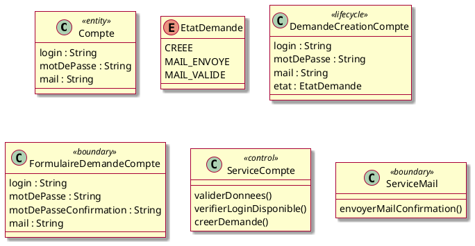

##### Cas nominal


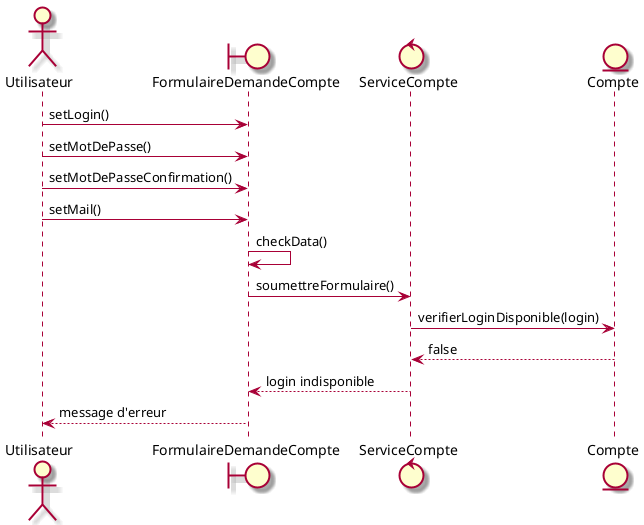

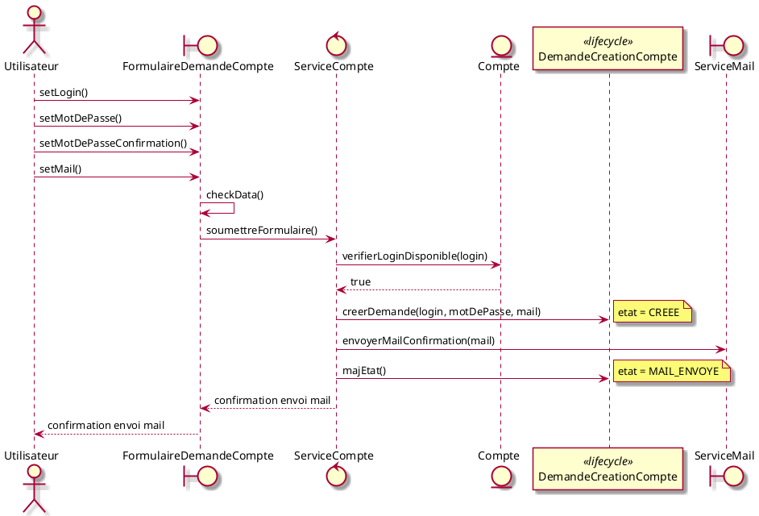

##### Déroulement alternatif : données incorrectes

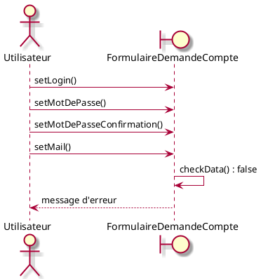

##### Déroulement alternatif : le compte existe déjà

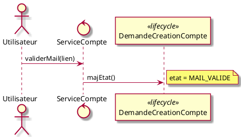

#### 4.1.2. Consulter les demandes de création de compte

- `ListeDemandesCompteUI` — interface utilisateur
- `ServiceCompte` — service
- `DemandeCreationCompte` — domaine + cycle de vie

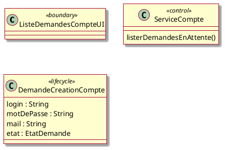

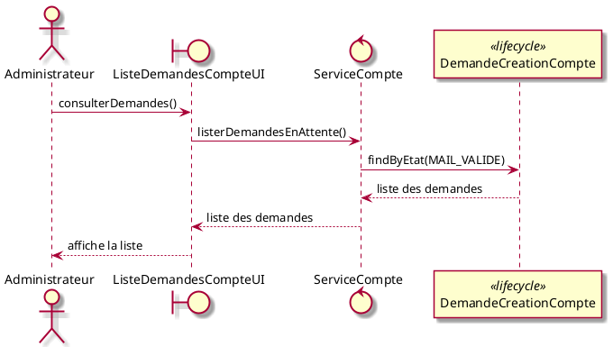

#### 4.1.3. Valider une demande de création de compte

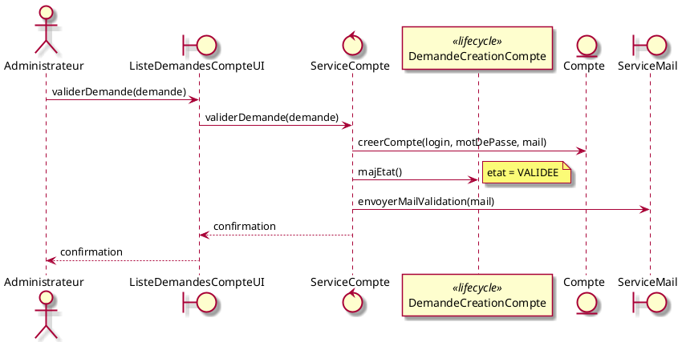

#### 4.1.4. Refuser une demande de création de compte

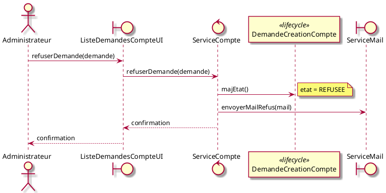

#### 4.1.5. Modifier les informations d'un compte

- `FormulaireModificationCompte` — interface utilisateur

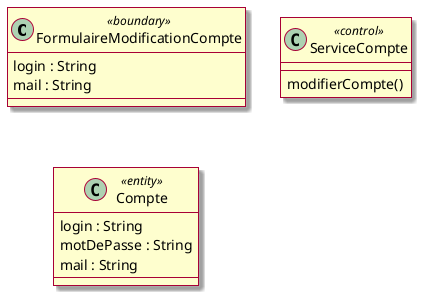

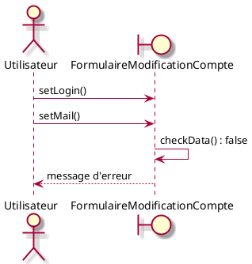

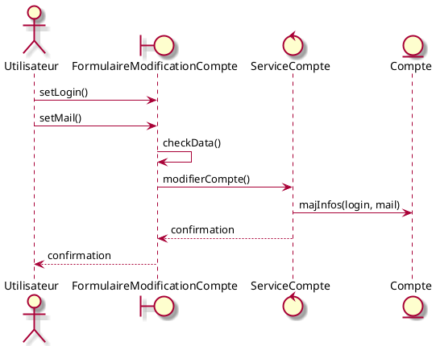

#### 4.1.6. Modifier un mot de passe

- `FormulaireModificationMotDePasse` — interface utilisateur

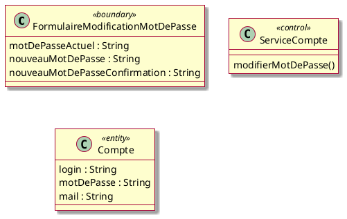

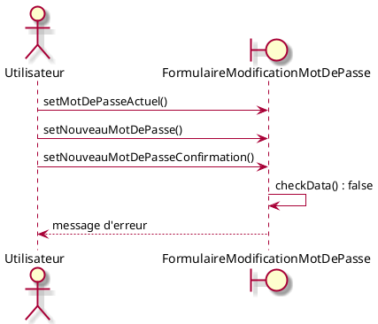

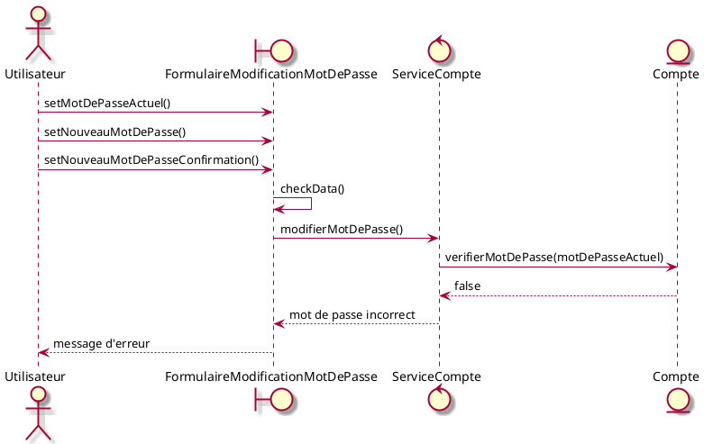

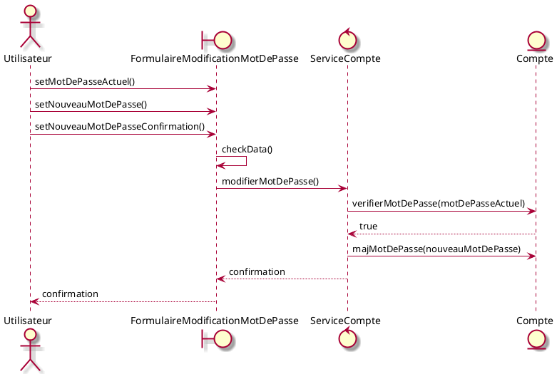

#### 4.1.7. Demander la réinitialisation d'un mot de passe

- `FormulaireDemandeReinitialisation` — interface utilisateur
- `FormulaireNouveauMotDePasse` — interface utilisateur

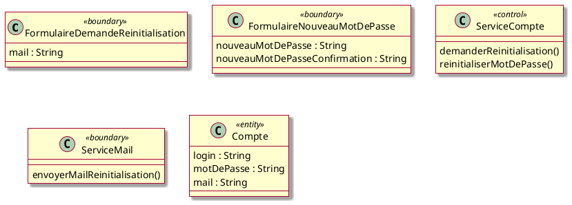

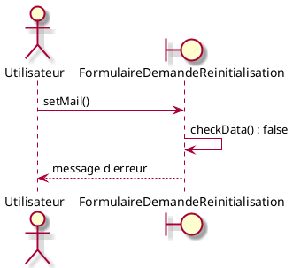

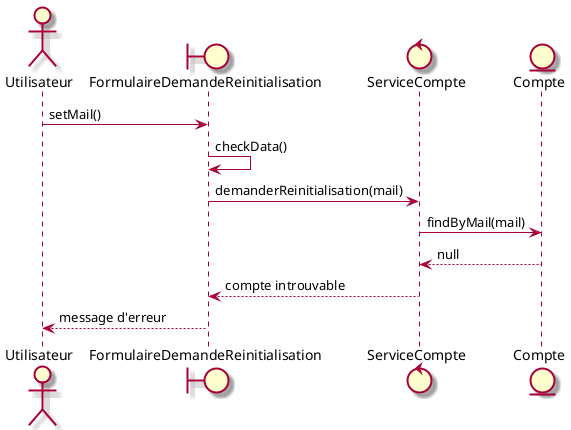

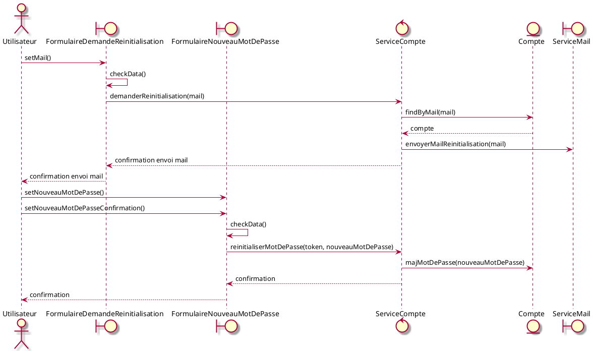

### 4.2. Groupe 2 : gestion des salles

#### 4.2.1. Créer une salle

- `FormulaireCreationSalle` — interface utilisateur
- `ServiceSalle` — service
- `Salle` — domaine
- `TypeSalle` — domaine

```plantuml
@startuml
skin rose

class FormulaireCreationSalle <<boundary>> {
  nom : String
  localisation : String
  capacite : Integer
  description : String
  type : TypeSalle
  reservationAvecValidation : Boolean
}

class ServiceSalle <<control>> {
  creerSalle()
}

class Salle <<entity>> {
  nom : String
  localisation : String
  capacite : Integer
  description : String
  type : TypeSalle
  reservationAvecValidation : Boolean
}

enum TypeSalle {
  COURS
  TP
  REUNION
}

@enduml
```

```plantuml
@startuml
skin rose
actor Responsable as r
boundary FormulaireCreationSalle as ui

r -> ui : setNom()
r -> ui : setLocalisation()
r -> ui : setCapacite()
r -> ui : setDescription()
r -> ui : setType()
r -> ui : setReservationAvecValidation()
ui -> ui : checkData() : false
ui --> r : message d'erreur
@enduml
```

```plantuml
@startuml
skin rose
actor Responsable as r
boundary FormulaireCreationSalle as ui
control ServiceSalle as svc
entity Salle as salle

r -> ui : setNom()
r -> ui : setLocalisation()
r -> ui : setCapacite()
r -> ui : setDescription()
r -> ui : setType()
r -> ui : setReservationAvecValidation()
ui -> ui : checkData()
ui -> svc : creerSalle()
svc -> salle : creerSalle(nom, localisation, capacite, description, type, reservationAvecValidation)
svc --> ui : confirmation
ui --> r : confirmation
@enduml
```

#### 4.2.2. Créer un équipement

- `FormulaireCreationEquipement` — interface utilisateur
- `ServiceSalle` — service
- `Equipement` — domaine
- `Salle` — domaine

```plantuml
@startuml
skin rose

class FormulaireCreationEquipement <<boundary>> {
  nom : String
  description : String
  salle : Salle
}

class ServiceSalle <<control>> {
  creerEquipement()
}

class Equipement <<entity>> {
  nom : String
  description : String
}

@enduml
```

##### Cas nominal

```plantuml
@startuml
skin rose
actor Responsable as r
boundary FormulaireCreationEquipement as ui
control ServiceSalle as svc
entity Equipement as eq
entity Salle as salle

r -> ui : setNom()
r -> ui : setDescription()
ui -> ui : checkData()
ui -> svc : creerEquipement(nom, description, salle)
svc -> eq : creerEquipement(nom, description)
svc --> ui : confirmation
ui --> r : confirmation
@enduml
```

#### 4.2.3. Ajouter une plage de disponibilité d'une salle

- `FormulaireDisponibiliteSalle` — interface utilisateur
- `ServiceSalle` — service
- `Salle` — domaine
- `PlageDisponibilite` — domaine + cycle de vie
- `Heure` — domaine

```plantuml
@startuml
skin rose

class FormulaireDisponibiliteSalle <<boundary>> {
  dateDebut : Date
  heureDebut : Heure
  dateFin : Date
  heureFin : Heure
  salle : Salle
}

class ServiceSalle <<control>> {
  ajouterPlageDisponibilite()
  verifierConflit()
}

class Salle <<entity>> {
  nom : String
  localisation : String
  capacite : Integer
  description : String
  type : TypeSalle
  reservationAvecValidation : Boolean
  plagesDisponibilite : Liste<PlageDisponibilite>
}

class PlageDisponibilite <<lifecycle>> {
  dateDebut : Date
  heureDebut : Heure
  dateFin : Date
  heureFin : Heure
  statut : StatutPlage
}

enum StatutPlage {
  ACTIVE
  INACTIVE
}

class Heure <<value>> {
  heure : Integer
  minute : Integer
}

@enduml
```

##### Cas nominal

```plantuml
@startuml
skin rose
actor Responsable as r
boundary FormulaireDisponibiliteSalle as ui
control ServiceSalle as svc
entity Salle as salle
participant PlageDisponibilite as pd <<lifecycle>>

r -> ui : setDateDebut()
r -> ui : setHeureDebut()
r -> ui : setDateFin()
r -> ui : setHeureFin()
r -> ui : selectSalle()
ui -> ui : checkData()
ui -> svc : ajouterPlageDisponibilite(formulaire)
svc -> pd : creerPlage(dateDebut, heureDebut, dateFin, heureFin)
note right : statut = ACTIVE
svc -> pd : verifierAbsenceConflict(salle, pd)
pd --> svc : aucun conflict
svc -> salle : ajouterPlageDisponibilite(pd)
svc --> ui : confirmation
ui --> r : confirmation
@enduml
```

##### Déroulement alternatif : conflit de disponibilité

```plantuml
@startuml
skin rose
actor Responsable as r
boundary FormulaireDisponibiliteSalle as ui
control ServiceSalle as svc
participant PlageDisponibilite as pd <<lifecycle>>

r -> ui : setDateDebut()
r -> ui : setHeureDebut()
r -> ui : setDateFin()
r -> ui : setHeureFin()
ui -> ui : checkData()
ui -> svc : ajouterPlageDisponibilite(formulaire)
svc -> pd : verifierAbsenceConflict(salle, pd)
pd --> svc : conflit existe
svc --> ui : erreur conflit de disponibilité
ui --> r : message d'erreur
@enduml
```

#### 4.2.4. Consulter la liste des salles

- `ListeSallesUI` — interface utilisateur
- `ServiceSalle` — service
- `Salle` — domaine
- `TypeSalle` — domaine

```plantuml
@startuml
skin rose

class ListeSallesUI <<boundary>> {
  sallesAffichees : Liste<Salle>
  filtreType : TypeSalle
  filtreRecherche : String
}

class ServiceSalle <<control>> {
  listerSalles()
  filtrerSalles()
}

class Salle <<entity>> {
  nom : String
  localisation : String
  capacite : Integer
  description : String
  type : TypeSalle
  reservationAvecValidation : Boolean
  plagesDisponibilite : Liste<PlageDisponibilite>
}

enum TypeSalle {
  COURS
  TP
  REUNION
}

@enduml
```

##### Cas nominal

```plantuml
@startuml
skin rose
actor Responsable as r
boundary ListeSallesUI as ui
control ServiceSalle as svc
entity Salle as salle

r -> ui : consulterListeSalles()
ui -> svc : listerSalles()
svc -> salle : findAll()
salle --> svc : liste des salles
svc --> ui : liste des salles
ui --> r : affiche la liste
@enduml
```

##### Déroulement alternatif : filtrage par type

```plantuml
@startuml
skin rose
actor Responsable as r
boundary ListeSallesUI as ui
control ServiceSalle as svc
entity Salle as salle

r -> ui : setFiltreType(type)
ui -> svc : filtrerSallesByType(type)
svc -> salle : findByType(type)
salle --> svc : liste des salles
svc --> ui : liste filtrée
ui --> r : affiche la liste filtrée
@enduml
```

#### 4.2.5. Modifier une salle

- `FormulaireModificationSalle` — interface utilisateur
- `ServiceSalle` — service
- `Salle` — domaine
- `TypeSalle` — domaine

```plantuml
@startuml
skin rose

class FormulaireModificationSalle <<boundary>> {
  id : Integer
  nom : String
  localisation : String
  capacite : Integer
  description : String
  type : TypeSalle
  reservationAvecValidation : Boolean
}

class ServiceSalle <<control>> {
  modifierSalle()
  verifierDonnees()
}

class Salle <<entity>> {
  id : Integer
  nom : String
  localisation : String
  capacite : Integer
  description : String
  type : TypeSalle
  reservationAvecValidation : Boolean
  plagesDisponibilite : Liste<PlageDisponibilite>

  modifierNom(nom : String)
  modifierLocalisation(localisation : String)
  modifierCapacite(capacite : Integer)
  modifierDescription(description : String)
  modifierType(type : TypeSalle)
  modifierReservationAvecValidation(reservationAvecValidation : Boolean)
}

enum TypeSalle {
  COURS
  TP
  REUNION
}

@enduml
```

##### Cas nominal

```plantuml
@startuml
skin rose
actor Responsable as r
boundary FormulaireModificationSalle as ui
control ServiceSalle as svc
entity Salle as salle

r -> ui : chargerSalle(id)
ui -> ui : afficherDonnees()
r -> ui : setNom()
r -> ui : setLocalisation()
r -> ui : setCapacite()
r -> ui : setDescription()
r -> ui : setType()
r -> ui : setReservationAvecValidation()
ui -> ui : checkData()
ui -> svc : modifierSalle(id, donnees)
svc -> svc : verifierDonnees()
svc -> salle : findById(id)
salle --> svc : salle
svc -> salle : modifierNom(nom)
svc -> salle : modifierLocalisation(localisation)
svc -> salle : modifierCapacite(capacite)
svc -> salle : modifierDescription(description)
svc -> salle : modifierType(type)
svc -> salle : modifierReservationAvecValidation(reservationAvecValidation)
svc --> ui : confirmation
ui --> r : confirmation
@enduml
```

##### Déroulement alternatif : données incorrectes

```plantuml
@startuml
skin rose
actor Responsable as r
boundary FormulaireModificationSalle as ui

r -> ui : setCapacite()
ui -> ui : checkData() : false
ui --> r : message d'erreur
@enduml
```

#### 4.2.6. Supprimer une salle

- `FormulaireSuppressionSalle` — interface utilisateur
- `ServiceSalle` — service
- `Salle` — domaine
- `DemandeSuppressionSalle` — domaine + cycle de vie
- `EtatDemandeSuppression` — domaine

```plantuml
@startuml
skin rose

class FormulaireSuppressionSalle <<boundary>> {
  salle : Salle
  confirmation : Boolean
}

class ServiceSalle <<control>> {
  supprimerSalle()
  verifierPossibiliteSuppression()
}

class Salle <<entity>> {
  id : Integer
  nom : String
  localisation : String
  capacite : Integer
  description : String
  type : TypeSalle
  reservationAvecValidation : Boolean
  plagesDisponibilite : Liste<PlageDisponibilite>

  supprimer()
}

class DemandeSuppressionSalle <<lifecycle>> {
  salle : Salle
  dateDemande : Date
  etat : EtatDemandeSuppression
}

enum EtatDemandeSuppression {
  EN_COURS
  CONFIRMEE
  SUPPRIMEE
}

@enduml
```

##### Cas nominal

```plantuml
@startuml
skin rose
actor Responsable as r
boundary FormulaireSuppressionSalle as ui
control ServiceSalle as svc
entity Salle as salle
participant DemandeSuppressionSalle as dds <<lifecycle>>

r -> ui : chargerSalle(salle)
ui -> ui : afficherDonneesSalle()
r -> ui : confirmerSuppression()
ui -> svc : supprimerSalle(salle)
svc -> svc : verifierPossibiliteSuppression(salle)
note right : verifier absences reservations
svc -> dds : creerDemande(salle, dateDemande)
note right : etat = EN_COURS
svc -> dds : confirmerDemande()
note right : etat = CONFIRMEE
svc -> salle : supprimer()
svc --> ui : confirmation
ui --> r : confirmation
@enduml
```

##### Déroulement alternatif : salle avec réservations actives

```plantuml
@startuml
skin rose
actor Responsable as r
boundary FormulaireSuppressionSalle as ui
control ServiceSalle as svc

r -> ui : chargerSalle(salle)
ui -> ui : afficherDonneesSalle()
r -> ui : confirmerSuppression()
ui -> svc : supprimerSalle(salle)
svc -> svc : verifierPossibiliteSuppression(salle)
svc --> ui : echec suppression
ui --> r : message d'erreur : salle avec réservations actives
@enduml
```

#### 4.2.7. Modifier un équipement

- `FormulaireModificationEquipement` — interface utilisateur
- `ServiceSalle` — service
- `Equipement` — domaine
- `Salle` — domaine

```plantuml
@startuml
skin rose

class FormulaireModificationEquipement <<boundary>> {
  id : Integer
  nom : String
  description : String
}

class ServiceSalle <<control>> {
  modifierEquipement()
  verifierDonnees()
}

class Equipement <<entity>> {
  id : Integer
  nom : String
  description : String

  modifierNom(nom : String)
  modifierDescription(description : String)
}

class Salle <<entity>> {
  id : Integer
  nom : String
  localisation : String
  capacite : Integer
  description : String
  type : TypeSalle
  reservationAvecValidation : Boolean
  plagesDisponibilite : Liste<PlageDisponibilite>
  equipements : Liste<Equipement>
}

@enduml
```

##### Cas nominal

```plantuml
@startuml
skin rose
actor Responsable as r
boundary FormulaireModificationEquipement as ui
control ServiceSalle as svc
entity Equipement as eq

r -> ui : chargerEquipement(id)
ui -> ui : afficherDonnees()
r -> ui : setNom()
r -> ui : setDescription()
ui -> ui : checkData()
ui -> svc : modifierEquipement(id, donnees)
svc -> svc : verifierDonnees()
svc -> eq : findById(id)
eq --> svc : equipement
svc -> eq : modifierNom(nom)
svc -> eq : modifierDescription(description)
svc --> ui : confirmation
ui --> r : confirmation
@enduml
```

##### Déroulement alternatif : données incorrectes

```plantuml
@startuml
skin rose
actor Responsable as r
boundary FormulaireModificationEquipement as ui

r -> ui : setNom()
r -> ui : setDescription()
ui -> ui : checkData() : false
ui --> r : message d'erreur
@enduml
```

#### 4.2.8. Supprimer un équipement

- `FormulaireSuppressionEquipement` — interface utilisateur
- `ServiceSalle` — service
- `Equipement` — domaine
- `Salle` — domaine
- `DemandeSuppressionEquipement` — domaine + cycle de vie
- `EtatDemandeSuppression` — domaine

```plantuml
@startuml
skin rose

class FormulaireSuppressionEquipement <<boundary>> {
  equipement : Equipement
  confirmation : Boolean
}

class ServiceSalle <<control>> {
  supprimerEquipement()
  verifierPossibiliteSuppression()
}

class Equipement <<entity>> {
  id : Integer
  nom : String
  description : String

  supprimer()
}

class Salle <<entity>> {
  id : Integer
  nom : String
  localisation : String
  capacite : Integer
  description : String
  type : TypeSalle
  reservationAvecValidation : Boolean
  plagesDisponibilite : Liste<PlageDisponibilite>
  equipements : Liste<Equipement>
}

class DemandeSuppressionEquipement <<lifecycle>> {
  equipement : Equipement
  dateDemande : Date
  etat : EtatDemandeSuppression
}

@enduml
```

##### Cas nominal

```plantuml
@startuml
skin rose
actor Responsable as r
boundary FormulaireSuppressionEquipement as ui
control ServiceSalle as svc
entity Equipement as eq
participant DemandeSuppressionEquipement as dse <<lifecycle>>

r -> ui : chargerEquipement(equipement)
ui -> ui : afficherDonneesEquipement()
r -> ui : confirmerSuppression()
ui -> svc : supprimerEquipement(equipement)
svc -> svc : verifierPossibiliteSuppression(equipement)
svc -> dse : creerDemande(equipement, dateDemande)
note right : etat = EN_COURS
svc -> dse : confirmerDemande()
note right : etat = CONFIRMEE
svc -> dse : supprimerDemande()
note right : etat = SUPPRIMEE
svc -> eq : supprimer()
svc -> Salle : retirerEquipement(equipement)
svc --> ui : confirmation
ui --> r : confirmation
@enduml
```

##### Déroulement alternatif : échec suppression

```plantuml
@startuml
skin rose
actor Responsable as r
boundary FormulaireSuppressionEquipement as ui
control ServiceSalle as svc

r -> ui : chargerEquipement(equipement)
ui -> ui : afficherDonneesEquipement()
r -> ui : confirmerSuppression()
ui -> svc : supprimerEquipement(equipement)
svc -> svc : verifierPossibiliteSuppression(equipement)
svc --> ui : echec suppression
ui --> r : message d'erreur
@enduml
```

#### 4.2.9. Modifier une plage de disponibilité d'une salle

- `FormulaireModificationDisponibilite` — interface utilisateur
- `ServiceSalle` — service
- `PlageDisponibilite` — domaine + cycle de vie
- `Salle` — domaine
- `Heure` — domaine

```plantuml
@startuml
skin rose

class FormulaireModificationDisponibilite <<boundary>> {
  id : Integer
  dateDebut : Date
  heureDebut : Heure
  dateFin : Date
  heureFin : Heure
  statut : StatutPlage
}

class ServiceSalle <<control>> {
  modifierPlageDisponibilite()
  verifierConflit()
}

class PlageDisponibilite <<entity>> {
  id : Integer
  dateDebut : Date
  heureDebut : Heure
  dateFin : Date
  heureFin : Heure
  statut : StatutPlage

  modifierDateDebut(date : Date)
  modifierHeureDebut(heure : Heure)
  modifierDateFin(date : Date)
  modifierHeureFin(heure : Heure)
  modifierStatut(statut : StatutPlage)
}

class Salle <<entity>> {
  id : Integer
  nom : String
  localisation : String
  capacite : Integer
  description : String
  type : TypeSalle
  reservationAvecValidation : Boolean
  plagesDisponibilite : Liste<PlageDisponibilite>
}

enum StatutPlage {
  ACTIVE
  INACTIVE
}

class Heure <<value>> {
  heure : Integer
  minute : Integer
}

@enduml
```

##### Cas nominal

```plantuml
@startuml
skin rose
actor Responsable as r
boundary FormulaireModificationDisponibilite as ui
control ServiceSalle as svc
entity PlageDisponibilite as pd
entity Salle as salle

r -> ui : chargerPlage(id)
ui -> ui : afficherDonnees()
r -> ui : setDateDebut()
r -> ui : setHeureDebut()
r -> ui : setDateFin()
r -> ui : setHeureFin()
r -> ui : setStatut()
ui -> ui : checkData()
ui -> svc : modifierPlageDisponibilite(id, donnees)
svc -> svc : verifierConflit(donnees)
svc -> pd : findById(id)
pd --> svc : plage
svc -> pd : modifierDateDebut(dateDebut)
svc -> pd : modifierHeureDebut(heureDebut)
svc -> pd : modifierDateFin(dateFin)
svc -> pd : modifierHeureFin(heureFin)
svc -> pd : modifierStatut(statut)
svc --> ui : confirmation
ui --> r : confirmation
@enduml
```

##### Déroulement alternatif : conflit de disponibilité

```plantuml
@startuml
skin rose
actor Responsable as r
boundary FormulaireModificationDisponibilite as ui
control ServiceSalle as svc
entity PlageDisponibilite as pd

r -> ui : chargerPlage(id)
ui -> ui : afficherDonnees()
r -> ui : setDateDebut()
r -> ui : setHeureDebut()
r -> ui : setDateFin()
r -> ui : setHeureFin()
ui -> ui : checkData()
ui -> svc : modifierPlageDisponibilite(id, donnees)
svc -> svc : verifierConflit(donnees)
svc -> pd : chercherConflit()
pd --> svc : conflit détecté
svc --> ui : erreur : plage en conflit
ui --> r : message d'erreur
@enduml
```

#### 4.2.10. Supprimer une plage de disponibilité d'une salle

- `FormulaireSuppressionDisponibilite` — interface utilisateur
- `ServiceSalle` — service
- `PlageDisponibilite` — domaine + cycle de vie
- `Salle` — domaine
- `DemandeSuppressionPlage` — domaine + cycle de vie

```plantuml
@startuml
skin rose

class FormulaireSuppressionDisponibilite <<boundary>> {
  plage : PlageDisponibilite
  salle : Salle
  confirmation : Boolean
}

class ServiceSalle <<control>> {
  supprimerPlageDisponibilite()
  verifierPossibiliteSuppression()
}

class PlageDisponibilite <<entity>> {
  id : Integer
  dateDebut : Date
  heureDebut : Heure
  dateFin : Date
  heureFin : Heure
  statut : StatutPlage

  supprimer()
}

class Salle <<entity>> {
  id : Integer
  nom : String
  localisation : String
  capacite : Integer
  description : String
  type : TypeSalle
  reservationAvecValidation : Boolean
  plagesDisponibilite : Liste<PlageDisponibilite>

  retirerPlageDisponibilite(plage : PlageDisponibilite)
}

class DemandeSuppressionPlage <<lifecycle>> {
  plage : PlageDisponibilite
  dateDemande : Date
  etat : EtatDemandeSuppression
}

enum StatutPlage {
  ACTIVE
  INACTIVE
}

@enduml
```

##### Cas nominal

```plantuml
@startuml
skin rose
actor Responsable as r
boundary FormulaireSuppressionDisponibilite as ui
control ServiceSalle as svc
entity PlageDisponibilite as pd
entity Salle as salle
participant DemandeSuppressionPlage as dsp <<lifecycle>>

r -> ui : chargerPlage(plage)
ui -> ui : afficherDonneesPlage()
r -> ui : confirmerSuppression()
ui -> svc : supprimerPlageDisponibilite(plage)
svc -> svc : verifierPossibiliteSuppression(plage)
svc -> dsp : creerDemande(plage, dateDemande)
note right : etat = EN_COURS
svc -> dsp : confirmerDemande()
note right : etat = CONFIRMEE
svc -> dsp : supprimerDemande()
note right : etat = SUPPRIMEE
svc -> pd : supprimer()
svc -> salle : retirerPlageDisponibilite(plage)
svc --> ui : confirmation
ui --> r : confirmation
@enduml
```

##### Déroulement alternatif : plage avec réservations associées

```plantuml
@startuml
skin rose
actor Responsable as r
boundary FormulaireSuppressionDisponibilite as ui
control ServiceSalle as svc

r -> ui : chargerPlage(plage)
ui -> ui : afficherDonneesPlage()
r -> ui : confirmerSuppression()
ui -> svc : supprimerPlageDisponibilite(plage)
svc -> svc : verifierPossibiliteSuppression(plage)
svc --> ui : echec suppression
ui --> r : message d'erreur : plage avec réservations associées
@enduml
```

### 4.3. Groupe 3 : gestion des réservations

#### 4.3.1. Afficher la liste des salles

- `ListeSallesReservationUI` — interface utilisateur
- `ServiceSalle` — service
- `Salle` — domaine
- `TypeSalle` — domaine

```plantuml
@startuml
skin rose

class ListeSallesReservationUI <<boundary>> {
  sallesAffichees : Liste<Salle>
  filtreType : TypeSalle
  filtreCapaciteMin : Integer
  filtreCapaciteMax : Integer
  disponibilite : Boolean
}

class ServiceSalle <<control>> {
  listerSalles()
  filtrerSalles()
}

class Salle <<entity>> {
  id : Integer
  nom : String
  localisation : String
  capacite : Integer
  description : String
  type : TypeSalle
  reservationAvecValidation : Boolean
  plagesDisponibilite : Liste<PlageDisponibilite>
  equipements : Liste<Equipement>
}

enum TypeSalle {
  COURS
  TP
  REUNION
}

@enduml
```

##### Cas nominal

```plantuml
@startuml
skin rose
actor Utilisateur as u
boundary ListeSallesReservationUI as ui
control ServiceSalle as svc
entity Salle as salle

u -> ui : afficherListeSalles()
ui -> svc : listerSalles()
svc -> salle : findAll()
salle --> svc : liste des salles
svc --> ui : liste des salles
ui --> u : affiche la liste
@enduml
```

##### Déroulement alternatif : filtrage par type et capacité

```plantuml
@startuml
skin rose
actor Utilisateur as u
boundary ListeSallesReservationUI as ui
control ServiceSalle as svc
entity Salle as salle

u -> ui : setFiltreType(type)
u -> ui : setCapaciteMin(min)
u -> ui : setCapaciteMax(max)
ui -> svc : filtrerSalles(type, min, max)
svc -> salle : findByTypeAndCapacite(type, min, max)
salle --> svc : liste des salles filtrées
svc --> ui : liste filtrée
ui --> u : affiche la liste filtrée
@enduml
```

#### 4.3.2. Rechercher une salle selon différents critères

- `FormulaireRechercheSalle` — interface utilisateur
- `ServiceSalle` — service
- `FiltreRechercheSalle` — domaine
- `Salle` — domaine
- `TypeSalle` — domaine

```plantuml
@startuml
skin rose

class FormulaireRechercheSalle <<boundary>> {
  nom : String
  localisation : String
  capaciteMin : Integer
  capaciteMax : Integer
  type : TypeSalle
  equipements : Liste<String>
  disponibilite : Boolean
  date : Date
  heureDebut : Heure
  heureFin : Heure
}

class ServiceSalle <<control>> {
  rechercherSalles()
  appliquerFiltres()
}

class FiltreRechercheSalle <<entity>> {
  nom : String
  localisation : String
  capaciteMin : Integer
  capaciteMax : Integer
  type : TypeSalle
  equipements : Liste<String>
  disponibilite : Boolean
  date : Date
  dateDebut : Date
  dateFin : Date
  heureDebut : Heure
  heureFin : Heure

  applyFilter(salle : Salle) : Boolean
}

class Salle <<entity>> {
  id : Integer
  nom : String
  localisation : String
  capacite : Integer
  description : String
  type : TypeSalle
  reservationAvecValidation : Boolean
  plagesDisponibilite : Liste<PlageDisponibilite>
  equipements : Liste<Equipement>
}

enum TypeSalle {
  COURS
  TP
  REUNION
}

@enduml
```

##### Cas nominal : recherche par nom

```plantuml
@startuml
skin rose
actor Utilisateur as u
boundary FormulaireRechercheSalle as ui
control ServiceSalle as svc
entity FiltreRechercheSalle as filtre
entity Salle as salle

u -> ui : setNom()
u -> ui : setLocalisation()
ui -> ui : checkData()
ui -> svc : rechercherSalles(formulaire)
svc -> filtre : creerFiltre(nom, localisation)
svc -> salle : findAll()
salle --> svc : toutes les salles
svc -> filtre : appliquerFiltre(salles)
filtre --> svc : salles filtrees
svc --> ui : liste des salles
ui --> u : affiche la liste
@enduml
```

##### Déroulement alternatif : recherche par disponibilité

```plantuml
@startuml
skin rose
actor Utilisateur as u
boundary FormulaireRechercheSalle as ui
control ServiceSalle as svc
entity FiltreRechercheSalle as filtre
entity Salle as salle
entity PlageDisponibilite as pd

u -> ui : setCapaciteMin()
u -> ui : setType()
u -> ui : setDisponible()
u -> ui : setDate()
u -> ui : setHeureDebut()
u -> ui : setHeureFin()
ui -> ui : checkData()
ui -> svc : rechercherSalles(formulaire)
svc -> filtre : creerFiltre(capaciteMin, type, date, dateDebut, dateFin, heureDebut, heureFin)
svc -> salle : findByCapaciteAndType(capaciteMin, type)
salle --> svc : salles candidates
svc -> filtre : filtrerByDisponibilite(salles, date, dateDebut, dateFin, heureDebut, heureFin)
filtre -> pd : verifierDisponibilite(plage, date, heureDebut, heureFin)
pd --> filtre : disponible / non disponible
filtre --> svc : salles disponibles
svc --> ui : liste des salles
ui --> u : affiche la liste
@enduml
```

#### 4.3.3. Réserver une salle

- `FormulaireReservationSalle` — interface utilisateur
- `ServiceReservation` — service
- `Reservation` — domaine
- `DemandeReservation` — domaine + cycle de vie
- `EtatReservation` — domaine
- `Salle` — domaine
- `PlageDisponibilite` — domaine
- `Compte` — domaine
- `Heure` — domaine

```plantuml
@startuml
skin rose

class FormulaireReservationSalle <<boundary>> {
  salle : Salle
  dateDebut : Date
  heureDebut : Heure
  dateFin : Date
  heureFin : Heure
  motif : String
  demandeur : Compte
}

class ServiceReservation <<control>> {
  creerReservation()
  verifierDisponibilite()
  creerDemande()
}

class Reservation <<entity>> {
  id : Integer
  dateDebut : Date
  heureDebut : Heure
  dateFin : Date
  heureFin : Heure
  motif : String
  demandeur : Compte
  salle : Salle
  statut : EtatReservation
}

class DemandeReservation <<lifecycle>> {
  reservation : Reservation
  dateCreation : Date
  etat : EtatDemandeReservation
}

class Compte <<entity>> {
  id : Integer
  login : String
  mail : String
}

class Salle <<entity>> {
  id : Integer
  nom : String
  localisation : String
  capacite : Integer
  description : String
  type : TypeSalle
  reservationAvecValidation : Boolean
  plagesDisponibilite : Liste<PlageDisponibilite>
  equipements : Liste<Equipement>
}

class PlageDisponibilite <<entity>> {
  id : Integer
  dateDebut : Date
  heureDebut : Heure
  dateFin : Date
  heureFin : Heure
  statut : StatutPlage
}

enum EtatReservation {
  EN_ATTENTE
  CONFIRMEE
  REFUSEE
  ANNULEE
}

enum EtatDemandeReservation {
  CREEE
  VALIDEE
  REJETEE
}

enum TypeSalle {
  COURS
  TP
  REUNION
}

@enduml
```

##### Cas nominal : réservation sans validation nécessaire

```plantuml
@startuml
skin rose
actor Utilisateur as u
boundary FormulaireReservationSalle as ui
control ServiceReservation as svc
entity Reservation as res
entity Salle as salle
entity Compte as compte

u -> ui : setSalle()
u -> ui : setDateDebut()
u -> ui : setHeureDebut()
u -> ui : setDateFin()
u -> ui : setHeureFin()
u -> ui : setMotif()
ui -> ui : checkData()
ui -> svc : creerReservation(formulaire)
svc -> svc : verifierDisponibilite(salle, dateDebut, dateFin, heureDebut, heureFin)
svc -> compte : findById(demandeurId)
compte --> svc : compte
svc -> res : creerReservation(dateDebut, dateFin, heureDebut, heureFin, motif, demandeur, salle)
note right : statut = EN_ATTENTE
svc -> res : sauvegarder()
svc --> ui : confirmation
ui --> u : confirmation reservation
@enduml
```

##### Déroulement alternatif : réservation avec validation requise

```plantuml
@startuml
skin rose
actor Utilisateur as u
boundary FormulaireReservationSalle as ui
control ServiceReservation as svc
entity Reservation as res
entity Salle as salle
entity DemandeReservation as dr <<lifecycle>>
entity Compte as compte
boundary ServiceMail as mail

u -> ui : setSalle()
u -> ui : setDateDebut()
u -> ui : setHeureDebut()
u -> ui : setDateFin()
u -> ui : setHeureFin()
u -> ui : setMotif()
ui -> ui : checkData()
ui -> svc : creerReservation(formulaire)
svc -> svc : verifierDisponibilite(salle, dateDebut, dateFin, heureDebut, heureFin)
svc -> compte : findById(demandeurId)
compte --> svc : compte
svc -> res : creerReservation(dateDebut, dateFin, heureDebut, heureFin, motif, demandeur, salle)
note right : statut = EN_ATTENTE
svc -> res : sauvegarder()
svc -> dr : creerDemande(reservation, dateCreation)
note right : etat = CREEE
svc -> mail : envoyerMailValidation(reservation)
svc -> dr : notifierValidation()
note right : etat = VALIDEE
svc --> ui : confirmation en attente
ui --> u : demande envoyee pour validation
@enduml
```

##### Déroulement alternatif : salle indisponible

```plantuml
@startuml
skin rose
actor Utilisateur as u
boundary FormulaireReservationSalle as ui
control ServiceReservation as svc

u -> ui : setSalle()
u -> ui : setDateDebut()
u -> ui : setHeureDebut()
u -> ui : setDateFin()
u -> ui : setHeureFin()
u -> ui : setMotif()
ui -> ui : checkData()
ui -> svc : creerReservation(formulaire)
svc -> svc : verifierDisponibilite(salle, dateDebut, dateFin, heureDebut, heureFin)
svc --> ui : echec verification
ui --> u : message d'erreur : salle indisponible
@enduml
```

#### 4.3.4. Consulter une réservation

- `FormulaireConsultationReservation` — interface utilisateur
- `ServiceReservation` — service
- `Reservation` — domaine
- `Salle` — domaine
- `DemandeReservation` — domaine + cycle de vie

```plantuml
@startuml
skin rose

class FormulaireConsultationReservation <<boundary>> {
  reservation : Reservation
  detailAffiche : Boolean
}

class ServiceReservation <<control>> {
  consulterReservation()
  afficherDetails()
}

class Reservation <<entity>> {
  id : Integer
  dateDebut : Date
  heureDebut : Heure
  dateFin : Date
  heureFin : Heure
  motif : String
  demandeur : Compte
  salle : Salle
  statut : EtatReservation
}

class DemandeReservation <<lifecycle>> {
  reservation : Reservation
  dateCreation : Date
  etat : EtatDemandeReservation
}

class Salle <<entity>> {
  id : Integer
  nom : String
  localisation : String
  capacite : Integer
  description : String
  type : TypeSalle
  reservationAvecValidation : Boolean
  plagesDisponibilite : Liste<PlageDisponibilite>
  equipements : Liste<Equipement>
}

enum EtatReservation {
  EN_ATTENTE
  CONFIRMEE
  REFUSEE
  ANNULEE
}

enum EtatDemandeReservation {
  CREEE
  VALIDEE
  REJETEE
}

@enduml
```

##### Cas nominal

```plantuml
@startuml
skin rose
actor Utilisateur as u
boundary FormulaireConsultationReservation as ui
control ServiceReservation as svc
entity Reservation as res
entity Salle as salle

u -> ui : consulterReservation(id)
ui -> svc : consulterReservation(id)
svc -> res : findById(id)
res --> svc : reservation
svc -> res : obtenirSalle()
salle --> svc : salle
svc --> ui : reservation completee
ui --> u : affiche reservation detaillee
@enduml
```

##### Déroulement alternatif : réservation refusée

```plantuml
@startuml
skin rose
actor Utilisateur as u
boundary FormulaireConsultationReservation as ui
control ServiceReservation as svc
entity Reservation as res

u -> ui : consulterReservation(id)
ui -> svc : consulterReservation(id)
svc -> res : findById(id)
res --> svc : reservation
res --> svc : statut = REFUSEE
svc --> ui : reservation detaillee avec statut refuse
ui --> u : affiche reservation detaillee avec statut refuse
@enduml
```

#### 4.3.5. Modifier une réservation

- `FormulaireModificationReservation` — interface utilisateur
- `ServiceReservation` — service
- `Reservation` — domaine
- `Salle` — domaine
- `PlageDisponibilite` — domaine
- `Heure` — domaine

```plantuml
@startuml
skin rose

class FormulaireModificationReservation <<boundary>> {
  idReservation : Integer
  dateDebut : Date
  heureDebut : Heure
  dateFin : Date
  heureFin : Heure
  motif : String
}

class ServiceReservation <<control>> {
  modifierReservation()
  verifierDisponibilite()
}

class Reservation <<entity>> {
  id : Integer
  dateDebut : Date
  heureDebut : Heure
  dateFin : Date
  heureFin : Heure
  motif : String
  demandeur : Compte
  salle : Salle
  statut : EtatReservation
}

class Salle <<entity>> {
  id : Integer
  nom : String
  localisation : String
  capacite : Integer
  description : String
  type : TypeSalle
  reservationAvecValidation : Boolean
  plagesDisponibilite : Liste<PlageDisponibilite>
  equipements : Liste<Equipement>
}

class PlageDisponibilite <<entity>> {
  id : Integer
  dateDebut : Date
  heureDebut : Heure
  dateFin : Date
  heureFin : Heure
  statut : StatutPlage
}

enum EtatReservation {
  EN_ATTENTE
  CONFIRMEE
  REFUSEE
  ANNULEE
}

enum TypeSalle {
  COURS
  TP
  REUNION
}

class Compte <<entity>> {
  id : Integer
  login : String
  mail : String
}

class Heure <<value>> {
  heure : Integer
  minute : Integer
}

@enduml
```

##### Cas nominal : modification réussie

```plantuml
@startuml
skin rose
actor Utilisateur as u
boundary FormulaireModificationReservation as ui
control ServiceReservation as svc
entity Reservation as res
entity Salle as salle

u -> ui : chargerReservation(id)
ui -> ui : afficherDonnees()
u -> ui : setDates()
u -> ui : setHeures()
u -> ui : setMotif()
ui -> ui : checkData()
ui -> svc : modifierReservation(id, modifications)
svc -> svc : verifierDonnees(modifications)
svc -> res : findById(id)
res --> svc : reservation
svc -> res : modifier(dates, heures, motif)
res --> svc : reservation modifiee
svc -> res : sauvegarder()
svc --> ui : confirmation
ui --> u : confirmation modification
@enduml
```

##### Déroulement alternatif : conflit de disponibilité

```plantuml
@startuml
skin rose
actor Utilisateur as u
boundary FormulaireModificationReservation as ui
control ServiceReservation as svc

u -> ui : chargerReservation(id)
ui -> ui : afficherDonnees()
u -> ui : setDates()
u -> ui : setHeures()
ui -> ui : checkData()
ui -> svc : modifierReservation(id, modifications)
svc -> svc : verifierDisponibilite(nouvellesDates)
svc -> PlageDisponibilite : detectConflit(salle, dates)
PlageDisponibilite --> svc : conflit trouve
svc --> ui : echec reservation
ui --> u : message d'erreur : nouvelle plage indisponible
@enduml
```

##### Déroulement alternatif : modification impossible (réservation validée/verrouillée)

```plantuml
@startuml
skin rose
actor Utilisateur as u
boundary FormulaireModificationReservation as ui
control ServiceReservation as svc
entity Reservation as res

u -> ui : chargerReservation(id)
ui -> ui : afficherDonnees()
u -> ui : setMotif()
ui -> svc : modifierReservation(id, modifications)
svc -> res : findById(id)
res --> svc : reservation
res --> svc : statut = CONFIRMEE (verrouiller)
svc --> ui : echec modification
ui --> u : message erreur : modification impossible
@enduml
```

#### 4.3.6. Annuler une réservation

- `FormulaireAnnulationReservation` — interface utilisateur
- `ServiceReservation` — service
- `Reservation` — domaine
- `Salle` — domaine
- `DemandeAnnulation` — domaine + cycle de vie

```plantuml
@startuml
skin rose

class FormulaireAnnulationReservation <<boundary>> {
  reservation : Reservation
  motifAnnulation : String
  confirmation : Boolean
}

class ServiceReservation <<control>> {
  annulerReservation()
  verifierPossibiliteAnnulation()
  envoyerNotification()
}

class Reservation <<entity>> {
  id : Integer
  dateDebut : Date
  heureDebut : Heure
  dateFin : Date
  heureFin : Heure
  motif : String
  demandeur : Compte
  salle : Salle
  statut : EtatReservation

  annuler()
}

class Salle <<entity>> {
  id : Integer
  nom : String
  localisation : String
  capacite : Integer
  description : String
  type : TypeSalle
  reservationAvecValidation : Boolean
  plagesDisponibilite : Liste<PlageDisponibilite>
  equipements : Liste<Equipement>
}

class DemandeAnnulation <<lifecycle>> {
  reservation : Reservation
  dateDemande : Date
  etat : EtatDemandeAnnulation
}

class Compte <<entity>> {
  id : Integer
  login : String
  mail : String
}

class ServiceMail <<control>> {
  envoyerNotification()
}

enum EtatReservation {
  EN_ATTENTE
  CONFIRMEE
  REFUSEE
  ANNULEE
}

enum EtatDemandeAnnulation {
  CREEE
  TRAITEE
}

@enduml
```

##### Cas nominal : annulation demandée par un utilisateur

```plantuml
@startuml
skin rose
actor Utilisateur as u
boundary FormulaireAnnulationReservation as ui
control ServiceReservation as svc
entity Reservation as res
entity Salle as salle
participant DemandeAnnulation as dc <<lifecycle>>

u -> ui : chargerReservation(reservation)
ui -> ui : afficherDetailsReservation()
u -> ui : setMotifAnnulation()
u -> ui : confirmerAnnulation()
ui -> svc : annulerReservation(reservation, motifAnnulation)
svc -> svc : verifierPossibiliteAnnulation(reservation)
svc -> dc : creerDemande(reservation, dateDemande)
note right : etat = CREEE
svc -> res : verifierStatut(reservation)
res --> svc : statut = EN_ATTENTE or CONFIRMEE
svc -> res : annuler()
note right : statut = ANNULEE
svc -> dc : traiterDemande()
note right : etat = TRAITEE
svc -> salle : libererPlage(plage)
svc --> ui : confirmation
ui --> u : reservation annulee
@enduml
```

##### Déroulement alternatif : annulation impossible (dates trop proches)

```plantuml
@startuml
skin rose
actor Utilisateur as u
boundary FormulaireAnnulationReservation as ui
control ServiceReservation as svc

u -> ui : chargerReservation(reservation)
ui -> ui : afficherDetailsReservation()
u -> ui : confirmerAnnulation()
ui -> svc : annulerReservation(reservation, motifAnnulation)
svc -> svc : verifierPossibiliteAnnulation(reservation)
svc --> ui : echec annulation
ui --> u : message d'erreur : annulation impossible (dates trop proches)
@enduml
```

#### 4.3.7. Consulter les demandes de réservation en attente

- `ListeDemandesReservationUI` — interface utilisateur
- `ServiceReservation` — service
- `DemandeReservation` — domaine + cycle de vie
- `Reservation` — domaine
- `EtatDemandeReservation` — domaine

```plantuml
@startuml
skin rose

class ListeDemandesReservationUI <<boundary>> {
  demandesAffichees : Liste<DemandeReservation>
  filtreStatut : EtatDemandeReservation
}

class ServiceReservation <<control>> {
  listerDemandesEnAttente()
  filtrerDemandes()
}

class DemandeReservation <<entity>> {
  id : Integer
  reservation : Reservation
  dateCreation : Date
  etat : EtatDemandeReservation
}

class Reservation <<entity>> {
  id : Integer
  dateDebut : Date
  heureDebut : Heure
  dateFin : Date
  heureFin : Heure
  motif : String
  demandeur : Compte
  salle : Salle
  statut : EtatReservation
}

class Salle <<entity>> {
  id : Integer
  nom : String
  localisation : String
  capacite : Integer
  description : String
  type : TypeSalle
  reservationAvecValidation : Boolean
  plagesDisponibilite : Liste<PlageDisponibilite>
  equipements : Liste<Equipement>
}

class Compte <<entity>> {
  id : Integer
  login : String
  mail : String
}

enum EtatDemandeReservation {
  CREEE
  VALIDEE
  REJETEE
}

enum EtatReservation {
  EN_ATTENTE
  CONFIRMEE
  REFUSEE
  ANNULEE
}

enum TypeSalle {
  COURS
  TP
  REUNION
}

@enduml
```

##### Cas nominal

```plantuml
@startuml
skin rose
actor Responsable as r
boundary ListeDemandesReservationUI as ui
control ServiceReservation as svc
entity DemandeReservation as dr <<lifecycle>>
entity Reservation as res
entity Salle as salle

r -> ui : listerDemandesEnAttente()
ui -> svc : listerDemandesEnAttente()
svc -> dr : findByEtat(ETAT_CREEE)
dr --> svc : liste des demandes
svc -> dr : chargerReservation()
res --> svc : reservation completee
svc -> res : chargerSalle()
salle --> svc : salle
svc --> ui : liste des demandes completees
ui --> r : affiche la liste
@enduml
```

#### 4.3.8. Valider une demande de réservation

- `FormulaireValidationDemande` — interface utilisateur
- `ServiceReservation` — service
- `DemandeReservation` — domaine + cycle de vie
- `Reservation` — domaine
- `Compte` — domaine
- `ServiceNotification` — service

```plantuml
@startuml
skin rose

class FormulaireValidationDemande <<boundary>> {
  demande : DemandeReservation
  reservation : Reservation
  validationsAccompliees : Integer
  validateurActuel : Compte
}

class ServiceReservation <<control>> {
  validerDemande()
  verifierConditionValidation()
  mettreAJourStatutReservation()
}

class DemandeReservation <<entity>> {
  id : Integer
  reservation : Reservation
  dateCreation : Date
  etat : EtatDemandeReservation

  validerDemande()
}

class Reservation <<entity>> {
  id : Integer
  dateDebut : Date
  heureDebut : Heure
  dateFin : Date
  heureFin : Heure
  motif : String
  demandeur : Compte
  salle : Salle
  statut : EtatReservation
}

class Compte <<entity>> {
  id : Integer
  login : String
  mail : String
}

class Salle <<entity>> {
  id : Integer
  nom : String
  localisation : String
  capacite : Integer
  description : String
  type : TypeSalle
  reservationAvecValidation : Boolean
  plagesDisponibilite : Liste<PlageDisponibilite>
  equipements : Liste<Equipement>
}

class ServiceNotification <<control>> {
  envoyerNotificationValidation()
}

enum EtatDemandeReservation {
  CREEE
  VALIDEE
  REJETEE
}

enum EtatReservation {
  EN_ATTENTE
  CONFIRMEE
  REFUSEE
  ANNULEE
}

@enduml
```

##### Cas nominal : validation acceptée

```plantuml
@startuml
skin rose
actor Responsable as r
boundary FormulaireValidationDemande as ui
control ServiceReservation as svc
entity DemandeReservation as dr <<lifecycle>>
entity Reservation as res
entity Salle as salle
entity Compte as demandeur
control ServiceNotification as notif

r -> ui : chargerDemande(demande)
ui -> ui : afficherDetailsDemande()
r -> ui : validerDemande()
ui -> svc : validerDemande(demande, validateur)
svc -> svc : verifierConditionValidation(demande)
svc -> dr : validerDemande()
note right : etat = VALIDEE
svc -> res : mettreAJourStatut(EN_ATTENTE -> CONFIRMEE)
note right : statut = CONFIRMEE
svc -> notif : preparerNotification(reservation, demandeur)
notif --> svc : notification preparée
svc -> notif : envoyerMailValidation(demandeur, reservation)
svc --> ui : confirmation
ui --> r : demande validée
@enduml
```

##### Déroulement alternatif : validation refusée

```plantuml
@startuml
skin rose
actor Responsable as r
boundary FormulaireValidationDemande as ui
control ServiceReservation as svc
entity DemandeReservation as dr <<lifecycle>>
entity Reservation as res
entity Compte as demandeur
control ServiceNotification as notif

r -> ui : chargerDemande(demande)
ui -> ui : afficherDetailsDemande()
r -> ui : refuserDemande()
ui -> svc : refuserDemande(demande, validateur, motifRefus)
svc -> svc : verifierConditionRefus(demande)
svc -> dr : refuserDemande()
note right : etat = REFUSEE
svc -> res : mettreAJourStatut(EN_ATTENTE -> REFUSEE)
note right : statut = REFUSEE
svc -> notif : preparerNotificationRefus(reservation, demandeur, motifRefus)
notif --> svc : notification refus preparée
svc -> notif : envoyerMailRefus(demandeur, reservation)
svc --> ui : confirmation
ui --> r : demande refusée
@enduml
```

#### 4.3.9. Rejeter une demande de réservation

- `FormulaireRejectionDemande` — interface utilisateur
- `ServiceReservation` — service
- `DemandeReservation` — domaine + cycle de vie
- `Reservation` — domaine
- `Compte` — domaine
- `ServiceNotification` — service

```plantuml
@startuml
skin rose

class FormulaireRejectionDemande <<boundary>> {
  demande : DemandeReservation
  reservation : Reservation
  motifRejet : String
  confirmation : Boolean
}

class ServiceReservation <<control>> {
  rejeterDemande()
  verifierPossibiliteRejet()
  envoyerNotificationRejet()
}

class DemandeReservation <<entity>> {
  id : Integer
  reservation : Reservation
  dateCreation : Date
  etat : EtatDemandeReservation

  rejeterDemande(motifRejet : String)
}

class Reservation <<entity>> {
  id : Integer
  dateDebut : Date
  heureDebut : Heure
  dateFin : Date
  heureFin : Heure
  motif : String
  demandeur : Compte
  salle : Salle
  statut : EtatReservation
}

class Salle <<entity>> {
  id : Integer
  nom : String
  localisation : String
  capacite : Integer
  description : String
  type : TypeSalle
  reservationAvecValidation : Boolean
  plagesDisponibilite : Liste<PlageDisponibilite>
  equipements : Liste<Equipement>
}

class Compte <<entity>> {
  id : Integer
  login : String
  mail : String
}

class ServiceNotification <<control>> {
  envoyerNotificationRejet()
}

enum EtatDemandeReservation {
  CREEE
  VALIDEE
  REJETEE
}

enum EtatReservation {
  EN_ATTENTE
  CONFIRMEE
  REFUSEE
  ANNULEE
}

enum TypeSalle {
  COURS
  TP
  REUNION
}

@enduml
```

##### Cas nominal : rejet direct

```plantuml
@startuml
skin rose
actor Responsable as r
boundary FormulaireRejectionDemande as ui
control ServiceReservation as svc
entity DemandeReservation as dr <<lifecycle>>
entity Reservation as res
entity Salle as salle
entity Compte as demandeur
control ServiceNotification as notif

u -> ui : chargerDemande(demande)
ui -> ui : afficherDetailsDemande()
r -> ui : setMotifRejet()
r -> ui : confirmerRejet()
ui -> svc : rejeterDemande(demande, motifRejet)
svc -> svc : verifierPossibiliteRejet(demande)
svc -> dr : rejeterDemande(motifRejet)
note right : etat = REJETEE
svc -> res : mettreAJourStatut(EN_ATTENTE -> REFUSEE)
note right : statut = REFUSEE
svc -> notif : preparerNotificationRejet(reservation, demandeur, motifRejet)
notif --> svc : notification preparée
svc -> notif : envoyerMailRejet(demandeur, reservation, motifRejet)
svc --> ui : confirmation
ui --> r : demande rejetée
@enduml
```

##### Déroulement alternatif : demande déjà validée ou rejetée

```plantuml
@startuml
skin rose
actor Responsable as r
boundary FormulaireRejectionDemande as ui
control ServiceReservation as svc
entity DemandeReservation as dr <<lifecycle>>

u -> ui : chargerDemande(demande)
ui -> ui : afficherDetailsDemande()
r -> ui : confirmerRejet()
ui -> svc : rejeterDemande(demande, motifRejet)
svc -> svc : verifierPossibiliteRejet(demande)
svc -> dr : obtenirEtat()
dr --> svc : etat = VALIDEE or REJETEE
svc --> ui : echec rejet
ui --> r : message d'erreur : demande deja traitée
@enduml
```

## 5. Regroupement des classes

### 5.1. Groupe domaine

```plantuml
@startuml
skin rose

class Salle <<entity>> {
  id : Integer
  nom : String
  localisation : String
  capacite : Integer
  description : String
  type : TypeSalle
  reservationAvecValidation : Boolean
  plagesDisponibilite : Liste<PlageDisponibilite>
  equipements : Liste<Equipement>
}

class Equipement <<entity>> {
  id : Integer
  nom : String
  description : String
}

class PlageDisponibilite <<entity>> {
  id : Integer
  dateDebut : Date
  heureDebut : Heure
  dateFin : Date
  heureFin : Heure
  statut : StatutPlage
}

class Reservation <<entity>> {
  id : Integer
  dateDebut : Date
  heureDebut : Heure
  dateFin : Date
  heureFin : Heure
  motif : String
  demandeur : Compte
  salle : Salle
  statut : EtatReservation
}

class Compte <<entity>> {
  id : Integer
  login : String
  mail : String
}

class Heure <<value>> {
  heure : Integer
  minute : Integer
}

enum TypeSalle {
  COURS
  TP
  REUNION
}

enum StatutPlage {
  ACTIVE
  INACTIVE
}

enum EtatReservation {
  EN_ATTENTE
  CONFIRMEE
  REFUSEE
  ANNULEE
}

@enduml
```

### 5.2. Groupe domaine et cycle de vie

```plantuml
@startuml
skin rose

class DemandeReservation <<lifecycle>> {
  id : Integer
  reservation : Reservation
  dateCreation : Date
  etat : EtatDemandeReservation
}

class DemandeSuppressionPlage <<lifecycle>> {
  plage : PlageDisponibilite
  dateDemande : Date
  etat :EtatDemandeSuppression
}

class DemandeAnnulation <<lifecycle>> {
  reservation : Reservation
  dateDemande : Date
  etat :EtatDemandeAnnulation
}

class DemandeSuppressionSalle <<lifecycle>> {
  salle : Salle
  dateDemande : Date
  etat :EtatDemandeSuppression
}

class DemandeSuppressionEquipement <<lifecycle>> {
  equipement : Equipement
  dateDemande : Date
  etat :EtatDemandeSuppression
}

enum EtatDemandeReservation {
  CREEE
  VALIDEE
  REJETEE
}

enum EtatDemandeAnnulation {
  CREEE
  TRAITEE
}

enum EtatDemandeSuppression {
  EN_COURS
  CONFIRMEE
  SUPPRIMEE
}

@enduml
```

### 5.3. Groupe Service

```plantuml
@startuml
skin rose

class ServiceSalle <<control>> {
  listerSalles()
  rechercherSalles()
  filtrerSalles()
  creeSalle()
  modifierSalle()
  supprimerSalle()
  ajouterEquipement()
  modifierEquipement()
  supprimerEquipement()
  creerPlageDisponibilite()
  supprimerPlageDisponibilite()
  verifierPossibiliteSuppression()
}

class ServiceReservation <<control>> {
  listerDemandesEnAttente()
  filtrerDemandes()
  creerReservation()
  consulterReservation()
  modifierReservation()
  annulerReservation()
  validerDemande()
  refuserDemande()
  rejeterDemande()
  verifierDisponibilite()
  verifierConditionValidation()
  envoyerNotification()
}

class ServiceNotification <<control>> {
  envoyerNotificationValidation()
  envoyerNotificationRefus()
  preparerNotificationValidation()
  preparerNotificationRefus()
}

class ServiceMail <<control>> {
  envoyerMailValidation()
  envoyerMailRefus()
  envoyerMailRejet()
}

@enduml
```

### 5.4. Groupe interface utilisateur et système

```plantuml
@startuml
skin rose

class ListeSallesUI <<boundary>> {
  filterByType()
  filterByCapacity()
}

class ListeSallesReservationUI <<boundary>> {
  sallesAffichees : Liste<Salle>
  filtreType : TypeSalle
  filtreCapaciteMin : Integer
  filtreCapaciteMax : Integer
  disponibilite : Boolean
}

class ListeDemandesReservationUI <<boundary>> {
  demandesAffichees : Liste<DemandeReservation>
  filtreStatut : EtatDemandeReservation
}

class FormulaireAjoutSalle <<boundary>> {
  nom : String
  localisation : String
  capacite : Integer
  type : TypeSalle
  equipements : Liste<Equipement>
  validation : Boolean
}

class FormulaireSuppressionSalle <<boundary>> {
  salle : Salle
  confirmation : Boolean
}

class FormulaireModificationSalle <<boundary>> {
  salle : Salle
  nom : String
  localisation : String
  capacite : Integer
  type : TypeSalle
  reservationAvecValidation : Boolean
}

class FormulaireModificationEquipement <<boundary>> {
  equipement : Equipement
  nom : String
  description : String
}

class FormulaireSuppressionEquipement <<boundary>> {
  equipement : Equipement
  confirmation : Boolean
}

class FormulaireModificationDisponibilite <<boundary>> {
  plage : PlageDisponibilite
  dateDebut : Date
  heureDebut : Heure
  dateFin : Date
  heureFin : Heure
}

class FormulaireSuppressionDisponibilite <<boundary>> {
  plage : PlageDisponibilite
  salle : Salle
  confirmation : Boolean
}

class FormulaireRechercheSalle <<boundary>> {
  nom : String
  localisation : String
  capaciteMin : Integer
  capaciteMax : Integer
  type : TypeSalle
  equipements : Liste<String>
  disponibilite : Boolean
  date : Date
  dateDebut : Date
  dateFin : Date
  heureDebut : Heure
  heureFin : Heure
}

class FormulaireReservationSalle <<boundary>> {
  salle : Salle
  dateDebut : Date
  heureDebut : Heure
  dateFin : Date
  heureFin : Heure
  motif : String
  demandeur : Compte
}

class FormulaireConsultationReservation <<boundary>> {
  reservation : Reservation
  detailAffiche : Boolean
}

class FormulaireModificationReservation <<boundary>> {
  idReservation : Integer
  dateDebut : Date
  heureDebut : Heure
  dateFin : Date
  heureFin : Heure
  motif : String
}

class FormulaireAnnulationReservation <<boundary>> {
  reservation : Reservation
  motifAnnulation : String
  confirmation : Boolean
}

class FormulaireValidationDemande <<boundary>> {
  demande : DemandeReservation
  reservation : Reservation
  validationsAccompliees : Integer
  validateurActuel : Compte
}

class FormulaireRejectionDemande <<boundary>> {
  demande : DemandeReservation
  reservation : Reservation
  motifRejet : String
  confirmation : Boolean
}

class FiltreRechercheSalle <<entity>> {
  nom : String
  localisation : String
  capaciteMin : Integer
  capaciteMax : Integer
  type : TypeSalle
  equipements : Liste<String>
  disponibilite : Boolean
  date : Date
  dateDebut : Date
  dateFin : Date
  heureDebut : Heure
  heureFin : Heure

  applyFilter(salle : Salle) : Boolean
}

@enduml
```
