# Projet *Réservation de salles* : Analyse v1.0

<!-- toc -->

- [2. Objectif du document](#2-objectif-du-document)
- [3. Sélection des cas d'utilisation.](#3-selection-des-cas-dutilisation)
- [4. Cas d’utilisation](#4-cas-dutilisation)
  * [4.1. Groupe 1 : gestion des comptes](#41-groupe-1--gestion-des-comptes)
    + [4.1.1. Déposer une demande de création de compte](#411-deposer-une-demande-de-creation-de-compte)
    + [4.1.2. Consulter les demandes de création de compte](#412-consulter-les-demandes-de-creation-de-compte)
    + [4.1.3. Valider une demande de création de compte](#413-valider-une-demande-de-creation-de-compte)
    + [4.1.4. Refuser une demande de création de compte](#414-refuser-une-demande-de-creation-de-compte)
    + [4.1.5. Modifier les informations d'un compte](#415-modifier-les-informations-dun-compte)
    + [4.1.6. Modifier un mot de passe](#416-modifier-un-mot-de-passe)
    + [4.1.7. Demander la réinitialisation d'un mot de passe](#417-demander-la-reinitialisation-dun-mot-de-passe)
  * [4.2. Groupe 2 : gestion des salles](#42-groupe-2--gestion-des-salles)
    + [4.2.1. Créer une salle](#421-creer-une-salle)
    + [4.2.2. Créer un équipement](#422-creer-un-equipement)
    + [4.2.3. Ajouter une plage de disponibilité d'une salle](#423-ajouter-une-plage-de-disponibilite-dune-salle)
    + [4.2.4. Consulter la liste des salles](#424-consulter-la-liste-des-salles)
    + [4.2.5. Modifier une salle](#425-modifier-une-salle)
    + [4.2.6. Supprimer une salle](#426-supprimer-une-salle)
    + [4.2.7. Modifier un équipement](#427-modifier-un-equipement)
    + [4.2.8. Supprimer un équipement](#428-supprimer-un-equipement)
    + [4.2.9. Modifier une plage de disponibilité d'une salle](#429-modifier-une-plage-de-disponibilite-dune-salle)
    + [4.2.10. Supprimer une plage de disponibilité d'une salle](#4210-supprimer-une-plage-de-disponibilite-dune-salle)
  * [4.3. Groupe 3 : gestion des réservations](#43-groupe-3--gestion-des-reservations)
    + [4.3.1. Afficher la liste des salles](#431-afficher-la-liste-des-salles)
    + [4.3.2. Rechercher une salle selon différents critères](#432-rechercher-une-salle-selon-differents-criteres)
    + [4.3.3. Réserver une salle](#433-reserver-une-salle)
    + [4.3.4. Consulter une réservation](#434-consulter-une-reservation)
    + [4.3.5. Modifier une réservation](#435-modifier-une-reservation)
    + [4.3.6. Annuler une réservation](#436-annuler-une-reservation)
    + [4.3.7. Consulter les demandes de réservation en attente](#437-consulter-les-demandes-de-reservation-en-attente)
    + [4.3.8. Valider une demande de réservation](#438-valider-une-demande-de-reservation)
    + [4.3.9. Rejeter une demande de réservation](#439-rejeter-une-demande-de-reservation)
- [5. Regroupement des classes](#5-regroupement-des-classes)
  * [5.1. Groupe domaine](#51-groupe-domaine)
  * [5.2. Groupe domaine et cycle de vie](#52-groupe-domaine-et-cycle-de-vie)
  * [5.3. Groupe Service](#53-groupe-service)
  * [5.4. Groupe interface utilisateur et système](#54-groupe-interface-utilisateur-et-systeme)

<!-- tocstop -->

## 2. Objectif du document

Ce document contient une analyse orientée objet fondée sur l'expression des besoins du projet "Réservation de salles".
L'analyse suit le langage de modélisation UML et la méthodologie Arrington. Le but essentiel est d'établir la liste des classes métier nécessaires pour modéliser chaque cas d'utilisation, et de voir comment elles seront manipulées par l'application.

## 3. Sélection des cas d'utilisation.

*On commence par évaluer les use case selon les critères :*

- *risques*
- *pertinence*
- *compétence de l'équipe*

*Les risques sont* :
- *les performances* ;
- *la qualité de l'UI* ;
- *les difficultés de planning* ;
- *la difficulté de prendre en charge de nouvelles spécifications* ;

Pour les risques, on peut utiliser l'échelle :

1. notre équipe a déjà fait ça ;
2. une autre équipe de l'entreprise l'a déjà fait ;
3. c'est un problème bien documenté (outils, tutoriels) ;
4. c'est un problème à creuser, mais des exemples similaires existent ;
5. c'est innovant.

Pour la pertinence :

1. son absence serait à peine remarquée ;
2. le système reste cohérent sans cette fonctionnalité ;
3. la majeure partie du système peut fonctionner ;
4. une partie du système peut fonctionner ;
5. le système ne fonctionnera pas sans cette fonctionnalité.


| Groupe      | Cas                                                     | Risques | Pertinence | Prioritaire |
|-------------|---------------------------------------------------------|---------|------------|-------------|
| Compte      | Déposer une demande de création de compte               | 1       | 5          | oui         |
| Compte      | Consulter les demandes de création de compte en attente | 1       | 5          | oui         |
| Compte      | Valider une demande de création de compte               | 1       | 5          | oui         |                                                                                                    
| Compte      | Refuser une demande de création de compte               | 1       | 4          | non         |
| Compte      | Modifier les informations d'un compte                   | 1       | 2          | non         |
| Compte      | Modifier un mot de passe                                | 3       | 2          | non         |
| Compte      | Demander la réinitialisation d'un mot de passe          | 3       | 2          | non         |
| Salle       | Créer une salle                                         | 1       | 5          | oui         |
| Salle       | Créer un équipement                                     | 1       | 3          | oui         |
| Salle       | Ajouter une plage de disponibilité d'une salle          | 4       | 5          | oui         |
| Salle       | Consulter la liste des salles                           | 1       | 4          | oui         |
| Salle       | Modifier une salle                                      | 1       | 2          | non         |
| Salle       | Supprimer une salle                                     | 1       | 2          | non         |
| Salle       | Modifier un équipement                                  | 1       | 1          | non         | 
| Salle       | Supprimer un équipement                                 | 1       | 1          | non         |
| Salle       | Modifier une plage de disponibilité d'une salle         | 3       | 2          | non         | 
| Salle       | Supprimer une plage de disponibilité d'une salle        | 3       | 2          | non         |
| Réservation | Afficher la liste des salles                            | 1       | 5          | oui         |
| Réservation | Rechercher une salle selon différents critères          | 4       | 4          | oui         |                                                                                                           
| Réservation | Réserver une salle                                      | 3       | 5          | oui         |                                                                                                            
| Réservation | Consulter une réservation                               | 1       | 4          | oui         |
| Réservation | Annuler une réservation                                 | 3       | 4          | oui         |
| Réservation | Consulter les demandes de réservation en attente        | 1       | 5          | oui         | 
| Réservation | Valider une demande de réservation                      | 3       | 5          | oui         |
| Réservation | Rejeter une demande de réservation                      | 1       | 4          | oui         |
| Réservation | Modifier une réservation                                | 3       | 3          | non         |

## 4. Cas d’utilisation

### 4.1. Groupe 1 : gestion des comptes

#### 4.1.1. Déposer une demande de création de compte

- `FormulaireDemandeCompte` — interface utilisateur
- `ServiceCompte` — service
- `Compte` — domaine
- `DemandeCreationCompte` — domaine + cycle de vie
- `ServiceMail` — interface système

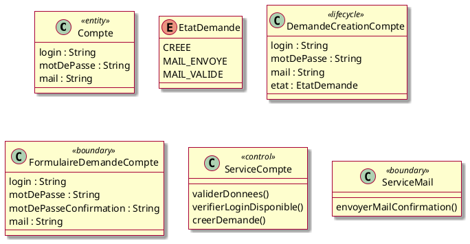

##### Cas nominal


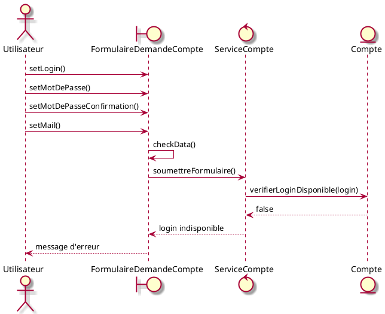

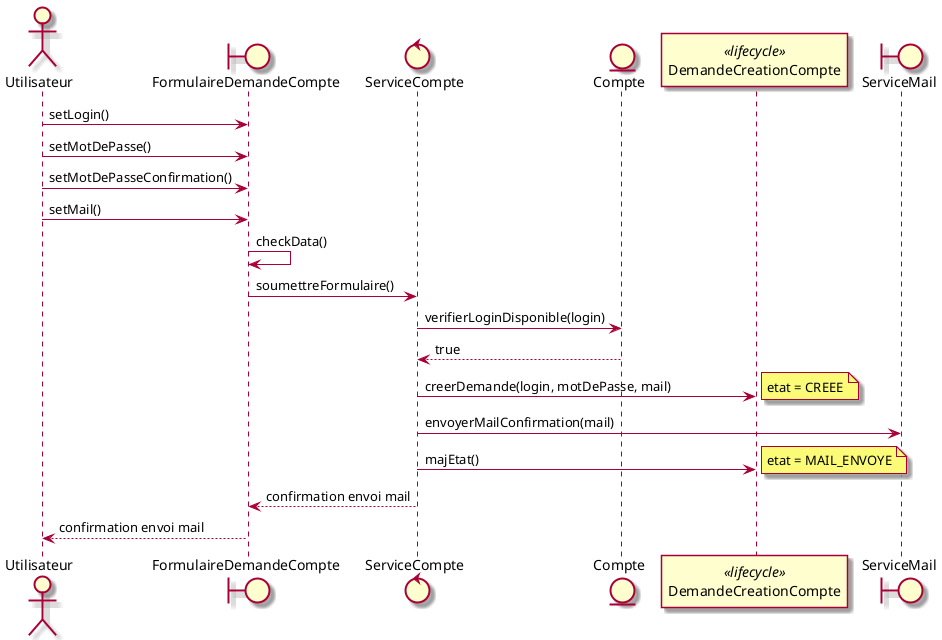

##### Déroulement alternatif : données incorrectes

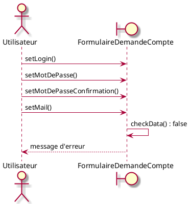

##### Déroulement alternatif : le compte existe déjà

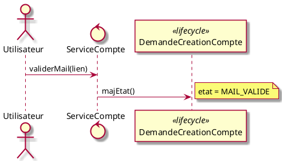

#### 4.1.2. Consulter les demandes de création de compte

- `ListeDemandesCompteUI` — interface utilisateur
- `ServiceCompte` — service
- `DemandeCreationCompte` — domaine + cycle de vie

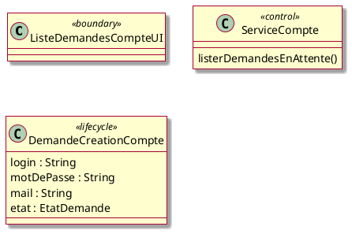

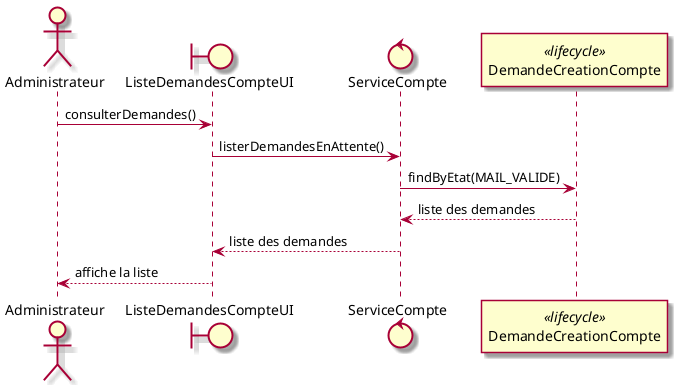

#### 4.1.3. Valider une demande de création de compte

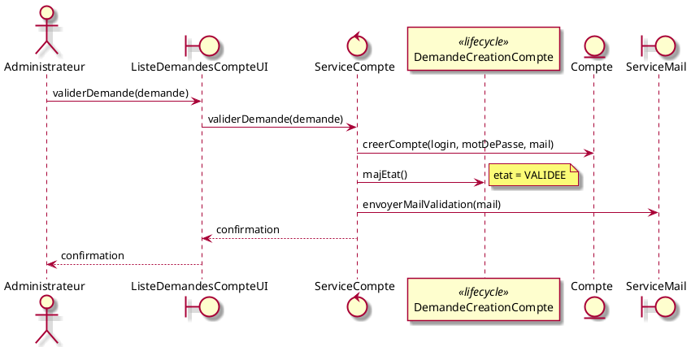

#### 4.1.4. Refuser une demande de création de compte

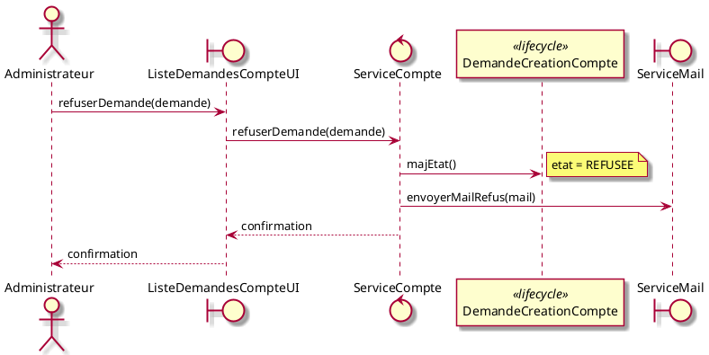

#### 4.1.5. Modifier les informations d'un compte

- `FormulaireModificationCompte` — interface utilisateur

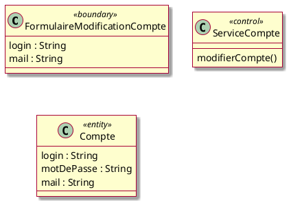

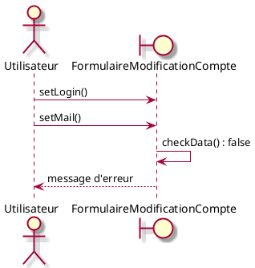

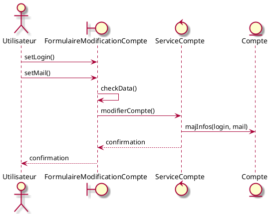

#### 4.1.6. Modifier un mot de passe

- `FormulaireModificationMotDePasse` — interface utilisateur

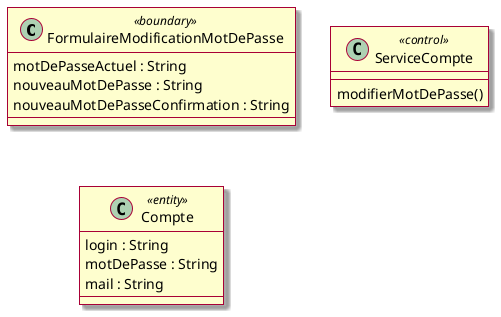

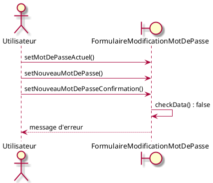

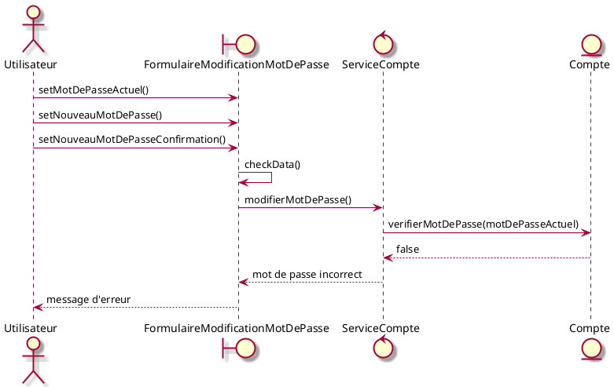

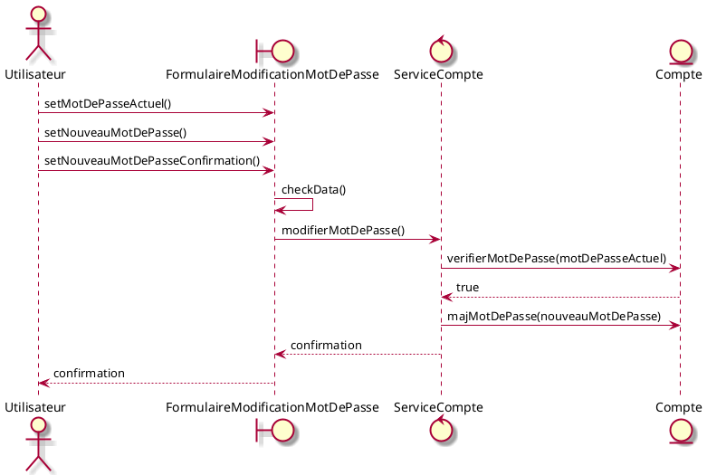

#### 4.1.7. Demander la réinitialisation d'un mot de passe

- `FormulaireDemandeReinitialisation` — interface utilisateur
- `FormulaireNouveauMotDePasse` — interface utilisateur

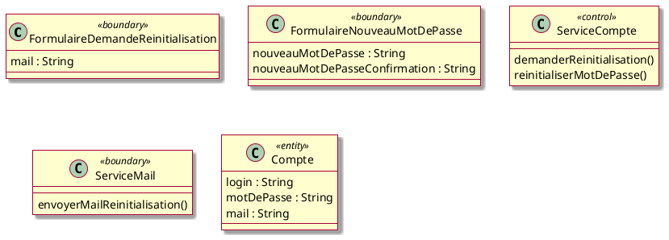

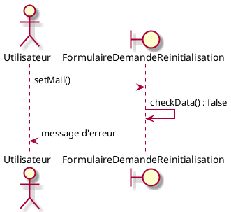

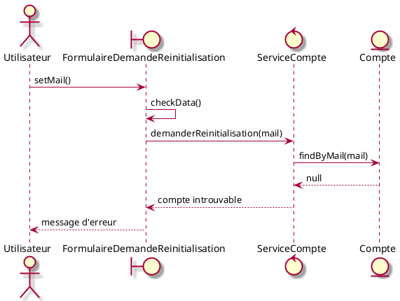

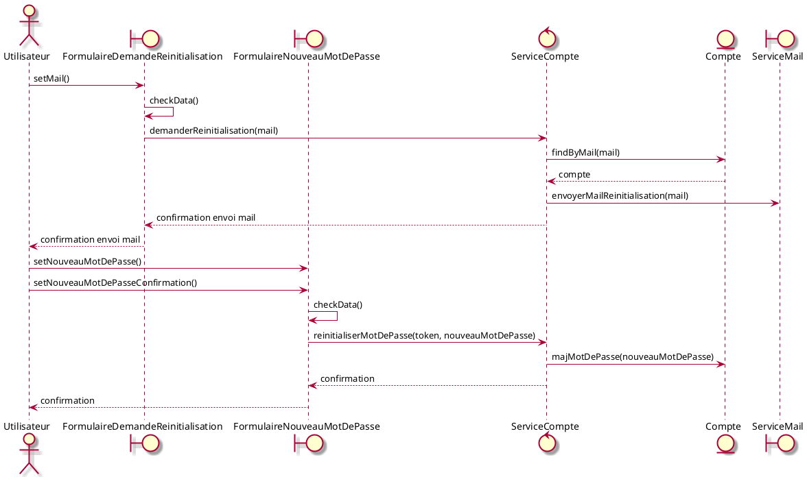

### 4.2. Groupe 2 : gestion des salles

#### 4.2.1. Créer une salle

- `FormulaireCreationSalle` — interface utilisateur
- `ServiceSalle` — service
- `Salle` — domaine
- `TypeSalle` — domaine

```plantuml
@startuml
skin rose

class FormulaireCreationSalle <<boundary>> {
  nom : String
  localisation : String
  capacite : Integer
  description : String
  type : TypeSalle
  reservationAvecValidation : Boolean
}

class ServiceSalle <<control>> {
  creerSalle()
}

class Salle <<entity>> {
  nom : String
  localisation : String
  capacite : Integer
  description : String
  type : TypeSalle
  reservationAvecValidation : Boolean
}

enum TypeSalle {
  COURS
  TP
  REUNION
}

@enduml
```

```plantuml
@startuml
skin rose
actor Responsable as r
boundary FormulaireCreationSalle as ui

r -> ui : setNom()
r -> ui : setLocalisation()
r -> ui : setCapacite()
r -> ui : setDescription()
r -> ui : setType()
r -> ui : setReservationAvecValidation()
ui -> ui : checkData() : false
ui --> r : message d'erreur
@enduml
```

```plantuml
@startuml
skin rose
actor Responsable as r
boundary FormulaireCreationSalle as ui
control ServiceSalle as svc
entity Salle as salle

r -> ui : setNom()
r -> ui : setLocalisation()
r -> ui : setCapacite()
r -> ui : setDescription()
r -> ui : setType()
r -> ui : setReservationAvecValidation()
ui -> ui : checkData()
ui -> svc : creerSalle()
svc -> salle : creerSalle(nom, localisation, capacite, description, type, reservationAvecValidation)
svc --> ui : confirmation
ui --> r : confirmation
@enduml
```

#### 4.2.2. Créer un équipement
#### 4.2.3. Ajouter une plage de disponibilité d'une salle
#### 4.2.4. Consulter la liste des salles
#### 4.2.5. Modifier une salle
#### 4.2.6. Supprimer une salle
#### 4.2.7. Modifier un équipement
#### 4.2.8. Supprimer un équipement
#### 4.2.9. Modifier une plage de disponibilité d'une salle
#### 4.2.10. Supprimer une plage de disponibilité d'une salle

### 4.3. Groupe 3 : gestion des réservations

#### 4.3.1. Afficher la liste des salles                    
#### 4.3.2. Rechercher une salle selon différents critères  
#### 4.3.3. Réserver une salle                              
#### 4.3.4. Consulter une réservation                       
#### 4.3.5. Modifier une réservation
#### 4.3.6. Annuler une réservation                         
#### 4.3.7. Consulter les demandes de réservation en attente
#### 4.3.8. Valider une demande de réservation              
#### 4.3.9. Rejeter une demande de réservation              

## 5. Regroupement des classes
### 5.1. Groupe domaine

### 5.2. Groupe domaine et cycle de vie

### 5.3. Groupe Service

### 5.4. Groupe interface utilisateur et système
