# Projet *Software Tickets* : Conception V 1.3

## 1. Table des matières

- [1. Table des matières](#1-table-des-matières)
- [2. Objectif du document](#2-objectif-du-document)
    - [2.1. Sur l'état du document (IMPORTANT)](#21-sur-létat-du-document-important)
- [3. Architecture](#3-architecture)
    - [3.1. Choix des technologies](#31-choix-des-technologies)
        - [3.1.1. Administration du système](#311-administration-du-système)
        - [3.1.2. Côté clients](#312-côté-clients)
        - [3.1.3. Côté manager/développeurs](#313-côté-managerdéveloppeurs)
    - [3.2. Contraintes techniques](#32-contraintes-techniques)
    - [4. Technologies utilisées](#4-technologies-utilisées)
        - [4.1. Serveur web](#41-serveur-web)
        - [4.2. Stockage des données](#42-stockage-des-données)
        - [4.3. Couche de persistance](#43-couche-de-persistance)
        - [4.4. Couche métier](#44-couche-métier)
        - [4.5. Couche service](#45-couche-service)
        - [4.6. Couche présentation](#46-couche-présentation)
        - [4.7. Authentification](#47-authentification)
        - [4.8. Environnement de développement](#48-environnement-de-développement)
        - [4.9. Test unitaire](#49-test-unitaire)
    - [4.10. Packages et dépendances](#410-packages-et-dépendances)
    - [4.11. Déploiement](#411-déploiement)
- [5. Préliminaire à la conception](#5-préliminaire-à-la-conception)
- [6. Cas d’utilisation](#6-cas-dutilisation)
    - [6.1. Rappel : modèle trouvé en analyse](#61-rappel--modèle-trouvé-en-analyse)
    - [6.2. Sous domaine : gestion des tickets](#62-sous-domaine--gestion-des-tickets)
        - [6.2.1. Créer un ticket](#621-créer-un-ticket)
            - [6.2.1.1. Diagramme de séquences](#6211-diagramme-de-séquences)
            - [6.2.1.2. Diagramme de classes](#6212-diagramme-de-classes)
        - [6.2.2. Valider un ticket](#622-valider-un-ticket)
            - [6.2.2.1. Diagramme de séquences](#6221-diagramme-de-séquences)
            - [6.2.2.2. Diagramme de séquence : rejet du ticket](#6222-diagramme-de-séquence--rejet-du-ticket)
            - [6.2.2.3. Diagramme de classes](#6223-diagramme-de-classes)
            - [6.2.2.4. Commentaire](#6224-commentaire)
        - [6.2.3. Créer un rapport d'avancement](#623-créer-un-rapport-davancement)
            - [6.2.3.1. Diagramme de séquence : cas nominal](#6231-diagramme-de-séquence--cas-nominal)
            - [6.2.3.2. Diagramme de classes](#6232-diagramme-de-classes)
        - [6.2.4. Déléguer un ticket](#624-déléguer-un-ticket)
            - [6.2.4.1. Diagramme de séquences](#6241-diagramme-de-séquences)
            - [6.2.4.2. Diagramme de classes](#6242-diagramme-de-classes)
            - [6.2.4.3. Autres remarques](#6243-autres-remarques)
        - [6.2.5. Accepter ou refuser une délégation](#625-accepter-ou-refuser-une-délégation)
            - [6.2.5.1. Diagramme de séquences](#6251-diagramme-de-séquences)
            - [6.2.5.2. Classes candidates (à l'issue de l'analyse)](#6252-classes-candidates-à-lissue-de-lanalyse)
            - [6.2.5.3. Cas nominal : acceptation d'une délégation](#6253-cas-nominal--acceptation-dune-délégation)
            - [6.2.5.4. Cas alternatif : refus d'une délégation](#6254-cas-alternatif--refus-dune-délégation)
            - [6.2.5.5. Diagramme de classes](#6255-diagramme-de-classes)
        - [6.2.6. Clore un ticket](#626-clore-un-ticket)
            - [6.2.6.1. Classes candidates](#6261-classes-candidates)
            - [6.2.6.2. Diagramme de séquence](#6262-diagramme-de-séquence)
            - [6.2.6.3. Diagramme de classes](#6263-diagramme-de-classes)
        - [6.2.7. Visualiser un ticket](#627-visualiser-un-ticket)
            - [6.2.7.1. Classes candidates](#6271-classes-candidates)
            - [6.2.7.2. Diagramme de séquences](#6272-diagramme-de-séquences)
            - [6.2.7.3. Diagramme de classes](#6273-diagramme-de-classes)
- [7. Regroupement des classes](#7-regroupement-des-classes)
    - [7.1. Groupe domaine](#71-groupe-domaine)
    - [7.2. Groupe cycle de vie](#72-groupe-cycle-de-vie)
    - [7.3. Groupe Service](#73-groupe-service)
    - [7.4. Groupe interface utilisateur et système](#74-groupe-interface-utilisateur-et-système)
- [8. Choix, questions ouvertes et remarques](#8-choix-questions-ouvertes-et-remarques)
    - [8.1. Modifications apportées lors de la rédaction des documents de conception](#81-modifications-apportées-lors-de-la-rédaction-des-documents-de-conception)
        - [8.1.1. Clôture des tickets](#811-clôture-des-tickets)
    - [8.2. Event sourcing et CQRS](#82-event-sourcing-et-cqrs)
    - [8.3. Les dates](#83-les-dates)
    - [8.4. Critique de cette version du modèle de conception](#84-critique-de-cette-version-du-modèle-de-conception)
    - [Modifications possibles](#modifications-possibles)
- [9. Annexes](#9-annexes)
    - [9.1. Terminologie](#91-terminologie)
    - [9.2. Autre annexes](#92-autre-annexes)
        - [9.2.1. Bibliographie](#921-bibliographie)

## 2. Objectif du document

Ce document aborde l'architecture, la conception et les choix techniques pour l'implémentation du projet « Software Tickets ». Les diagrammes suivent le langage de modélisation UML et la méthodologie Arrington.

- On commencera par énumérer les diverses contraintes techniques qui pèsent sur notre projet ;
- on décrira ensuite les technologies choisies ;
- puis l'architecture (les deux étant évidemment liés) ;
- et enfin, nous décrirons le design de notre système en revenant sur les *use cases*.

### 2.1. Sur l'état du document (IMPORTANT)

Nous avons conservé plusieurs versions de ce document. La version 1.0 est une version temporaire, dans laquelle nous avons repris telles quelles les classes métier trouvée en analyse. Dans la présente version (1.3), nous avons modélisé plus précisément l'historique des opérations sur les tickets, et introduit des composants mieux définis.

Notre première modélisation comportait finalement une classe `TicketService` qui regroupait toutes les opérations sur le métier. C'est ce qu'on surnomme une **god class** : elle sait tout, et fait tout. En conséquence, il est difficile de s'y repérer et de la modifier.

Un découpage en composants plus petits permet de mieux organiser le code.

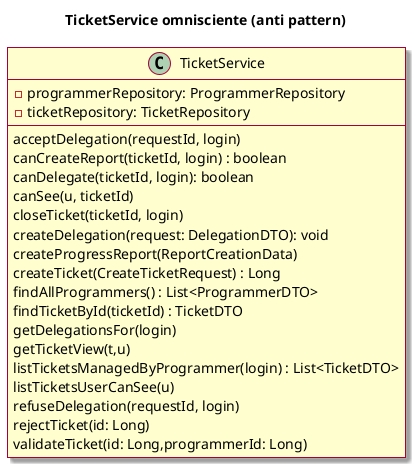

La version 1.3 comporte en particulier une meilleure définition des composants du système, tout en conservant une modélisation assez simple. Nous avons quitté pour ce faire la méthode Arrington, qui ne dit pas grand'chose sur la manière de trouver les composants du système, pour utiliser l'approche  **Acteur/Action**,  proposée dans (Gandhi et al. 2024). Pour la découverte des **composants** du système, ce livre suggère deux systèmes :

- l'approche par **Workflow** : les composants représentent les différentes étapes du *workflow* utilisateur ;
- l'approche **Acteur/Action** : on liste les acteurs et leurs actions, et chaque action est liée à un **composant** ; un composant peut être lié à plusieurs actions. Cette méthode est proche de l'*event storming*.

Attention, ça ne nous donne pas des *classes* mais des *composants* qui correspondent typiquement à des *packages*.

Le livre de (Gandhi et al. 2024) déconseille en revanche de tomber dans **l'entity trap**, c'est à dire de découper les composants logiques en fonction des entités identifiées. Ça n'est pas très loin de ce que nous avons fait, mais le modèle est assez simple pour que ça ne porte pas (trop) à conséquence.

Par ailleurs, le sujet s'est révélé plus riche que prévu. Nous avions voulu proposer un petit sujet simple à expliquer, pour montrer les étapes de la méthode, avec juste assez de complexité pour que le public ne s'endorme pas. Il s'avère qu'il n'est pas si trivial que ça. Nous avons utilisé quelques patterns en chemin, mais nous insistons sur le fait que ce n'est pas une obligation. Ils se sont pour ainsi dire imposés à nous, mais il faut se défier de *l'overengineering*.

Nous avons aussi amélioré le nom de certaines méthodes en les rendant plus « métier ». L'ancienne méthode `listTicketsForUser` a été renommée `listTicketsUserCanSee()` pour expliciter sa signification. De même `listTicketsManagedByProgrammer` permet de savoir qu'on liste précisément les tickets dont le programmeur est le mainteneur actuel, et pas tous les tickets qu'il a jamais eu à gérer.

## 3. Architecture

### 3.1. Choix des technologies

Il est bien entendu possible de sélectionner plusieurs technologies différentes pour un même type de couches. On peut par exemple avoir une application qui travaille avec un client lourd pour certaines fonctionnalités, et un client web pour d'autres. Mais ça a évidemment un coût.

Les points à considérer sont en particulier :

- la complexité de l'interface utilisateur ;
- les contraintes de déploiement ;
- le nombre et le type d'utilisateurs ;
- l'interaction avec le **système** ;
- les performances ;
- le passage à l'échelle ;
- la sécurité

#### 3.1.1. Administration du système

- on est essentiellement dans du CRUD ;
- le système *peut* être administré en interne ;
- il y a un administrateur ;
- on veut que ça soit très sécurisé.

On pourrait envisager une petite application spécifique, avec client lourd ou en ligne de commande. D'un autre côté, un client web standard, avec des interactions en HTTPS pourrait convenir.

Le nombre d'utilisateurs attendus est assez faible ; il pourrait y avoir beaucoup de clients, mais ça n'est pas le cas actuellement.

#### 3.1.2. Côté clients

L'interface est assez simple. Une interface web classique conviendrait. On peut envisager une version mobile de l'application, mais c'est un peu un gadget. Si la création d'un site responsive n'est pas trop embêtante, c'est quand même probablement une bonne idée.

Le client peut souhaiter pouvoir visualiser facilement un ticket donné. Il sera donc intéressant d'utiliser des URL stables.

#### 3.1.3. Côté manager/développeurs

- l'interface est plus complexe, mais rien qui soit hors de portée d'une application web classique ;
- les mécanismes de sélection pourraient bénéficier de l'utilisation d'AJAX ;
- on souhaite pouvoir envoyer des mails ;
- la sécurité est évidemment importante, mais un site web correctement sécurisé ferait l'affaire (https).

### 3.2. Contraintes techniques

- Le système permettant aux clients de créer des tickets et de les visualiser doit être accessible de l'extérieur ;
- en terme de volumétrie, l'application s'adresse à des clients professionnels, a priori peu nombreux. En dehors des problèmes techniques, la gestion manuelle des tickets rendrait peu réaliste son extension à un nombre très importants de clients. En conséquence, la volumétrie et la montée en charge ne sont probablement pas des problèmes ;
- on maîtrise bien Spring/JPA/Thymeleaf ;
- le système doit être fiable (en particulier pour l'expédition de mails).
- l'application doit être raisonnablement sécurisée.

### 4. Technologies utilisées

#### 4.1. Serveur web

Pour des raisons de facilité de maintenance, on choisit d'utiliser une application Spring Boot hébergée dans un conteneur docker. Le serveur utilisé sera donc un serveur tomcat embarqué.

#### 4.2. Stockage des données

Dans un premier temps, les données seront stockées dans une base h2, qui devrait suffire à nos besoins.

#### 4.3. Couche de persistance

La couche de persistance sera JPA, que l'équipe maîtrise bien.

#### 4.4. Couche métier

Vu l'ampleur réduite du logiciel, et la relative simplicité du modèle, la couche métier sera composée d'entités JPA et des implémentations de services.

#### 4.5. Couche service

La couche service sera isolée de la couche présentation par des façade et des DTO.

#### 4.6. Couche présentation

Pour la couche présentation, le gros du travail sera réalisé avec **Spring MVC**. Le cas échéant, on pourra recourir à un peu d'AJAX et de REST.

#### 4.7. Authentification

Comme Spring Security permet d'isoler assez facilement la sécurité, on pourra commencer simplement, avec des données sur les utilisateurs stockées en base, pour envisager, dans un second temps, d'utiliser keycloack.

#### 4.8. Environnement de développement

Les projets seront manipulés à travers `gradle`, ce qui les rendra indépendants d'un IDE quelconque. Les développeurs utiliseront ce qu'ils veulent.

#### 4.9. Test unitaire

On utilisera JUnit 5.

### 4.10. Packages et dépendances

L'approche acteurs/actions permet de proposer les composants suivants :

- `UserCreationComponent` : création de compte utilisateur ;
- `TicketLifeComponent` : cycle de vie des tickets : création, validation, rejet, clôture ;
- `ProgressReportComponent` : création de rapports d'avancement ;
- `DelegationComponent` : délégation de tickets ;
- `DashboardComponent` : affichage des informations des dashboards (éventuellement spécialisés selon les clients) ;
- `TicketVisualizationComponent` : visualisation d'un ticket donné.

Le modèle des tickets sera partagés. Comme on n'envisage pas une architecture microservice, mais qu'un monolithe nous suffit amplement, découper le modèle en sections indépendantes serait probablement de *l'overengineering.*

À chaque composant lié aux actions de l'utilisateur correspondra une classe **Service** au sens Spring du terme, qui servira aussi de **façade** au composant, et communiquera avec la couche de présentation à travers des **DTOs**.

~~~plantuml
@startuml packages
skin rose

package softwareTicket {
  package usercreation {
    package ui {
      package forms {

      }
    }    
    package services {
        package dto {}
    }          
    package model {}
    package repositories {}
    
    ui ..> services
    services ..> model
    services ..> repositories
    repositories .> model    
  }

  package ticketlife {
    package ui {    
    }    
    package services {
        package dto {}
    }              
  }

  package progressreport {
    package ui {    
    }    
    package services {
        package dto {}
    }              
  }

  package delegation {     
    package ui {    
    }    
    package services {
        package dto {}
    }              
  }

   package dashboard {     
    package ui {    
    }    
    package services {
        package dto {}
    }              
  }

   package ticketview {     
    package ui {    
    }    
    package services {
        package dto {}
    }              
  }

  package ticketmodel {
    package model {}
    package repositories {}
    repositories .> model    
  }

  ticketlife ..> ticketmodel
  progressreport ..> ticketmodel
  delegation ..> ticketmodel
  dashboard ..> ticketmodel
  ticketview ..> ticketmodel

}
@enduml
~~~

Assez curieusement, les repositories de Spring sont inspirés du Domain Driven Design **et** d'une certaine manière d'une architecture hexagonale, si on considère que la couche de persistance n'est pas l'interface, mais son implémentation. La différence est que typiquement en Spring, on a une dépendance malgré tout assez forte au framework. En théorie, on pourrait utiliser XML pour configurer les entités, et prétendre que le code java de celles-ci est indépendant de **JPA** et de Spring. C'est assez illusoire.

Par ailleurs, les deux packages `ticketmodel` et `userManagement` vont devoir communiquer. **La création d'un compte utilisateur va causer celle d'un `Client`, d'un `Programmer` ou d'un `Manager`.**

On a pour cela plusieurs solutions :

1. placer les classes `Client`, `Programmer` et `Manager` dans `userManagement.model`. C'est possible, mais un peu embêtant, car la création d'utilisateur est finalement quelque chose d'essentiellement technique, et ça nuira à la cohésion de `userManagement` **et** de `tickets` ;
2. les placer dans `tickets`, mais les créer depuis les services de `userManagement`. C'est possible, mais ça couple `userManagement` à `tickets`, ce qui n'est pas très logique ;
3. éviter le couplage en question en utilisant le **pattern `Observable`** et un **bus d'événements** : la création d'un utilisateur émet un événement, qui sera récupéré par `tickets`. On peut le traiter à la main, ou le faire gérer par les **mécanismes d'événements** de **Spring**, voire, si on séparait les deux packages dans deux applications distinctes, passer à un vrai middleware de messagerie.
   La classe de l'événement lui-même, pour bien faire, devrait être dans un package "commun" ou **api**, où on pourrait placer certaines classes utilisées par tout le monde.

On pourrait aussi envisager d'utiliser pour les packages `ui` une approche strictement par couche. En effet, dans les logiciels, web, il est assez fréquent qu'une page aggrège des données venant d'horizons différents.

**le découpage proposé n'est pas celui suivi par la suite. Nous avons mis à jour les classes pour qu'elles s'y insèrent plus facilement, mais le reste du travail est à réaliser**.

### 4.11. Déploiement

~~~plantuml
@startuml deploiement
!pragma layout smetana
skin rose

node machineUtilisateur {
  component navigateur {
  }
}

node "conteneur docker" {
node "docker container" {
  component applicationSpring {
  }
  HTTPS -- [applicationSpring]
  database "server h2" as h2
  TCP -- [h2]
}

component "docker data volume" as vol {
}

  [applicationSpring] ..> TCP : use
  [navigateur] ..> HTTPS : use

  h2 --> vol
  note right of vol
    volume de données persistant
  end note
@enduml
}
~~~

- notez que dans cette application, le volume de données survit à une modification du serveur (il n'est pas dans le container) ;
- cependant, le système serait peu utilisable si on voulait dupliquer le serveur ; il faudrait déplacer la base de données pour le partager ;
- en revanche, la base de données est isolée du monde extérieur.

## 5. Préliminaire à la conception

La conception est un processus itératif ; mais si l'analyse d'un *use case* invalide la manière dont on a traité les précédents, le volume de travail nécessaire pour chaque itération peut être assez important.

On a donc intérêt à faire dans un premier temps un premier passage rapide et informel sur les *use cases*, et à réfléchir aux modifications éventuelles. En particulier pour le modèle lui-même. C'est aussi une raison pour **réfléchir d'abord aux cas les plus complexes.**

Cet aspect itératif plaide aussi pour l'utilisation d'outils.

La version **1.2** provient d'un nettoyage de la version **1.1**, après avoir hésité entre plusieurs modélisations possibles.

Pour simplifier, on peut avoir une modélisation où certains événements sont représentés *implicitement* dans l'objet ticket, et d'autres, explicitement, comme ici les *ProgressReport*.

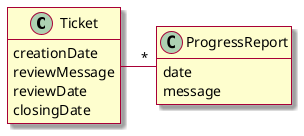

Inversement, on peut avoir une modélisation *événementielle* de tout ce qui arrive à un ticket :

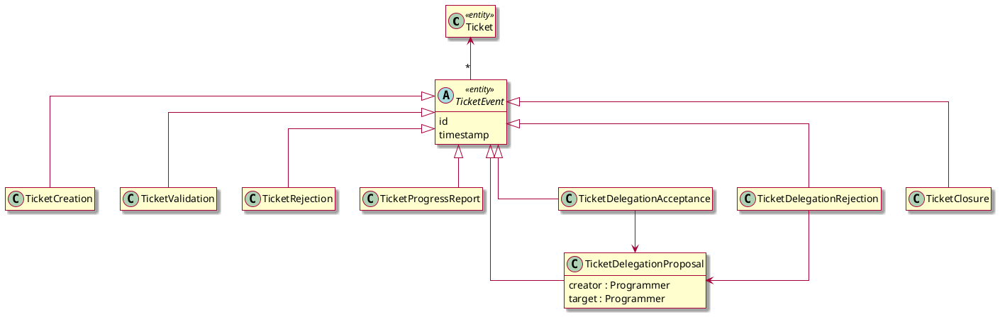

Pour l'affichage de l'historique, il est assez clair que la représentation explicite des événement est une option intéressante. Pour la modélisation métier, c'est un peu plus complexe.

- la création, la validation et le rejet d'un ticket suivent un ordre strict, et sont liés par des contraintes fortes. On ne peut pas accepter **et** rejeter le même ticket, et un ticket ne peut être validé ou rejeté s'il n'est pas encore créé.

- les rapports d'avancement sont des évéments indépendants les uns des autres, et la seule contrainte entre eux est chronologique ; ils sont donc très bien adaptés à la modélisation événementielle.

- le suivi des délégations est plus complexe, car chaque délégation a son propre historique. Quand on les gère, on ne s'occupe de rien d'autre.

La représentation événementielle *pure* de l'historique des tickets n'est donc pas forcément la meilleur solution pour la couche métier.

En revanche, pour l'affichage de l'historique, une représentation explicite des événement est pratique. Elle résoud le problème de l'affichage chronologique, et permet l'application simple de **filtres** pour déterminer ce qui doit être montré.

On peut résoudre ce dilemne en représentant explicitement les évéments dans les **DTOs utilisés pour l'affichage.** La conception ainsi obtenue est proche du principe **CQRS** : la manière d'écrire les données est décorrélée de la manière de les lire.

## 6. Cas d’utilisation

On choisit de développer un sous-ensemble cohérent des fonctionnalités.

### 6.1. Rappel : modèle trouvé en analyse

Le modèle issu de l'analyse, qui sera probablement modifié, est cependant un point de départ intéressant. Comme il prend en compte la **totalité** de l'analyse, il peut aussi nous permettre d'éviter de créer des modèles trop simplifiés pour certains *use cases*.

Petite modification à faire : La classe `DelegationRequest` représentait à la fois une demande de délégation, et une délégation active. On la renomme `Delegation` tout court.

~~~plantuml
@startuml
skin rose
hide empty members
title Modèle d'analyse

together {
  class User <<entity>> {
    login
    password
    type
    email
    setLogin()
    setPassword()
    setType()
    setEmail()
    checkPassword()
  }

  enum TypeUser <<entity>> {
    CLIENT
    MANAGER
    PROGRAMMER
    ADMINISTRATOR
  }

  User -> TypeUser
}

class Ticket <<entity>> {
    title
    description
    creationDate    
    reviewMessage  
    reviewDate    
    closingDate
    closed : boolean
    close()
    isNewTicket()
    addProgressReport(d: ProgressReport)
    getProgressReports()
    getDelegations()
    setTitle()
    setDescription()
    setClient()
    setState()
    setProgrammer(p: Programmer)
    setDateValidation()    
    setReviewMessage()
  }

  Ticket ..> TicketType : > type
  enum TicketType {
    BUG
    IMPROVEMENT
  }

  enum TicketState {
    NEW
    OPEN
    REJECTED
    CLOSED  
  }

  note top of Ticket
  * creationDate est la date de la création du ticket par le client
  * evaluationDate est la date de traitement de la note par le manager.
  end note

  class ProgressReport <<entity>> {
    date
    message
    setMessage()
    setDate()
  }

  class Programmer  <<entity>> {}

 
  class Delegation <<entity>> {
    publicText
    privateText
    creationDate
    processingDate
    setStatus()
    setProcessingDate()
    setTarget(p : Programmer)
    setTicket(t)
    setPublicText()
    setPrivateText()
  }

  enum DelegationStatus {
    PENDING
    ACCEPTED
    REFUSED
  }

  Ticket -> "1" TicketState : > state
  Ticket *-- "*" ProgressReport
  Ticket --> Client : > client
  Ticket --> Programmer : > firstMaintainer
  
  Delegation --> Programmer : > target
  Delegation . Ticket
  DelegationStatus . Delegation : < status
@enduml
~~~

### 6.2. Sous domaine : gestion des tickets

#### 6.2.1. Créer un ticket

##### 6.2.1.1. Diagramme de séquences

~~~plantuml
@startuml
skin rose
actor client as c
boundary CreateTicketController as ui
participant "f: CreateTicketForm" as f
participant "r: CreateTicketRequest" as r
control TicketLifeService as wf
entity "t: Ticket" as t
participant ClientRepository as cdao <<lifecycle>>
participant TicketRepository as dao <<lifecycle>>

c -> ui : getForm()
ui --> c
c -> ui : createTicket(createTicketForm, principal)
ui -> f : toRequest()
create r
f -> r : new CreateTicketRequest(principal, title, description, type)
r --> f : r
f --> ui : r
ui -> wf : createTicket(r)
wf -> cdao : findByLogin(r.login)
cdao --> wf : client
create t
wf -> t : new Ticket(r.title, r.description, client, r.type)
wf -> dao : save(t)
wf --> ui : id
ui --> c : redirect /ticket/**id**
@enduml
~~~

##### 6.2.1.2. Diagramme de classes

~~~plantuml
@startuml
skin rose
hide empty members

package ui {
  class CreateTicketController {
    getForm(Model) : String
    createTicket(CreateTicketForm, Principal, Model) : String
  }

  class CreateTicketForm {
    title : String
    description : String
    type : String
  }

  CreateTicketController .> CreateTicketForm

}

package services {

  class TicketLifeService  {
    createTicket(CreateTicketRequest) : Long
  }

  package dto {
    class CreateTicketRequest {
      title : String
      description : String
      type : String
      login : String
    }
  }

  TicketLifeService .> dto
  
}

package repositories {
    interface ClientRepository {
      findByLogin(login : String) : Client
    }

    interface TicketRepository {
      save(Ticket) : Ticket
    }

}

package model {
  class Ticket <<entity>> {
      id : Long
      title : String
      description : String
      creationDate : LocalDateTime
      Ticket(title: String, description: String, c : Client; t: TicketType)
    }

    note left of Ticket::id
      les ids sont donnés par JPA.
    end note

    Ticket ..> TicketType : > type
    enum TicketType {
      BUG
      IMPROVEMENT
    }

    enum TicketState {
      NEW
      OPEN
      REJECTED
      CLOSED  
    }

    class Client {
      id : Long
      name : String
      login : String
    }

    note left of Client::login 
      le login permet de lier 
      le client à un compte.
    end note
    Ticket -> "1" TicketState : > state
    Ticket --> Client : > client  
  }

  ui ..> services
  services ..> model
  services ..> repositories
  repositories ..> model
@enduml
~~~

Notes :

- pour la date et l'heure, on pourrait aussi penser à `OffsetDateTime` ;
- le type de ticket dans le DTO : on utilise des Strings. On pourrait envisager de dupliquer l'enum `TicketType`, ou mieux, de placer les types-valeurs communs dans un package séparé.

#### 6.2.2. Valider un ticket

Historique :

- première version
- seconde version : on s'est aperçu que le message envoyé lors du rejet n'était pas mentionné ; on le rajoute.

##### 6.2.2.1. Diagramme de séquences

*A priori*, la validation de tickets suppose que celui-ci a été sélectionné et visualisé au préalable. Ce que permet par exemple [**Visualiser un ticket**](#517-visualiser-un-ticket). Il est assez probable que le formulaire de validation soit intégré dans une autre page, et possible que `ValidateTicketController` soit fusionné avec une autre classe.

~~~plantuml
@startuml
skin rose
actor manager as actor
boundary ValidateTicketController as ui
control TicketLifeService as wf
participant DTOFactory
entity "t: Ticket" as t
participant ProgrammerRepository <<lifecycle>>
participant TicketRepository <<lifecycle>>
boundary MessagerService as ext

actor -> ui ++: showValidationForm(id)
ui -> wf ++: findAllProgrammers()
wf -> ProgrammerRepository ++: findAll()
ProgrammerRepository --> wf -- : pList
wf -> DTOFactory ++ : toDTO(pList)
DTOFactory --> wf --: pDTOs
wf --> ui --: pDTOs
ui --> actor --: form

actor -> ui ++: validateTicket(id,programmerId)
ui -> wf ++ : validateTicket(id,programmerId)
wf -> ProgrammerRepository ++ : findById(programmerId)
ProgrammerRepository -> wf -- : p
wf -> TicketRepository ++: findById(id)
TicketRepository --> wf -- : t
wf -> t : setState(OPEN)
wf -> t : setReviewDate(now())
wf -> t : setFirstMaintainer(p)
wf -> t : setCurrentMaintainer(p)

wf -> TicketRepository  : save(t)
wf -> ext -- : mailTo(t.getClient().getEmail(), validationMessage)
ui --> actor : redirect ticket/**id**
@enduml
~~~

##### 6.2.2.2. Diagramme de séquence : rejet du ticket

~~~plantuml
@startuml
skin rose
actor manager as actor
boundary ValidateTicketController as ui
control TicketLifeService as wf
participant DTOFactory
entity "t: Ticket" as t
participant ProgrammerRepository <<lifecycle>>
participant TicketRepository <<lifecycle>>
boundary MessagerService as ext

actor -> ui ++: showValidationForm(id)
note over actor, ext: comme diagramme précédent
ui --> actor --: form

actor -> ui ++: rejectTicket(id, message)
ui -> wf ++ : rejectTicket(id, message)
wf -> TicketRepository ++: findById(id)
TicketRepository --> wf -- : t
wf -> t : reject(message)
t -> t : setState(REJECTED)
t -> t : validationRejectionMessage = message
wf -> t : setReviewDate(now())
wf -> TicketRepository  : save(t)
wf -> ext -- : mailTo(t.getClient().getEmail(), rejectionMessage)
ui --> actor : redirect ticket/**id**
@enduml
~~~

Pour les tickets, les changements d'états peuvent conduire à renseigner des messages. Il serait logique de forcer ceux-ci à être mis en place, et probablement de remplacer `setState()` par des méthodes spécifiques comme `reject()`. La modélisation est alors (un peu) plus riche, et plus « métier ». Dans la même veine, l'ouverture d'un ticket force à lui affecter un programmeur. On peut représenter cette obligation en remplaçant la séquence :

~~~java
ticket.setState(OPEN)
ticket.setProgrammer(p)
~~~

par :

~~~java
ticket.openAndAssignTo(p)
~~~

Avec un peu de chance, on peut trouver un meilleur nom métier pour cette opération.

##### 6.2.2.3. Diagramme de classes

~~~plantuml
@startuml
skin rose
hide empty members

package ui {
  class ValidateTicketController {
    showValidationForm(id: long, m: Model) : String
    validateTicket(id: Long, programmerId: Long) : String
    rejectTicket(id: Long) : String
  }
}

package services {
  class TicketLifeService {
        rejectTicket(id: Long)
        validateTicket(id: Long,programmerId: Long)
        findAllProgrammers() : List<ProgrammerDTO>
        rejectTicket(id: Long)        
  }

  package dto {
    class DTOFactory {
      toDTO(Programmer): ProgrammerDTO
    }

    class ProgrammerDTO {
      id: Long 
      name: String
      ...
    }

    note right of ProgrammerDTO
      détails à discuter. 
      Le mail pourrait être intéressant.
    end note
  }
  
}

package repositories {

  interface ProgrammerRepository {
    findAll(): List<Programmer>
    findById(id: Long): Programmer
  }

  interface TicketRepository {
    findById(id: Long): Ticket
    save(t: Ticket)
  }

}

package model {
  class Ticket <<entity>> {
    currentMaintainer : Programmer

    openAndAssignTo(p: Programmer)
    rejectTicket(message: String)
    setReviewDate(d: LocalDateTime)
  }

  class Programmer <<entity>> {

  }
  Ticket ..> Programmer

  enum TicketState {
    NEW
    OPEN
    REJECTED
    CLOSED  
  }

  class Client  <<entity>> {
    id : Long
    name : String
    login : String
    getEmail(): String
  }

  Ticket -> "1" TicketState : > state
  Ticket --> Client : > client  
}

package mail {
  class MessagerService {
    mailTo(email: String, MailMessage)    
  }

  class MailMessage {
    subject: String
    text: String
  }

  MessagerService ..> MailMessage

}

  ui ..> services
  services ..> model
  services ..> repositories
  repositories ..> model

  TicketLifeService ..> MessagerService
@enduml
~~~

##### 6.2.2.4. Commentaire

Voir [Créer un rapport d'avancement](#523-créer-un-rapport-davancement) pour une modification importante à faire à ce *Use Case*. Normalement, cette modification devrait être effectuée dans la description de notre *use case*, mais encore une fois, nous avons jugé qu'il était pédagogiquement plus intéressant de garder la trace des hésitations du concepteur.

#### 6.2.3. Créer un rapport d'avancement

##### 6.2.3.1. Diagramme de séquence : cas nominal

**Note :** la sélection du ticket à renseigner se fera plutôt à partir d'une autre page (par exemple la page du ticket, ou le tableau de bord du programmeur). Il est assez probable qu'en fin de compte, les deux parties de ce *use case* soient séparées.

Après une première version où le `Ticket` connaît ses `ProgressReports`, il devient clair qu'il est plus simple d'avoir une relation **unidirectionnelle**.

~~~plantuml
@startuml
skin rose

actor Programmer as a0
boundary CreateProgressReportController as ui
control ProgressReportService as wf2
control TicketModelService as wf
participant DTOFactory 
entity "doc : ProgressReport" as doc
entity "t: Ticket" as t
participant TicketRepository as tdao <<lifecycle>>
participant ProgrammerRepository <<lifecycle>>
participant ProgressReportRepository <<lifecycle>>

a0 -> ui : getTicketSelectionForm(principal)
ui -> wf : listTicketsManagedByProgrammer(login)
wf -> tdao : findTicketsByProgrammerLogin(login)
tdao --> wf : ticketList
wf -> DTOFactory : toDTO(ticketList)
wf --> ui : ticketListDTO
ui --> a0 : ticketListDTO
a0 -> ui : getNewReportFormFor(principal,ticketId)
ui -> wf2 : canCreateReport(login, ticketId)
wf2 --> ui : true
ui -> wf : findTicketById(ticketId)
wf -> tdao : findById(ticketId)
tdao --> wf : ticket
wf -> DTOFactory : toDTO(ticket)
DTOFactory --> wf : ticketDTO
wf --> ui
ui --> a0
a0 -> ui : createReport(progressReportForm, principal)
ui -> wf : canCreateReport(login, ticketId)
wf --> ui : true
ui -> ui : createReportData(progressReportForm, principal)
ui -> wf2 : createProgressReport(reportData)
wf2 -> TicketRepository : getReferenceById(reportData.ticketId)
TicketRepository --> wf2 : t
wf2 -> ProgrammerRepository : getReferenceById(reportData.user)
ProgrammerRepository --> wf2: p
create doc
wf2 -> doc : new ProgressReport(t, date, message, p)
doc --> wf2 : doc
wf2 ->  ProgressReportRepository : save(doc)
wf2 --> ui
ui --> a0
@enduml
~~~

Note : la vérification que le programmeur a le droit de visualiser le formulaire est probablement mal placée.

- soit on rend le service plus proche d'un workflow (en donnant éventuellement des noms plus métiers aux méthodes, voire en utilisant plusieurs couches `@Service` différentes, les unes pour le workflow, les autres pour les méthodes transversales) ;
- soit on passe par `SpringSecurity`.
- dans tous les cas, il faut bien vérifier que seules les personnes autorisées peuvent voir les rapports et les tickets.

Un retour sur les diagrammes d'analyse, et une réflexion sur la méthode `canCreateReport`, qui vérifie si un programmeur peut créer un rapport, nous incite à proposer une architecture un peu différente pour le modèle.  On part de :

~~~plantuml
@startuml
skin rose
title situation actuelle
class Ticket {}
class Programmer {}
class DelegationRequest {}

Ticket --> Programmer : firstMaintainer
Ticket -> "*" DelegationRequest
DelegationRequest --> Programmer : target
@enduml
~~~

Pour implémenter `canCreateReport`, il est assez difficile de savoir qui est le programmeur actuellement en charge. On se trouve plus ou moins avec l'algorithme suivant :

~~~
p = ticket.firstMaintainer
for req in ticket.delegationRequestList (triée par date décroissante)
   si req.status == ACCEPTED alors
    p = req.target
    break
   finsi
fin for
~~~

On a alors une différence entre le firstMaintainer et les autres.

On pourrait avoir à la place :

~~~plantuml
@startuml
skin rose
title modification proposée
class Ticket {}
class Programmer {}
class Delegation {}

enum DelegationStatus {
  PENDING
  ACCEPTED
  REFUSED
}

Ticket --> Programmer : currentMaintainer
Ticket -> "1..n" Delegation : delegationHistory
Delegation --> Programmer
Delegation --> DelegationStatus
@enduml
~~~

Dans ce cadre :

- quand le ticket est assigné à son premier responsable, on l'enregistre dans la `delegationHistory` ;
- de manière redondante, le responsable actuel est enregistré dans le ticket ;
- dans ce cas, le lien du ticket vers la liste de ses délégations n'a plus grand intérêt. Si on veut afficher un historique, on pourra se référer à `DelegationRepository`.

En poussant plus loin la réflexion, on s'aperçoit que l'important est que le ticket ait une méthode `getCurrentMaintainer()`. L'approche où celui-ci est déduit, et l'approche où il est stocké dans la base sont des détails d'implémentation pour le client de la classe `Ticket`. En allant plus loin (peut-être un peu trop pour cette phase), on peut aussi suggérer que cette méthode retournera un `Optional<Programmer>`.

##### 6.2.3.2. Diagramme de classes

~~~plantuml
@startuml
skin rose
hide empty members

package ui { 
  class CreateProgressReportController <<boundary>> {
    getTicketSelectionForm(Principal)
    getNewReportFormFor(Principal,ticketId)
    createReport(ReportForm, Principal)
    - createReportData(progressReportForm, principal)
  }

  package uiDTO {
    class TicketViewDTO {
      id : Long
    }

    class ReportForm {
      ticketId
      message
    }
  }
}

package services {
 
  class TicketModelService <<control>> {
    listTicketsManagedByProgrammer(login) : List<TicketDTO>
    findTicketById(ticketId) : TicketDTO
    
  }

  class ProgressReportService <<control>> {
    canCreateReport(login, ticketId) : boolean
    createProgressReport(ReportCreationData)
  }

  package servicedto {
    class DTOFactory {
      toDTO(List<Ticket>) : List<TicketDTO>
      toDTO(Ticket) : TicketDTO
    }

    class TicketDTO {}

    class ReportCreationData {
      ticketId
      login
      message
    }
  }

  TicketModelService ..> servicedto
  ProgressReportService ..> servicedto
}

package repositories {

  interface TicketRepository {
    findTicketsByProgrammerLogin(String)
    getReferenceById(Long)    
  }

  interface ProgrammerRepository {
    getReferenceById(String)
  }

  interface ProgressReportRepository {
    save(ProgressReport)
  }
}

package model {

  class Ticket <<entity>> {
    addProgressReport(d: ProgressReport)
    getCurrentMaintainer() : Optional<Programmer>
  }

  class Programmer <<entity>> {

  }

  class ProgressReport <<entity>> {
    message
    date
    setMessage()
    setDate()
  }

  ProgressReport "*" --> Ticket
  ProgressReport -> Programmer : creator
}

CreateProgressReportController --> TicketModelService
CreateProgressReportController --> ProgressReportService

services .> repositories
repositories ..> model

@enduml
~~~
#### 6.2.4. Déléguer un ticket
##### 6.2.4.1. Diagramme de séquences

~~~plantuml
@startuml
skin rose
title déléguer un ticket, diagramme de séquences

actor Programmer as a
boundary DelegateTicketController as ui
control DelegationService as wf2
control TicketModelService as wf
participant DTOFactory 
entity "t: Ticket" as t
entity Delegation as d
participant ProgrammerRepository <<lifecycle>>
participant DelegationRepository <<lifecycle>>
participant TicketRepository <<lifecycle>>

a -> ui : getDelegationForm(ticketId)
ui -> wf2 : canDelegate(form.ticketId, principal)
wf2 -> TicketRepository : findById(ticketId)
TicketRepository --> wf : t
wf2 -> t : canDelegate(principal)
t --> wf2 : true
wf --> ui : true
ui -> wf : findAllProgrammers()
wf -> ProgrammerRepository : findAll()
ProgrammerRepository --> wf : programmers
wf -> DTOFactory : toDTO(programmers)
wf --> ui : List<ProgrammerDTO>
ui --> a
a -> ui : postDelegation(form, principal)
ui -> wf2 : createDelegation(delegationRequest)
wf2 -> TicketRepository : findById(req.ticketId)
wf2 -> t : canDelegate(req.authorLogin)
t --> wf2 : true
wf2 -> ProgrammerRepository : getReferenceById(req.targetLogin)
create d
wf2 -> d : new Delegation()
wf2 -> DelegationRepository : save(d)
@enduml
~~~

Note : les données passées à `delegationRequest`
##### 6.2.4.2. Diagramme de classes

~~~plantuml
@startuml
skin rose
hide empty members
package ui {
    class DelegateTicketController {
        + getDelegationForm(ticketId: String): DelegationForm
        + postDelegation(form: DelegationForm, principal: String): void
    }

    package uiForm {
        class DelegationForm {
            - ticketId: String
            - targetLogin: String
            - publicText : String
            - privateText : String
        }
    }
}

package service {
    class TicketModelService {        
        - programmerRepository: ProgrammerRepository
        + findAllProgrammers(): List<ProgrammerDTO>
        
    }

    class DelegationService {
        - ticketRepository: TicketRepository
        - programmerRepository: ProgrammerRepository
        + canDelegate(ticketId: String, principal: String): boolean
        + createDelegation(request: DelegationDTO): void
    }

    package servicedto {

      class DelegationDTO {
        ticketId : Long
        creatorLogin : String
        targetLogin : String
        publicText : String
        privateText : String
      }

      class ProgrammerDTO {
          - login: String
          - name: String
          - // other attributes
      }

      class DTOFactory {
        + toDTO(programmers: List<Programmer>): List<ProgrammerDTO>
      }   
    }
    
}

package model {
    class Delegation {
        - ticketId: String
        - creator : Programmer
        - target : Programmer
    }

    class Ticket {
        - // attributes of Ticket
    }

   
    class Programmer {
      - login: String
      - name: String
      - // other attributes
    }

    Delegation ..> "2" Programmer
    Delegation -> Ticket
}

package repository {
    class ProgrammerRepository <<lifecycle>> {
        + findAll(): List<Programmer>
        + getReferenceById(login: String): Programmer
    }

    class DelegationRepository <<lifecycle>> {
        + save(delegation: Delegation): void
    }

    class TicketRepository <<lifecycle>> {
        + findById(ticketId: String): Ticket
    }
}

service ..> repository
repository ..> model
service ..>model

DelegateTicketController --> TicketModelService
DelegateTicketController --> DelegationService

TicketModelService ..> DTOFactory
DelegationService ..> DTOFactory

@enduml
~~~

##### 6.2.4.3. Autres remarques

Sur la sécurité : où doit-on vérifier les droits, et comment remonter les erreurs ?

On a tout intérêt à disposer d'un mécanisme uniforme.

- a priori, le formulaire de délégation ne doit être visible que si le programmeur a le droit de déléguer le ticket
- si on gère la chose au niveau de l'UI, on va faire plusieurs appels pour récupérer le ticket : l'un lors de la vérification, le second lors de la création de la délégation.

#### 6.2.5. Accepter ou refuser une délégation

##### 6.2.5.1. Diagramme de séquences

##### 6.2.5.2. Classes candidates (à l'issue de l'analyse)

~~~plantuml
@startuml
skin rose
hide empty members

class Programmer <<entity>> {}

class Delegation <<entity>> {
  processingDate
  setStatus()
  setProcessingDate()
}

enum DelegationStatus {
  PENDING
  ACCEPTED
  REFUSED
}

class Ticket <<entity>> {}

Delegation .. Programmer : > target
Delegation . Ticket
DelegationStatus . Delegation : < status

class ProcessDelegationUI <<boundary>> {
  displayTicket()
  accept()
  refuse()
}

class ProcessDelegationWorkflow <<control>> {
  accept()
  refuse()
}

Ticket <. ProcessDelegationUI 
Delegation <. ProcessDelegationWorkflow

ProcessDelegationUI ..> ProcessDelegationWorkflow

@enduml
~~~

##### 6.2.5.3. Cas nominal : acceptation d'une délégation

~~~plantuml
@startuml
skin rose

actor Programmer as a
boundary ProcessDelegationController as ui
control DelegationService as wf2
participant DTOFactory
entity "rq: Delegation" as rq
entity "t: Ticket" as t
participant DelegationRepository <<lifecycle>>
participant TicketRepository <<lifecycle>>
participant ProgrammerRepository <<lifecycle>>

a -> ui : getDelegationsFor(principal)
ui -> wf2 : getDelegationsFor(principal)
wf2 -> DelegationRepository : findByProgrammerLogin(login)
DelegationRepository --> wf2 : List<Delegation>
wf2 -> DTOFactory : toDTO(List<Delegation>)
DTOFactory --> wf2 : requestsDTO
wf2 --> ui : requestsDTO
ui --> a : requestsDTO
a -> ui : acceptDelegation(requestId, principal)
ui -> wf2 : acceptDelegation(requestId, login)
wf2 -> ProgrammerRepository : findByLogin(login)
ProgrammerRepository --> wf2 : p
wf2 -> DelegationRepository : findById(requestId)
DelegationRepository --> wf2 : rq
wf2 -> rq : acceptFor(p)
rq -> rq : checkCanAccept(p)
alt ok
rq -> rq : setStatus(ACCEPTED)
rq -> t : setCurrentMaintainer(p)
t --> rq
rq --> wf2
wf2 -> rq : setProcessingDate(now)
wf2 --> ui
ui --> a : ok
else
rq --> wf2 : error
wf2 --> ui : error
ui --> a : error
end
ui --> a
@enduml
~~~

**Modification par rapport à l'analyse** : les autres *use cases* nous conduisent à rajouter ici une mise à jour de la propriété `currentMaintainer` du `Ticket`

- la méthode `findByProgrammerLogin` suppose l'ajout du login dans les données du programmeur. On pourrait aussi récupérer l'objet Programmeur depuis un `ProgrammerRepository`.
- on hésite un peu pour la méthode `acceptFor()` de `Delegation` ; l'argument doit-il être le simple *login* du programmeur, ou l'objet programmeur lui-même ? en pratique, la seconde option est plus propre.
- noter qu'il faut vérifier que le programmeur a bien le droit d'accepter la délégation ; en considérant que les objets ne sont pas anémiques, nous décidons de placer la méthode qui fait effectivement la validation dans `Delegation`.

##### 6.2.5.4. Cas alternatif : refus d'une délégation

~~~plantuml
@startuml
skin rose

actor Programmer as a
boundary ProcessDelegationController as ui
control DelegationService as service
participant DTOFactory
entity "rq: Delegation" as rq
participant DelegationRepository <<lifecycle>>
participant ProgrammerRepository <<lifecycle>>

note over a,ProgrammerRepository: comme diagramme précédent
a -> ui : refuseDelegation(requestId, principal)
ui -> service : refuseDelegation(requestId, login)
service -> ProgrammerRepository : findByLogin(login)
ProgrammerRepository --> service : p
service -> DelegationRepository : findById(requestId)
DelegationRepository --> service : rq
service -> rq : refuseFor(p)
rq -> rq : checkCanAccept(p)
alt ok
rq -> rq : setStatus(REFUSED)
rq --> service
service -> rq : setProcessingDate(now)
service --> ui
ui --> a : ok
else
rq --> service : error
service --> ui : error
ui --> a : error
end
ui --> a

@enduml
~~~

##### 6.2.5.5. Diagramme de classes

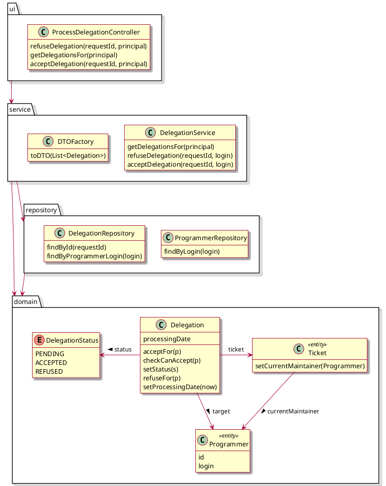

#### 6.2.6. Clore un ticket

##### 6.2.6.1. Classes candidates

~~~plantuml
@startuml
  skin rose
  hide empty members

  class Ticket <<entity>> {
    closed : boolean
    closingDate
    close()
  }

  class TicketClosingUI <<boundary>> {
    closeTicket()
  }

  class TicketClosingWF <<control>> {
    closeTicket()
  }  

  TicketClosingUI ..> TicketClosingWF
  TicketClosingWF .> Ticket
@enduml
~~~

##### 6.2.6.2. Diagramme de séquence
~~~plantuml
  @startuml
  skin rose

  actor Programmer as a0
  boundary CreateProgressReportController as ui
  control TicketLifeService as wf
  entity "t: Ticket" as t
  participant TicketRepository as tdao <<lifecycle>>
  participant ProgrammerRepository <<lifecycle>>

  note over a0, ProgrammerRepository: extension de "Créer un rapport d'avancement"
  a0 -> ui : closeTicket(principal,ticketId)
  ui -> wf : closeTicket(login,ticketId)
  wf -> tdao : findById(ticketId)
  tdao --> wf : t
  wf -> ProgrammerRepository : findByLogin(login)
  ProgrammerRepository --> wf : p
  wf -> t : closeBy(p)
  t -> t : canClose(p)
  alt canClose true
    t -> t : setClosed(true)
    wf -> t : setClosingDate(now)
    wf -> tdao : save(t)
  else
    t --> wf : error
    wf --> ui : error
    ui --> a0 : error
  end
@enduml
~~~

**Note** : en reprenant ce diagramme, la question du `currentMaintainer` est réapparue pour valider le droit d'un programmeur à clôre un ticket.
Globalement, `canClose(p)` équivaut à `this.currentMaintainer.equals(p)`.

##### 6.2.6.3. Diagramme de classes

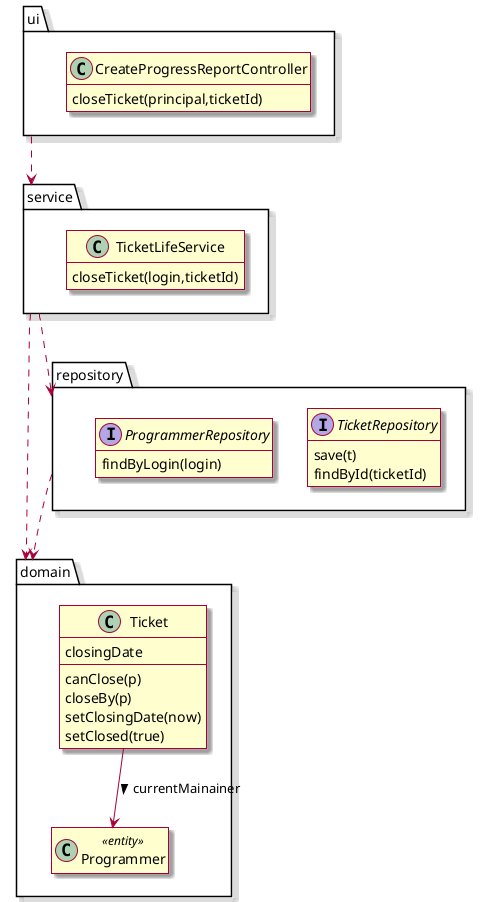

#### 6.2.7. Visualiser un ticket

Ce *use case* est assez complexe, et nous redonnons sa description pour fixer les idées, en surlignant ce qui *pourrait* poser des problèmes. À la réflexion, si c'était à refaire, je distinguerais **deux** use cases : *lister les tickets* et *visualiser un ticket*, même si *lister les ticket*, seul, est d'un intérêt modéré.

- le système liste les tickets **auxquels l'utilisateur a accès**
- il en choisit un ;
- le système affiche toutes les informations sur le ticket :
    - son titre
    - sa description,
    - le client qui l'a créé,
    - sa date de création,
    - son statut,
    - **le premier programmeur en charge du ticket,**
    - sa date de validation ou d'invalidation ;
    - s'il a été invalidé, le texte correspondant ;
    - la liste, **dans l'ordre chronologique,** des **actions** sur le ticket :
        - rapports d'avancement
            - texte écrit par le développeur
            - nom du développeur
            - date
            - clôture éventuelle
        - demande de délégation **(non affichée au client)**
        - refus d'une demande de délégation **(non affichée au client)**
        - acceptation d'une demande de délégation **(vue par le client comme un simple changement de programmeur)**

##### 6.2.7.1. Classes candidates

~~~plantuml
@startuml visualisation-analyse
skin rose
hide empty members
title Visualisation (analyse)

together {
  class Ticket <<entity>> {
    id : Long
    title : String
    description : String
    creationDate : LocalDateTime
    currentMaintainer : Programmer
    closingDate :  LocalDateTime
    evaluationMessage : String
    evaluationDate : LocalDateTime
    state : TicketState

    Ticket(title: String, description: String, c : Client; t: TicketType)
    getProgressReports()
    getDelegations()
    addProgressReport(d: ProgressReport)  
    openAndAssignTo(p: Programmer)
    rejectTicket(message: String)
    getCurrentMaintainer() : Optional<Programmer>
    canClose(p)
    closeBy(p)
    setClosingDate(date)
    setReviewDate(d: LocalDateTime)    
    setClosed(true)
  }

  enum TicketState {
    NEW
    OPEN
    REJECTED
    CLOSED  
  }

  note top of Ticket
  * creationDate est la date de la création du ticket par le client
  * evaluationDate est la date de traitement de la note par le manager.
  end note

  class ProgressReport <<entity>> {
    text
    date
    close
  }

  class Programmer  <<entity>> {}

  class Client  <<entity>> {}

  class Delegation <<entity>> {
    processingDate
    setStatus()
    setProcessingDate()
  }

  enum DelegationStatus {
    PENDING
    ACCEPTED
    REFUSED
  }

  Ticket -> "1" TicketState : > state
  Ticket *-- "*" ProgressReport
  Ticket --> Client : > client
  Ticket --> Programmer : > programmer
  
  Delegation --> Programmer : > target
  Delegation . Ticket
  DelegationStatus . Delegation : < status
}

@enduml
~~~

La visualisation va impliquer la création de **DTOs**. Comme elle est *composite* et assez complexe, le mieux est de proposer pour un ticket une DTO qui aura la structure suivante :

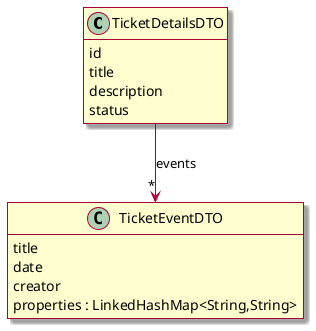

On peut envisager une *hiérarchie* de DTOs ; en utilisant des DTOs différentes pour des événements différents ; mais dans ce cas, la logique d'affichage devient plus complexe. La solution retenue est de rendre le `TicketEventDTO` plus générique. On peut y inclure une *map* de propriétés, dont les noms et les valeurs seront fixées librement. Les valeurs peuvent être des données simples, ou on peut envisager d'y ajouter des informations de typage (ce qui permettrait une représentation différenciée selon les valeurs).

Par exemple, les références à des personnes pourraient donner (dans certains cas) des liens vers la page d'information sur la personne dans la base.

**Représentation par DTO des différents événements**

| champ     | signification                                      |
| --------- | -------------------------------------------------- |
| type      | le titre de l'événement (ex. "création du ticket") |
| date      | la date de l'événement                             |
| initiator | personne à l'origine de l'action                   |

Propriétés à renseigner selon les événements

création du ticket
: les champs de base suffisent ; l'initiator est le client.

ticket rejection
: l'initiator est le manager ; on a de plus un commentaire.

ticket validation
: idem ; on a probablement intérêt à dédoubler la validation en :
- la validation elle même ;
- l'assignation au programmeur d'origine

assignation d'un ticket
: cet événement est implicite dans notre représentation actuelle des entités ; il intervient lors de la validation du ticket, et aussi de l'acceptation d'une délégation. Ses propriétés sont
- le nouveau programmeur ;

rapport d'avancement
: texte du rapport

clôture du ticket
: les champs de base suffisent

demande de délégation
: cible de la délégation (programmeur pressenti), message(s) accompagnant la demande

refus de délégation
: message de refus

acceptation d'une demande de délégation
: les champs de base suffisent ; on créera aussi un DTO pour **l'assignation d'un ticket**.

**Note** : en revenant sur la description de la demande de délégation dans l'expression des besoins, on voit une incohérence entre celle-ci et les choix fais ultérieurement. On avait parlé de ne pas montrer les demandes de délégation au client, mais en fait, l'expression des besoins indique qu'il y a une partie publique et une partie privée lors des délégations, et que le client verra la partie publique **quand la délégation a été acceptée**.

Les droits de l'utilisateur interviennent **deux fois** :

- dans la liste des tickets qu'il visualise
- dans les informations qu'il verra sur les tickets.

On décide d'utiliser le pattern **Strategy** pour ces deux cas.

**Note** : à la réflexion, on pourrait aussi imaginer que l'objet qui représente l'utilisateur ait une méthode qui permette de renvoyer les tickets qu'il peut voir. Ce serait assez sympathique d'un point de vue métier, mais un peu coûteux à implémenter de manière efficace.

On s'aperçoit aussi d'un problème annexe. Comme le comportement attendu dépend des droits et du type d'utilisateur, il faut pouvoir le gérer d'une manière assez uniforme. On décide de créer une interface `UserInfoService`, qui permettra d'accéder à un objet `UserInfoDTO` :

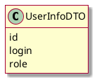

Les données de cet objet permettront de savoir quels sont les droits de l'utilisateur et de l'identifier précisément.

##### 6.2.7.2. Diagramme de séquences

On utilise le *pattern* **Strategy** pour gérer les différences de comportement selon les types d'utilisateur. On a donc une stratégie de liste de tickets, et une stratégie de visualisation d'un ticket.

~~~plantuml
  @startuml
  skin rose
  title Visualisation d'un ticket pour un client

  actor User as u
  boundary ViewTicketController as ui
  control TicketDisplayService as wf
  participant UserInfoService
  participant "st: TicketListStrategy" as st
  participant "vt: TicketViewStrategy" as vt
  participant "l: TicketDetailsDTO" as l

  participant TicketInfoDTOFactory 

  entity "t: Ticket" as t
  participant DelegationRepository as dao1 <<lifecycle>>
  participant TicketRepository as dao <<lifecycle>>
  participant ClientRepository as dao3 <<lifecycle>>

  u -> ui : listTicketsUserCanSee(principal)
  ui -> UserInfoService : getUserInfo(principal.getName())
  UserInfoService --> ui : u
  ui -> wf : listTicketsUserCanSee(u)
    note right
    u est un client
    end note
    wf -> wf : st = clientStrategy
    wf -> st : listTicketsUserCanSee(u)
    st-> dao3 : getReferenceById(u.getId())
    st -> dao : findByClient(client)
    dao --> wf : tickets
    wf -> TicketInfoDTOFactory : toSummaryDTO(tickets)
    TicketInfoDTOFactory --> wf : dtos
    wf --> ui : dtos        
  
  u -> ui : getTicket(principal, ticketId)
  ui -> UserInfoService : getUserInfo(principal.getName())
  UserInfoService --> ui : u
  ui -> wf : canSee(u, ticketId)
  wf -> dao : findById(login)
  dao --> wf: t
  wf -> t : canSee(u)
  wf --> ui : true
  ui -> wf : getTicketView(t,u)
  wf -> wf: vt = clientViewStrategy
  wf -> vt : getTicketDetailsDTO(t,u)
  loop d: t.getProgressReport()
    vt -> vt : getDTOsFor(d)    
    vt -> l : add(dtos)
  end
  loop d: t.getDelegations()
    vt -> l : add(d) if needed
  end
  vt --> wf : l  
  wf --> ui : l
  ui -> u
@enduml
~~~

~~~plantuml
  @startuml
  skin rose
  title Visualisation d'un ticket pour un programmeur

  actor User as u
  boundary ViewTicketController as ui
  control TicketDisplayService as wf
  participant UserInfoService
  participant "st: TicketListStrategy" as st
  participant "vt: TicketViewStrategy" as vt
  participant "l: TicketDetailsDTO" as l

  participant TicketInfoDTOFactory as factory

  entity "t: Ticket" as t
  participant DelegationRepository as dao1 <<lifecycle>>
  participant TicketRepository as dao <<lifecycle>>
  participant ProgrammerRepository as daoProg <<lifecycle>>

  u -> ui : listTicketsUserCanSee(principal)
  ui -> UserInfoService : getUserInfo(principal.getName())
  UserInfoService --> ui : u
  ui -> wf : listTicketsUserCanSee(u)
    note right
    u est un programmeur
    end note
    wf -> wf : st = programmerStrategy
    wf -> st : listTicketsUserCanSee(u)
    st-> daoProg : getReferenceById(u.getId())
    st -> dao : findByFirstMaintainer(p)
    st -> dao1 : findByTarget(p)
    st --> wf : tickets
    wf -> factory : toSummaryDTO(tickets)
    factory --> wf : dtos
    wf --> ui : dtos        
  
  u -> ui : getTicket(principal, ticketId)
  ui -> UserInfoService : getUserInfo(principal.getName())
  UserInfoService --> ui : u
  ui -> wf : canSee(u, ticketId)
  wf -> dao : findById(login)
  dao --> wf: t
  wf -> t : canSee(u)
  wf --> ui : true
  ui -> wf : getTicketView(t,u)
  wf -> wf: vt = programmerViewStrategy
  wf -> vt : getTicketDetailsDTO(t,u)
  loop d: t.getProgressReport()
    vt -> vt : getDTOsFor(d)    
    vt -> l : add(dtos)
  end
  loop d: t.getDelegations()
    vt -> l : add(d) if needed
  end
  vt --> wf : l  
  wf --> ui : l
  ui -> u
@enduml
~~~

Le diagramme de séquence pour un **Manager** n'apporte pas grand chose, car il est plus simple. On liste tous les tickets.
##### 6.2.7.3. Diagramme de classes

~~~plantuml
@startuml
skin rose
hide empty members

package ui {
 class ViewTicketController{
    listTicketsUserCanSee(principal)
    getTicket(principal, ticketId)
  }
}

ui -> service.TicketDisplayService
ui -> service.UserInfoService

package service {

  class TicketDisplayService{    
    listTicketsUserCanSee(u)
    canSee(u, ticketId)
    getTicketView(t,u)
  }

  class UserInfoService{
    getUserInfo(String) : User
  }

  package dto {
    class User{
      
    }

    class TicketInfoDTOFactory{
      toSummaryDTO(tickets)
    }
  }

  package ticketView {
    
    interface TicketViewStrategy{
      getDTOsFor(User)
      getTicketDetailsDTO(Ticket,User)
    }

    TicketViewStrategy <|.. ClientTicketViewStrategy
    TicketViewStrategy <|.. ProgrammerTicketViewStrategy 
    TicketViewStrategy <|.. ManagerTicketViewStrategy
    TicketViewStrategy .> TicketDetailsDTO

    class TicketDetailsDTO {
      id
      title
      description
      status
      add(List<TicketEventDTO>)          
    }

    class TicketEventDTO {
      titre
      date
      creator
      properties : LinkedHashMap<String,String>
    }

    TicketDetailsDTO --> "*" TicketEventDTO: events
  }

  interface TicketListStrategy{
    listTicketsUserCanSee(u)
  }

  TicketDisplayService ..> TicketViewStrategy
  TicketDisplayService ..> TicketListStrategy
  TicketDisplayService ..> TicketInfoDTOFactory
    
}

package repository {
  class ClientRepository{
    getReferenceById(u.getId())
  }

  class TicketRepository{
    findById(login)
    findByFirstMaintainer(p)
    findByClient(client)
  }
  
  class ProgrammerRepository{
    getReferenceById(u.getId())
  }

  class DelegationRepository{
    findByTarget(p)
  }
  

}

package model {

  class Ticket <<entity>> {
    canSee(u)
  }
}

@enduml
~~~

## 7. Regroupement des classes

Lors de la consolidation, les questions suivantes sont soulevées :

- Comment gérer les différentes classes qui représentent les acteurs ? en effet, il n'est pas impossible qu'un programmeur soit aussi un manager (ça n'est pas dans les *use cases*, mais on sent bien que c'est un choix qui pourrait être fait) ;
    - on pourrait avoir une classe unique (pour Manager et Programmer), avec simplement des droits ; ça donnerait la possibilité de modifier les règles métier à moindre frais. `Client` est peut-être une classe à part. Encore que, si l'application est aussi utilisée en interne...
    - on pourrait avoir un système d'héritage formel entre entités ;
    - on pourrait utiliser `MappedSuperclass`, pour avoir un héritage d'implémentation mais non un héritage entre entités ;

### 7.1. Groupe domaine

Un point important est que l'objet `Ticket` va conserver des informations qu'on pourrait recalculer, comme le `currentMaintainer` ou l'état du ticket. Dans une architecture CQRS pure, on aurait une *source de vérité* qui serait l'historique des évémenents, et la vision du ticket serait une projection de celui-ci. Dans notre cas, nous avons jugé plus simple de stocker dans `Ticket` des information importantes qui demanderaient une recherche dans l'historique des événements pour être calculées.

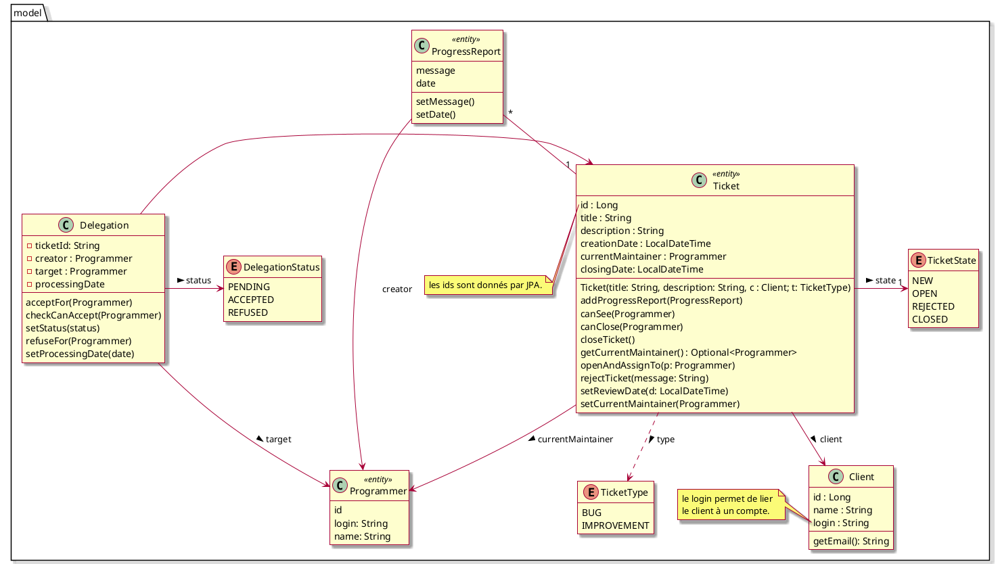

### 7.2. Groupe cycle de vie

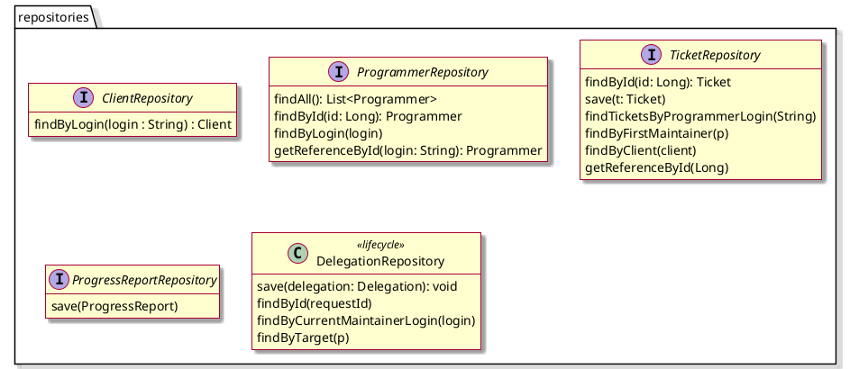

### 7.3. Groupe Service

```plantuml
@startuml
skin rose
hide empty members

package services {

  class TicketLifeService {
    closeTicket(ticketId, login)
    createTicket(CreateTicketRequest) : Long
    rejectTicket(id: Long)
    validateTicket(id: Long,programmerId: Long)
  }

  class ProgressReportService {
    canCreateReport(ticketId, login) : boolean
    createProgressReport(ReportCreationData)

  }

  class DelegationService {
    getDelegationsFor(login)    
    acceptDelegation(requestId, login)
    canDelegate(ticketId, login): boolean
    createDelegation(request: DelegationDTO): void
    refuseDelegation(requestId, login)
  }

  class DashBoardService {
    
  }

  class TicketDisplayService {
    canSee(u, ticketId)        
    getTicketView(t,u)
    listTicketsUserCanSee(u)

  }

  class TicketModelService {
    - ticketRepository: TicketRepository
    - programmerRepository: ProgrammerRepository
    findTicketById(ticketId) : TicketDTO
    listTicketsManagedByProgrammer(login) : List<TicketDTO>
    findAllProgrammers() : List<ProgrammerDTO>           

  }


  package dto {
    class DelegationDTO {
      ticketId : Long
      creatorLogin : String
      targetLogin : String
      publicText : String
      privateText : String
    }

    class ProgrammerDTO {
        - login: String
        - name: String
        - // other attributes
    }

    class DTOFactory {
      toDTO(programmers: List<Programmer>): List<ProgrammerDTO>
      toDTO(List<Delegation>)

    }   

    class CreateTicketRequest {
      title : String
      description : String
      type : String
      login : String
    }

    class DTOFactory {
      toDTO(Programmer): ProgrammerDTO
      toDTO(List<Ticket>) : List<TicketDTO>
      toDTO(Ticket) : TicketDTO    
    }

    class ProgrammerDTO {
      id: Long 
      name: String
      ...
    }

    note right of ProgrammerDTO
      détails à discuter. 
      Le mail pourrait être intéressant.
    end note

    class TicketDTO {}

    class ReportCreationData {
      ticketId
      login
      message
    }



    class User{
    
    }
  }


  class UserInfoService{
    getUserInfo(String) : User
  }

  package ticketView {
    
    interface TicketViewStrategy{
      getDTOsFor(User)
      getTicketDetailsDTO(Ticket,User)
    }

    TicketViewStrategy <|.. ClientTicketViewStrategy
    TicketViewStrategy <|.. ProgrammerTicketViewStrategy 
    TicketViewStrategy <|.. ManagerTicketViewStrategy
    TicketViewStrategy .> TicketDetailsDTO


    class TicketDetailsDTO {
      id
      title
      description
      status
      add(List<TicketEventDTO>)          
    }

    class TicketEventDTO {
      titre
      date
      creator
      properties : LinkedHashMap<String,String>
    }

    TicketDetailsDTO --> "*" TicketEventDTO: events
  }

  interface TicketListStrategy{
    listTicketsUserCanSee(u)
  }

  TicketDisplayService ..> TicketViewStrategy
  TicketDisplayService ..> TicketListStrategy
  TicketDisplayService ..> TicketInfoDTOFactory
    
}

package mail {
  class MessagerService {
    mailTo(email: String, MailMessage)    
  }

  class MailMessage {
    subject: String
    text: String
  }

  MessagerService ..> MailMessage
  TicketLifeService ..> MessagerService

}
@enduml
```

### 7.4. Groupe interface utilisateur et système

```plantuml
@startuml
skin rose
hide empty members

package ui {
  class CreateTicketController {
    getForm(Model) : String
    createTicket(CreateTicketForm, Principal, Model) : String
  }


  class CreateTicketForm {
    title : String
    description : String
    type : String
  }

  CreateTicketController .> CreateTicketForm

  class ValidateTicketController {
    showValidationForm(id: long, m: Model) : String
    validateTicket(id: Long, programmerId: Long) : String
    rejectTicket(id: Long) : String
  }

  class CreateProgressReportController <<boundary>> {
    getTicketSelectionForm(Principal)
    getNewReportFormFor(Principal,ticketId)
    createReport(ReportForm, Principal)
    - createReportData(progressReportForm, principal)
  }

  package uiDTO {
    class TicketViewDTO {
      id : Long
    }

    class ReportForm {
      ticketId
      message
    }
  }

  class DelegateTicketController {
        + getDelegationForm(ticketId: String): DelegationForm
        + postDelegation(form: DelegationForm, principal: String): void
  }

  package uiForm {
        class DelegationForm {
            - ticketId: String
            - targetLogin: String
            - publicText : String
            - privateText : String
        }
  }

  package ui {
    class ProcessDelegationController{
      refuseDelegation(requestId, principal)
      getDelegationsFor(principal)
      acceptDelegation(requestId, principal)
    }


  class CreateProgressReportController{
    closeTicket(principal,ticketId)
  } 

  class ViewTicketController{
    listTicketsUserCanSee(principal)
    getTicket(principal, ticketId)
  }
}


}
@enduml
```

## 8. Choix, questions ouvertes et remarques

### 8.1. Modifications apportées lors de la rédaction des documents de conception

Nous avons laissé le document d'analyse dans son état d'origine. Mais la rédaction du document de conception a laissé paraître plusieurs défauts ou manques de l'analyse. Nous les avons conservés tels quels, parce que c'est plus parlant pour comprendre comment le travail peut évoluer (et que ce document ne vise pas tellement à préparer l'écriture d'un « vrai » logiciel, mais à expliquer comment on s'y prend).

Ces évolutions, et les modifications qu'elles impliquent sur des schémas déjà écrits, plaident en faveur de l'utilisation d'un logiciel comme Visual Paradigm ou Star UML.

Les différences entre les versions `1.1` et `1.2` de la conception sont minimes. Il s'agit essentiellement des parties rédactionnelles. En reprenant le problème, alors que nous étions très tentés par la modélisation événementielle, nous avons été confortés, en révisant les *use cases* et en prenant du recul, dans notre choix d'utiliser une modélisation mixte, en séparant la visualisation de l'historique de la gestion du ticket.

#### 8.1.1. Clôture des tickets

En travaillant sur la clôture des tickets, il est apparu qu'il fallait savoir qui était en charge du ticket à un moment donné. C'est correctement géré par le *Use Case* [Valider un ticket](#522-valider-un-ticket), mais pas par le système de délégation de ticket.

Globalement, dans l'état d'origine de l'analyse :

- on avait, dans le ticket lui-même, la connaissance du premier programmeur en charge de celui-ci ;
- pour connaître le programmeur *actuellement* responsable d'un ticket, il fallait regarder l'historique des délégations.

Ça n'est pas très cohérent.

Au vu du cahier des charges, on décide donc de revenir (très légèrement) sur l'analyse, et d'ajouter dans celle-ci :

> *en cas d'acceptation d'une délégation de ticket, le destinataire de la délégation devient le programmeur en charge du ticket*.

### 8.2. Event sourcing et CQRS

Le modèle actuel permet de représenter les tickets, mais la production de la **visualisation** de leur historique est un peu complexe. On peut sérieusement, avec un peu d'expérience, trouver qu'il faudrait aller plus loin, et introduire une notion *d'événements*, qui permettraient de conserver, de manière structurée, toutes les actions qui sont effectuées sur un ticket. Ce qui n'empêcherait pas de conserver, de manière redondante, dans l'objet Ticket, son état actuel.

Dans des cas complexes (comme en particulier les systèmes de réservation), on utilise souvent les patterns d'[Event Sourcing](https://martinfowler.com/eaaDev/EventSourcing.html) et de [CQRS (Command and Query Responsibility Segregation)](https://martinfowler.com/bliki/CQRS.html). L'**Event Sourcing** est intéressant, mais a un surcoût en terme de complexité du logiciel.

Je renvoie aussi, sur le sujet de l'**Event Sourcing**, à [Betts, Dominic, Julián Domínguez, Grigori Melnick, Fernando Simonazzi, and Mani Subramanian. 2012. **Exploring CQRS and Event Sourcing**](https://www.microsoft.com/en-us/download/details.aspx?id=34774).

Une idée intéressante de l'*event sourcing* est que l'événement n'est pas la **commande** qui a déclenché une action, mais le **résultat** de celle-ci. Les évéments sont donc plus robustes face à des modifications éventuelles du code. Par exemple, si une règle métier change, on ne veut généralement pas l'appliquer de manière rétroactive.

En regardant de près le *Use Case* « Visualiser un ticket », on constate deux phénomènes :

- d'abord, l'expression des besoins demande de lister **dans l’ordre chronologique, des actions sur le ticket.** Ce choix plaide très fortement pour l'utilisation d'une classe commune à toutes les actions effectuées sur un ticket, ce qui permettrait de les placer dans une même collection et de les trier ;
- ensuite, **l'affichage effectué dépend du lecteur.** Certaines actions sont vues par le client d'une manière différente de ce qui est montré au programmeur ou au manager. On règle ce problème au niveau de la production des **DTO**.

### 8.3. Les dates

Quelle classe choisir pour représenter les dates locales (les dates sur le serveur) ?

Il faut éviter les classes `java.util.Date` ou `java.util.Calendar`, qui sont mal conçues.

On pourrait penser à utiliser `java.time.LocalDate` ou `java.time.LocalDateTime`, qui sont bien conçues, ou leurs versions avec fuseau horaire. Ces classes ont des définitions précises et sont bien conçues, cependant, elles posent éventuellement des problèmes :

- **si le serveur est déplacé** par exemple pour un hébergement dans le cloud, on a une modification des dates (avec `LocalDate`);
- les heures locales ont un comportement assez curieux lors des passages à l'heure d'hivers (on revient en arrière!);
- la classe `java.time.Instant` est un *timestamp* sur la zone **UTC**, sans changement d'heure.
- on peut envisager de l'utiliser comme implémentation interne, et de passer à une heure non UTC pour l'affichage.

Notez qu'il y aura un « bug de l'an 2000 » avec la classe `Instant` en l'an  1 000 000 000. Ça devrait laisser un peu de temps.

### 8.4. Critique de cette version du modèle de conception

- il faudrait revenir un peu sur les packages. Nous avons pour l'instant pris l'analyse initiale en composants, et nous avons en fait représenté la plupart de ces composants par un simple **service**, en gardant notre architecture initiale relativement monolithique.

- pour la partie `ui`, il faudrait utiliser des sous-packages pour les diverses tâches. On se perd entre les différentes `DTOs.`

- il faut aussi unifier les concepts et les dénominations ; par exemple, choisir une manière de voir les utilisateurs plus unifiées, se donner et respecter des conventions plus strictes pour le nommage des différents éléments, etc.

- Nous avons écarté la modélisation par événements ; la classe `Ticket` a en conséquence énormément de responsabilités. On pourrait déplacer celles-ci sur l'état du ticket, qui pourrait éventuellement gérer les opérations possibles.

### Modifications possibles

- Pour la gestion des délégations, on pourrait distinguer :
    - la demande de délégation ;
    - l'acceptation de la délégation ;
    - le refus de la délégation ;
- la logique du ticket dépend de son **état**. Certaines opérations sont possibles à un instant *t* et impossible à d'autres moments. Par exemple, on ne peut pas créer de rapport sur un ticket clôt ou pas encore validé. On peut donc penser à utiliser le *Design Pattern* **State/État** pour gérer les différentes étapes du ticket.

On pourrait créer une **interface** `TicketState` (ou une classe abstraite). Les différents cas peuvent être gérés en java, soit en utilisant le pattern **Visitor** pour appliquer des traitements différents selon les états, soit en faisant de l'interface `TicketState` une *sealed interface*, et en utilisant le *pattern matching* (introduit dans les versions récentes de Java). Notez que logiquement, une action sur un état produit l'état suivant. Par exemple, sur un `NewTicketState`, l'action de validation pourrait retourner l'état `ActiveTicketState` ; sur un `ActiveTicketState`, l'action de clôture pourrait retourner un `ClosedTicketState`, tandis que l'action de délégation pourrait retourner un `ActiveTicketState`, en ayant modifié les données du ticket.

On peut envisager (mais ce n'est pas le cas ici), que certaines actions puissent produire des états différents selon les circonstances.

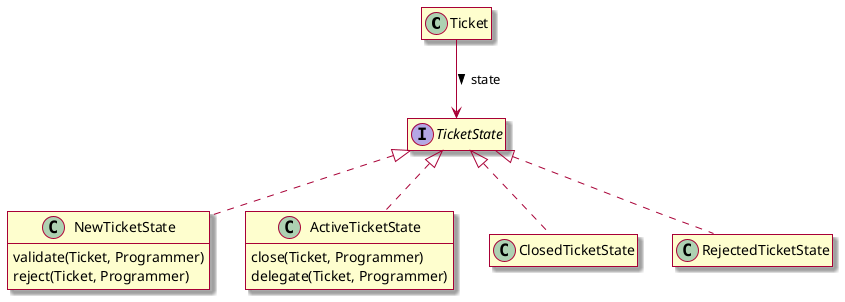

Les sous-classes de `TicketState` implémentent les opérations possibles sur le ticket, en rejetant celles qui ne sont pas possibles, ce qui allège le code de la classe `Ticket` et respecte mieux le *single responsibility principle*.

## 9. Annexes
### 9.1. Terminologie
### 9.2. Autre annexes

#### 9.2.1. Bibliographie
Sur le *Domain Driven Design*

- Avram A., Marinescu F. *Domain-Driven Design Quickly: A Summary of Eric Evans’ Domain-Driven Design* [En ligne]. C4Media, 2006. (Enterprise Software Development Series). [lien](https://www.infoq.com/fr/minibooks/domain-driven-design-quickly)
- Evans E. *Domain-driven design: tackling complexity in the heart of software.* Boston : Addison-Wesley, 2004.
- Evans E. *Domain-driven design reference: definitions and pattern summaries.* Indianapolis, 2015. [lien](https://www.domainlanguage.com/wp-content/uploads/2016/05/DDD_Reference_2015-03.pdf) (résumé des patterns)
- Gandhi, Raju, Mark Richards, and Neal Ford. 2024. *Head First Software Architecture.* First edition. Head First. O’Reilly Media, Inc.
- Martin R. C. Clean architecture: a craftsman’s guide to software structure and design. London, England : Prentice Hall, 2018.
- [Projet Cargo](https://github.com/citerus/dddsample-core) un projet qui implémente l'exemple du livre d'Evans
- [Domain Driven Design and Development In Practice](https://www.infoq.com/articles/ddd-in-practice/)

