# Projet *Réservation de salles* : Conception v1.0

## 1. Table des matières

\tableofcontents
\newpage

## 2. Objectif du document

Ce document aborde l'architecture, la conception et les choix techniques pour l'implémentation du projet "Réservation de salles". Les diagrammes suivent le langage de modélisation UML et la méthodologie Arrington.

- On commencera par énumérer les diverses contraintes techniques qui pèsent sur notre projet ;
- on décrira ensuite les technologies choisies ;
- puis l'architecture ;
- et enfin, nous décrirons le design de notre système en revenant sur les *use cases*.

## 3. Architecture

### 3.1. Choix des technologies

Le système est découpé en deux parties distinctes : un **backend** Spring Boot exposant une API REST, et un **frontend** Vue.js qui consomme cette API. Ce choix découple clairement la logique métier de la présentation, ce qui facilite la maintenance et l'évolution indépendante de chaque partie.

Les points à considérer sont en particulier :

- la complexité de l'interface utilisateur ;
- les contraintes de déploiement ;
- le nombre d'utilisateurs ;
- la sécurité ;
- les performances et le passage à l'échelle.

#### 3.1.1. Administration du système

- opérations essentiellement CRUD (gestion des comptes, des salles, des réservations, etc) ;
- l'administrateur est un utilisateur interne ;
- sécurité importante : accès réservé aux administrateurs.

Une interface web classique est suffisante. La même application Vue.js pourra proposer des vues spécifiques aux administrateurs, protégées par le système d'authentification.

#### 3.1.2. Côté utilisateurs

- les utilisateurs consultent et filtrent la liste des salles disponibles ;
- ils effectuent, modifient et annulent des réservations ;
- ils reçoivent des notifications par mail.

L'application Vue.js fournit une interface fluide sans rechargement de page complet. Les interactions avec l'API REST permettent de filtrer les salles dynamiquement et de gérer les réservations en temps réel.

#### 3.1.3. Côté responsables

- les responsables gèrent les salles, les équipements et les plages de disponibilité ;
- ils valident ou rejettent les demandes de réservation ;
- l'interface est plus riche que celle des utilisateurs simples, mais reste dans les capacités d'une SPA (Single Page Application) Vue.js.

### 3.2. Contraintes techniques

- le système doit être accessible de l'extérieur via HTTPS ; le conteneur frontend (Nginx) est le seul point d'entrée exposé, le backend n'est joignable que depuis le réseau interne ;
- le backend expose une API REST ; le frontend Vue.js est une application distincte qui consomme cette API à travers le reverse proxy Nginx ;
- le système doit être fiable pour l'envoi de mails (confirmation de réservation, annulation, etc) ;
- l'application doit être raisonnablement sécurisée (authentification JWT, HTTPS, validation des données côté serveur).

**Deux architectures de déploiement sont envisagées** :

- **Architecture simple** (cible initiale) : un seul conteneur backend, un seul conteneur frontend, une seule base de données PostgreSQL. Suffisante pour un établissement d'enseignement à charge modérée. C'est cette architecture qui sera mise en place en premier.
- **Architecture avec load balancer** (évolution possible) : si la charge augmente, on peut passer à une architecture horizontalement scalable avec un load balancer devant plusieurs instances du backend. L'utilisation de **tokens JWT sans état** (*stateless*) facilite cette évolution : aucune session côté serveur n'est à partager entre les instances.

## 4. Technologies utilisées

### 4.1. Serveur web

Pour des raisons de facilité de maintenance, on choisit d'utiliser une application **Spring Boot** hébergée dans un conteneur Docker. Le serveur utilisé sera le serveur **Tomcat embarqué**. Le backend expose uniquement des endpoints REST (pas de rendu de templates côté serveur).

### 4.2. Stockage des données

Les données seront stockées dans une base **PostgreSQL**, aussi bien en développement qu'en production. Ce choix garantit la cohérence entre les environnements et évite les comportements inattendus liés aux différences entre bases de données.

### 4.3. Couche de persistance

La couche de persistance sera **JPA/Hibernate**. Les entités seront annot   ées JPA, et les repositories seront des interfaces Spring Data JPA.

### 4.4. Couche métier

La couche métier sera composée d'entités JPA et d'implémentations de services Spring (`@Service`). Les règles métier importantes (vérification de disponibilité, gestion des conflits de réservation, transitions d'état) seront encapsulées dans les entités ou dans des classes de service dédiées.

### 4.5. Couche service et API REST

La couche service est isolée de la couche présentation via des **DTOs**. Les **contrôleurs REST** (`@RestController`) exposent les endpoints JSON, et délèguent le traitement aux services. Cette séparation permet de tester les services indépendamment des contrôleurs.

### 4.6. Couche présentation

La couche présentation est entièrement gérée par **Vue.js**, une application SPA. Elle communique avec le backend via des appels HTTP (Axios) adressés à des **URL relatives** (`/api/…`). Le build Vue.js produit des fichiers statiques (HTML, CSS, JS) qui sont servis par **Nginx**.

Nginx assure deux rôles dans le même conteneur frontend :

- **serveur de fichiers statiques** pour l'application Vue.js ;
- **reverse proxy** vers l'API : les requêtes `/api/` sont relayées vers le conteneur backend.

Le navigateur ne dialogue donc qu'avec Nginx, sur une **origine unique**, ce qui supprime le besoin de configuration CORS et évite d'exposer le backend directement. Ce choix est cohérent avec l'architecture horizontalement scalable retenue : les instances Spring Boot ne gèrent que l'API REST, et Nginx reste le seul point d'entrée du système.

### 4.7. Authentification

L'authentification sera gérée par **Spring Security** avec des **tokens JWT**. Le frontend envoie ses identifiants, reçoit un token, et l'inclut dans l'en-tête `Authorization` de chaque requête. Ce mécanisme est adapté à une architecture découplée frontend/backend.

On pourra envisager dans un second temps l'utilisation de **Keycloak** pour une gestion plus avancée des identités.

### 4.8. Environnement de développement

Les projets backend seront manipulés via **Gradle**. Le projet frontend utilisera **npm** avec **Vite** comme outil de build. Les développeurs utilisent l'IDE de leur choix.

### 4.9. Tests

- Tests unitaires backend : **JUnit** ;
- Tests d'intégration : **Spring Boot Test** avec base PostgreSQL (via **Testcontainers**) ;
- Tests frontend : **Vitest** (ou Jest) pour les composants Vue.

### 4.10. Packages et dépendances

Un découpage par modules permet de proposer les composants backend suivants :

- `compte` : gestion des demandes de création de compte, validation, refus, et gestion des informations utilisateur ;
- `salle` : gestion des salles, des équipements et des plages de disponibilité ;
- `reservation` : cycle de vie des réservations (création, validation, rejet, annulation) ;
- `notification` : envoi de mails (confirmation de réservation, annulation, validation de compte) ;
- `auth` : authentification et gestion des tokens JWT.

Chaque composant suit la même structure interne :

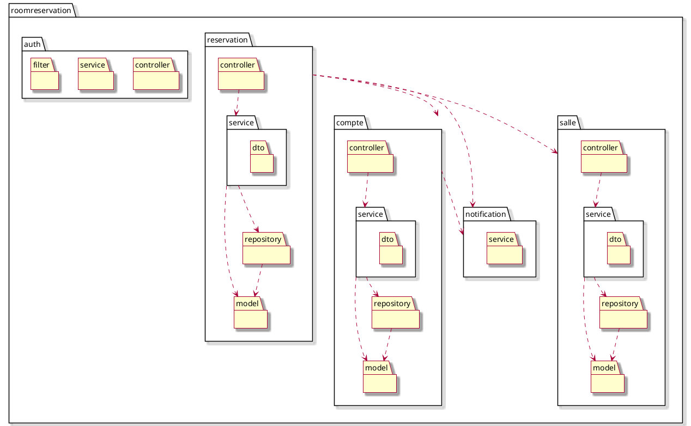

À chaque composant correspond un (ou plusieurs) `@RestController` qui sert de **façade** et communique avec la couche de présentation à travers des **DTOs**. Les entités JPA ne sont jamais exposées directement dans l'API.

### 4.11. Déploiement

#### 4.11.1. Architecture simple (cible initiale)

Un seul conteneur par composant : frontend, backend, base de données. Orchestration via **Ansible playbook** ou **Docker Compose**.

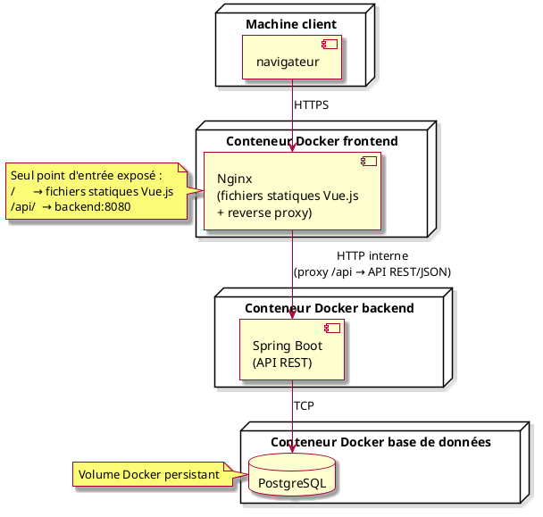

- le conteneur frontend est le **seul point d'entrée exposé** : Nginx sert les fichiers statiques Vue.js et relaie les requêtes `/api/` vers le backend ;
- le navigateur ne connaît donc qu'une seule origine : aucun appel direct à l'API, pas de configuration CORS, et un seul certificat HTTPS à gérer ;
- le backend Spring Boot expose l'API REST sur le réseau interne Docker uniquement (`backend:8080`) ; son port n'est pas publié vers l'extérieur ;
- la base de données PostgreSQL est dans son propre conteneur avec un volume persistant.

#### 4.11.2. Architecture avec load balancer (évolution horizontale)


Si la charge augmente, on peut multiplier les instances backend derrière un **load balancer**. Le frontend reste servi par un **Nginx** unique, les fichiers statiques Vue.js n'ont pas besoin d'être scalés. Le principe du point d'entrée unique est conservé : le navigateur ne s'adresse toujours qu'à Nginx, qui relaie les requêtes `/api/` vers le load balancer au lieu de les relayer vers un backend unique.

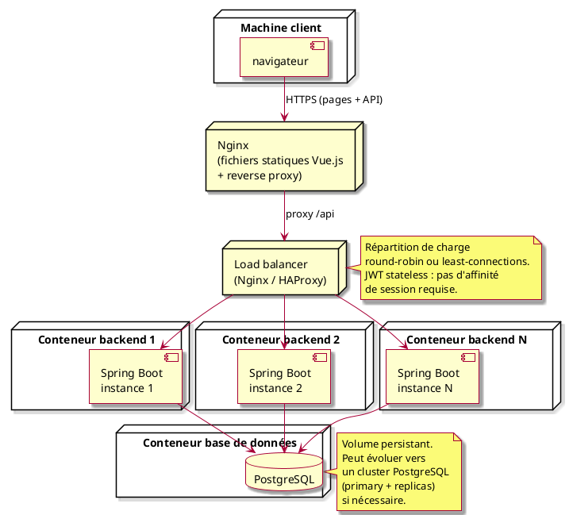

- le frontend Vue.js est servi par un **Nginx** unique, les fichiers statiques étant identiques pour tous les utilisateurs ; il reste le seul point d'entrée exposé et relaie les requêtes `/api/` vers le load balancer ;
- le **load balancer** distribue les appels API REST entre les instances Spring Boot ; il n'est pas joignable directement depuis l'extérieur ;
- les tokens **JWT étant sans état**, n'importe quelle instance peut traiter n'importe quelle requête sans partage de session ;
- la base de données PostgreSQL reste centralisée ; elle peut évoluer vers un cluster (primary + replicas en lecture) si elle devenait un goulot d'étranglement ;
- cette architecture peut être gérée **Ansible** ou **Kubernetes** selon les besoins.

## 5. Préliminaire à la conception

Les entités principales identifiées lors de l'analyse sont :

- `Compte` : représente un compte utilisateur dans le système ;
- `DemandeCreationCompte` : représente une demande de création de compte en attente de validation ;
- `Salle` : représente une salle pouvant être réservée ;
- `Equipement` : représente un équipement disponible dans une salle ;
- `PlageDisponibilite` : représente une plage horaire durant laquelle une salle est disponible ;
- `Reservation` : représente une réservation effective ;
- `DemandeReservation` : représente une demande de réservation en attente de traitement.

## 6. Cas d'utilisation

On choisit de développer un sous-ensemble cohérent des fonctionnalités, en commençant par les cas prioritaires identifiés en analyse.

### 6.1. Rappel : modèle trouvé en analyse

Le modèle issu de l'analyse est un point de départ qui sera affiné pendant la conception.

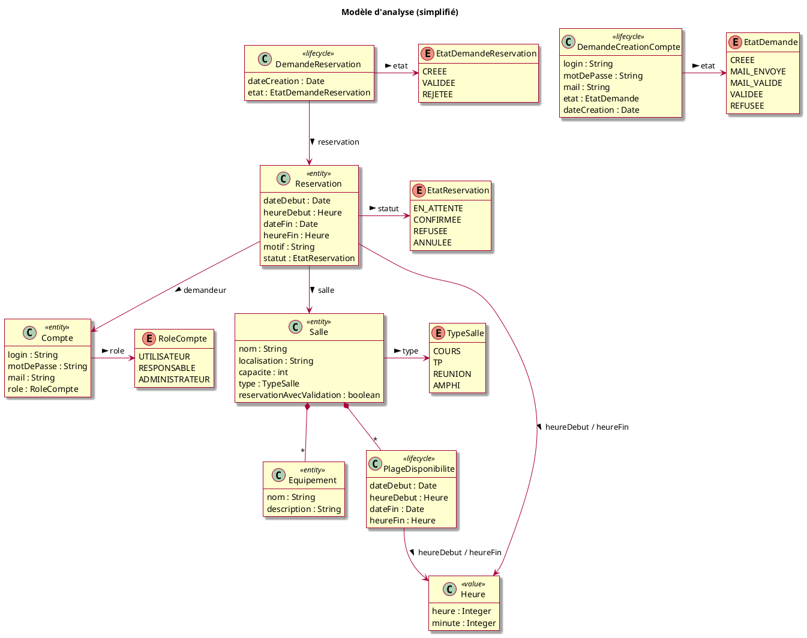

### 6.2. Groupe 1 : Gestion des comptes

Les quatre cas de gestion des comptes s'appuient sur `CompteController` et `ServiceCompte`. La persistance est assurée par `CompteRepository` et `DemandeCreationCompteRepository`.

#### 6.2.1. Déposer une demande de création de compte

##### Endpoints :
- `POST /api/comptes/demandes` : soumettre la demande
- `GET /api/comptes/demandes/valider?token={token}` : valider le mail via le lien reçu

Un champ `tokenValidation` est ajouté à `DemandeCreationCompte` pour sécuriser le lien de validation envoyé par mail. Le mot de passe est haché (BCrypt) avant la persistance. Lorsque l'utilisateur clique sur le lien reçu, `validerMail` retrouve la demande via son token et la fait passer à l'état `MAIL_VALIDE` ; elle devient alors visible des administrateurs.

##### Classes de conception

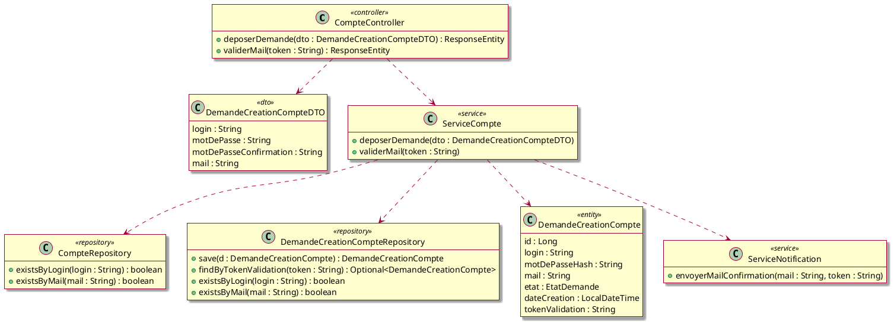

##### Séquence

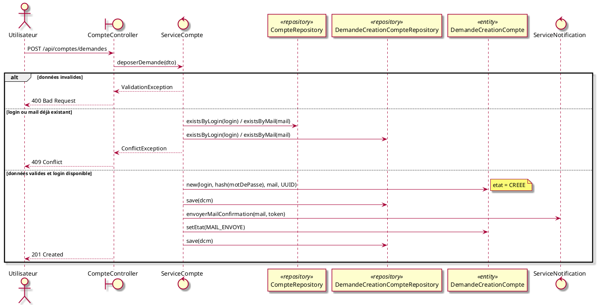

#### 6.2.2. Consulter les demandes de création de compte en attente

##### Endpoints :
- `GET /api/comptes/demandes` (accès restreint aux administrateurs ; retourne les demandes en état `MAIL_VALIDE`)

##### Classes de conception

Aucune nouvelle classe. On ajoute un DTO de réponse et une méthode au repository.

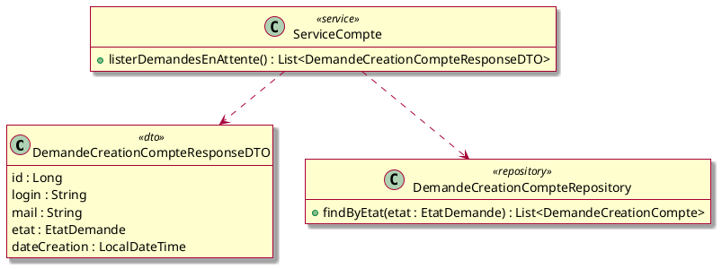

##### Séquence

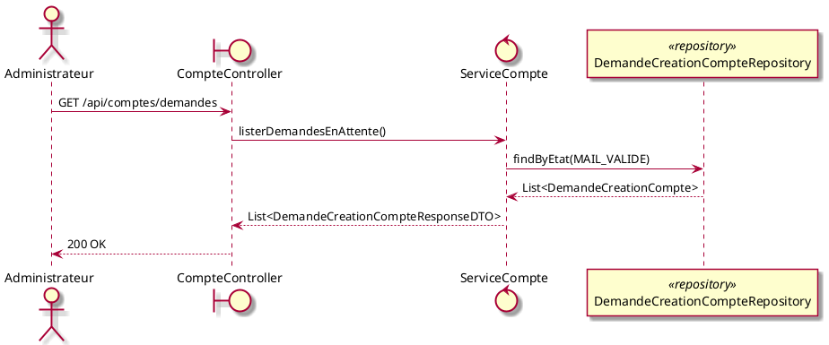

#### 6.2.3. Valider une demande de création de compte

##### Endpoints :
- `PUT /api/comptes/demandes/{id}/valider` (accès restreint aux administrateurs)

La validation crée un `Compte` à partir des données de la `DemandeCreationCompte`, puis passe la demande à l'état `VALIDEE`.

##### Classes de conception

Aucune nouvelle classe. On utilise `CompteController`, `ServiceCompte`, `DemandeCreationCompteRepository`, `CompteRepository`, `Compte` et `ServiceNotification`.

##### Séquence

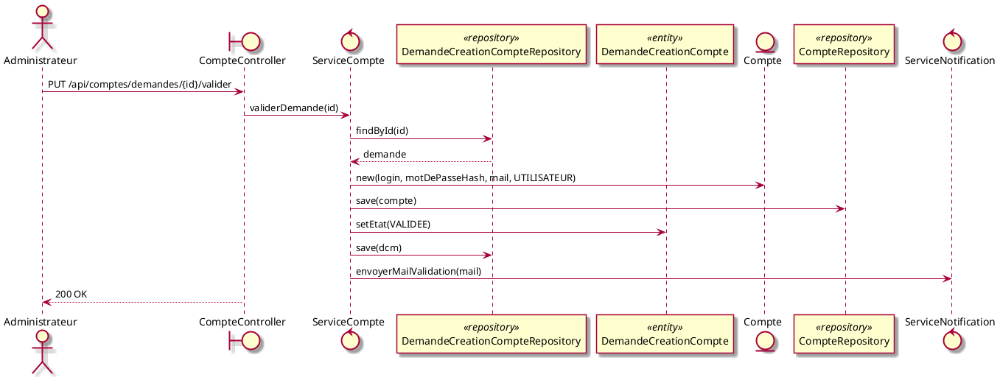

#### 6.2.4. Refuser une demande de création de compte

##### Endpoints :
- `PUT /api/comptes/demandes/{id}/refuser` (accès restreint aux administrateurs)

##### Classes de conception

Aucune nouvelle classe.

##### Séquence

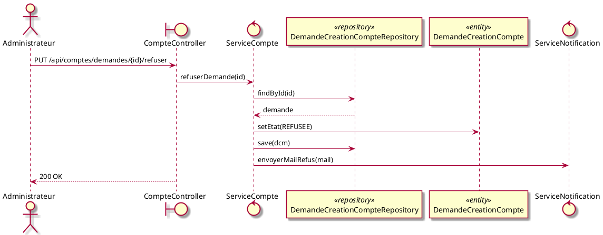

### 6.3. Groupe 2 : Gestion des salles

Les quatre cas s'appuient sur `SalleController` et `ServiceSalle`. La persistance est assurée par `SalleRepository`, `EquipementRepository` et `PlageDisponibiliteRepository`.

#### 6.3.1. Créer une salle

##### Endpoints :
- `POST /api/salles` (accès réservé aux responsables)

##### Classes de conception

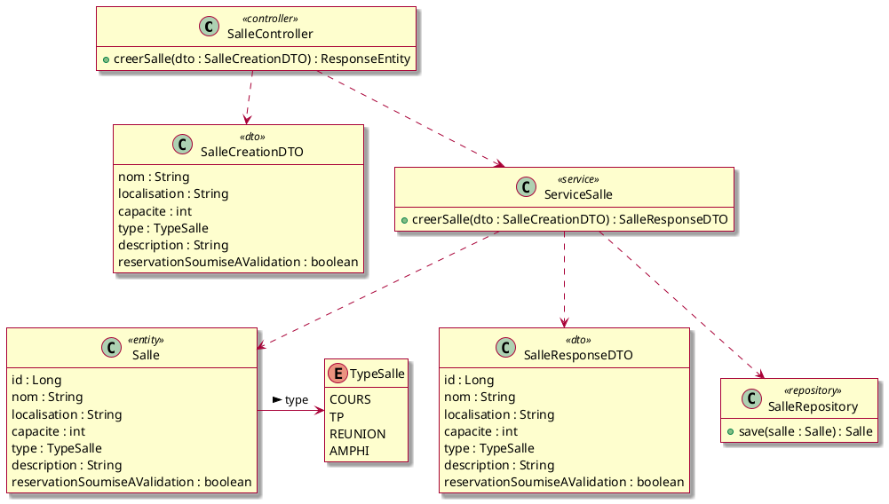

##### Séquence

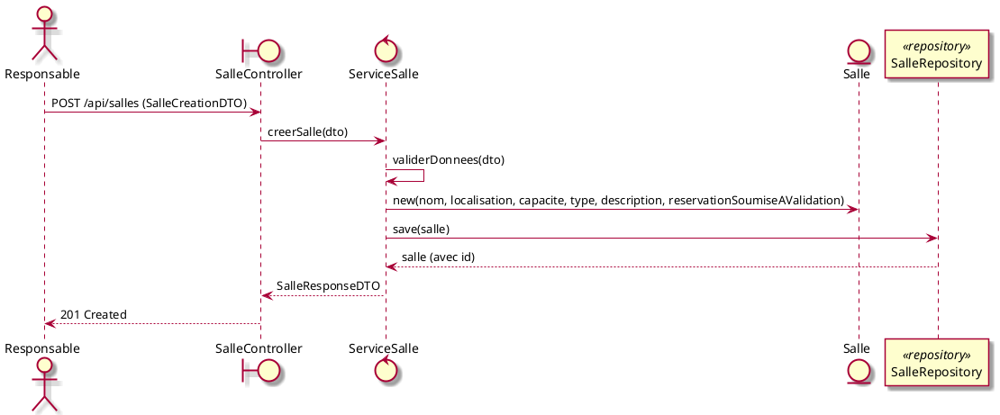

#### 6.3.2. Créer un équipement

##### Endpoints :
- `POST /api/salles/{salleId}/equipements` (accès réservé aux responsables)

L'équipement est rattaché à une salle existante via `salleId`.

##### Classes de conception

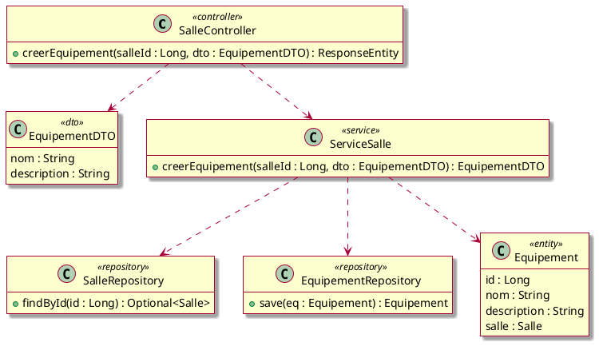

##### Séquence

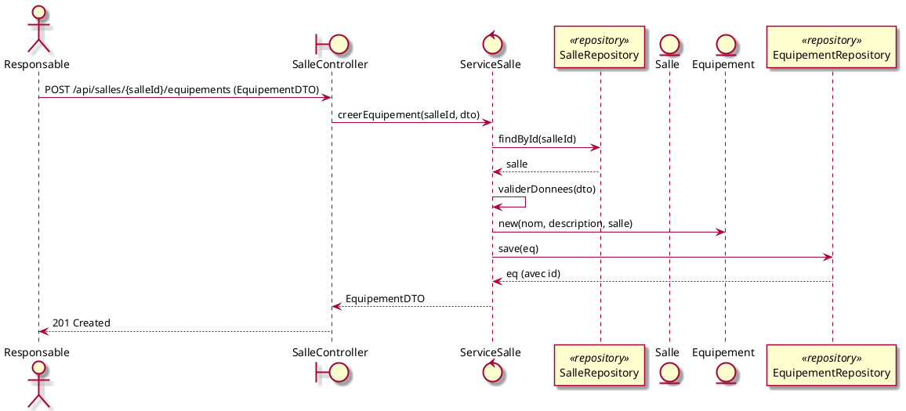

#### 6.3.3. Ajouter une plage de disponibilité d'une salle

##### Endpoints :
- `POST /api/salles/{salleId}/disponibilites` (accès réservé aux responsables)

La vérification des conflits est une opération clé : on s'assure que la nouvelle plage ne chevauche aucune plage existante de la même salle. La requête de détection utilise le prédicat :

```sql
dateDebut < :fin AND dateFin > :debut AND salle.id = :salleId
```

##### Classes de conception

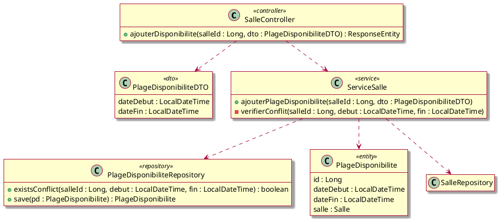

##### Séquence

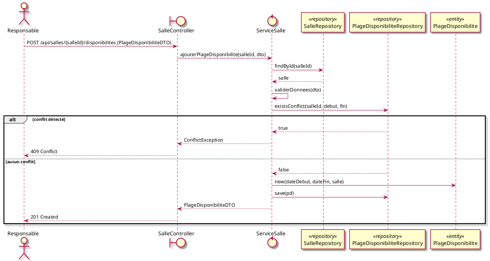

#### 6.3.4. Consulter la liste des salles

##### Endpoints :
- `GET /api/salles` (accès authentifié)

##### Classes de conception

Aucune nouvelle classe. `ServiceSalle` expose une méthode de listage simple.

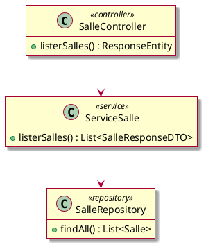

##### Séquence

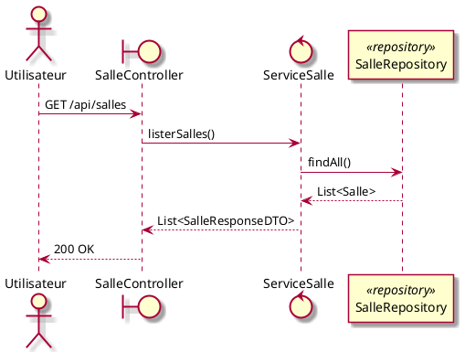

### 6.4. Groupe 3 : Gestion des réservations

Dans l'analyse, la classe `DemandeReservation` était distincte de `Reservation`, chacune avec son propre état (`EtatDemandeReservation` et `EtatReservation`). En conception, on simplifie : une seule entité `Reservation`, dont le champ `etat` fusionne les deux enums et couvre tout le cycle de vie (`EN_ATTENTE_VALIDATION` → `CONFIRMEE` ou `REJETEE`, ou `ANNULEE`).

Les cas de ce groupe s'appuient sur `ReservationController` et `ServiceReservation`, à l'exception de la recherche de salle qui relève de `SalleController` et `ServiceSalle`.

#### 6.4.1. Rechercher une salle selon différents critères

##### Endpoints :
- `POST /api/salles/recherche` (corps de requête : un objet `Filtre`)

Plutôt que de multiplier les paramètres de requête (`?nom=…&capaciteMin=…&…`), la recherche passe par un **`POST`** dont le corps porte un **objet unique `Filtre`**. Ce choix présente deux avantages :

- **signature d'endpoint stable** : l'URL ne change pas quand on enrichit les critères ; seul le schéma de `Filtre` évolue ;
- **`Filtre` évolutif** : ajouter un critère (étage, accessibilité PMR...) revient à ajouter un champ à `Filtre` et un prédicat correspondant, sans toucher à la signature de l'endpoint.

La recherche multi-critères reste implémentée via `JpaSpecificationExecutor<Salle>` et une `SalleSpecification` composable : chaque champ renseigné de `Filtre` donne lieu à un prédicat JPA indépendant, combiné avec `and`.

##### Classes de conception

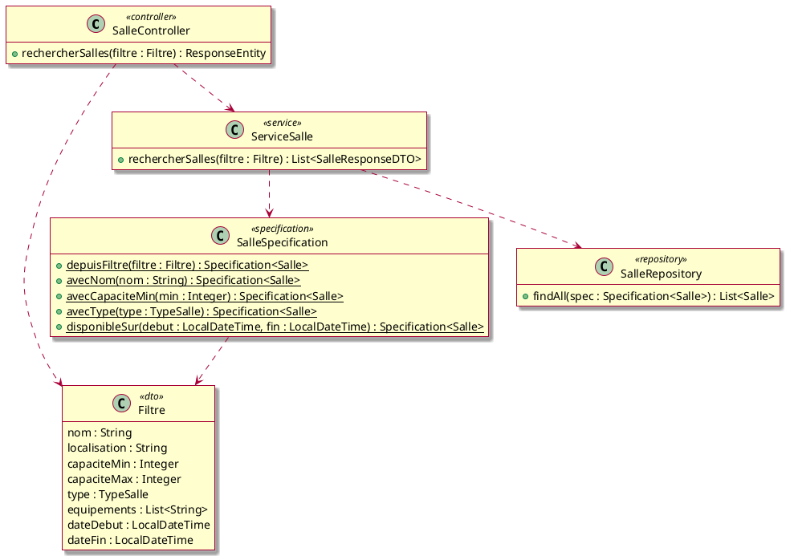

##### Séquence

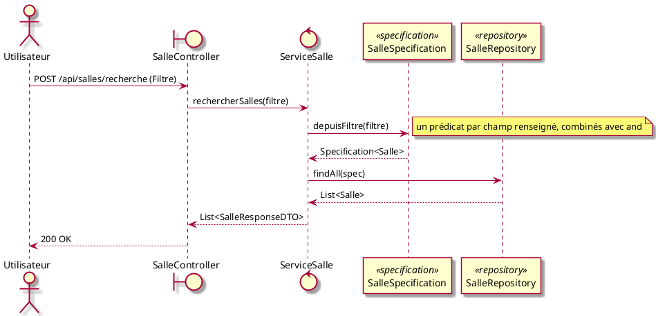

#### 6.4.2. Réserver une salle

##### Endpoints :
- `POST /api/reservations`

Selon `salle.reservationSoumiseAValidation` :
- `false` → la réservation passe directement à `CONFIRMEE` et un mail de confirmation est envoyé ;
- `true` → la réservation passe à `EN_ATTENTE_VALIDATION` et un mail d'accusé de réception est envoyé.

Deux vérifications précèdent la création :

1. **Le créneau tombe dans une plage de disponibilité** de la salle : on s'assure que `[dateDebut, dateFin]` est couvert par une `PlageDisponibilite` de la salle. Sans cela, le concept de `PlageDisponibilite` serait inopérant : une salle pourrait être réservée en dehors de tout créneau déclaré ouvert.
2. **Aucun conflit avec une réservation existante** : même logique de chevauchement que pour les plages, en excluant les réservations `ANNULEE` et `REJETEE` (le filtre sur l'état fait partie de la requête `existsConflict`).

> **Concurrence (mécanisme simple, v1)** : on ne verrouille pas le créneau pendant que le client réfléchit. Le déroulement se fait en deux temps : le client consulte la liste des salles disponibles, puis il soumet sa réservation. Si, entre les deux, un autre client a réservé le même créneau, le contrôle `existsConflict` au moment de la soumission échoue et la demande est rejetée (`409 Conflict`). C'est donc le premier à enregistrer qui l'emporte ; le second est informé que le créneau n'est plus libre et peut relancer une recherche.

##### Classes de conception

```plantuml
@startuml
skin rose
hide empty members

class ReservationController <<controller>> {
  + creerReservation(dto : ReservationCreationDTO) : ResponseEntity
}

class ReservationCreationDTO <<dto>> {
  salleId : Long
  dateDebut : LocalDateTime
  dateFin : LocalDateTime
  motif : String
}

class ReservationResponseDTO <<dto>> {
  id : Long
  salleId : Long
  dateDebut : LocalDateTime
  dateFin : LocalDateTime
  motif : String
  etat : EtatReservation
}

class ServiceReservation <<service>> {
  + creerReservation(dto : ReservationCreationDTO, demandeur : Compte) : ReservationResponseDTO
  - verifierDansPlageDisponible(salleId : Long, debut : LocalDateTime, fin : LocalDateTime)
  - verifierDisponibilite(salleId : Long, debut : LocalDateTime, fin : LocalDateTime)
}

class ReservationRepository <<repository>> {
  + save(r : Reservation) : Reservation
  + existsConflict(salleId : Long, debut : LocalDateTime, fin : LocalDateTime) : boolean
}

class PlageDisponibiliteRepository <<repository>> {
  + couvreCreneau(salleId : Long, debut : LocalDateTime, fin : LocalDateTime) : boolean
}

class Reservation <<entity>> {
  id : Long
  dateDebut : LocalDateTime
  dateFin : LocalDateTime
  dateCreation : LocalDateTime
  motif : String
  etat : EtatReservation
  salle : Salle
  demandeur : Compte
}

class ServiceNotification <<service>> {
  + envoyerMailConfirmation(mail : String, reservation : Reservation)
  + envoyerMailAccuseReception(mail : String, reservation : Reservation)
}

ReservationController ..> ReservationCreationDTO
ReservationController ..> ServiceReservation
ServiceReservation ..> ReservationRepository
ServiceReservation ..> SalleRepository
ServiceReservation ..> PlageDisponibiliteRepository
ServiceReservation ..> Reservation
ServiceReservation ..> ServiceNotification
@enduml
```

##### Séquence

```plantuml
@startuml
skin rose

actor Utilisateur as u
boundary ReservationController as ctrl
control ServiceReservation as svc
participant SalleRepository as salleRepo <<repository>>
participant PlageDisponibiliteRepository as pdRepo <<repository>>
participant ReservationRepository as resRepo <<repository>>
participant Reservation as res <<entity>>
control ServiceNotification as notif

u -> ctrl : POST /api/reservations (ReservationCreationDTO)
ctrl -> svc : creerReservation(dto, demandeur)
svc -> salleRepo : findById(salleId)
salleRepo --> svc : salle
svc -> pdRepo : couvreCreneau(salleId, debut, fin)
alt créneau hors plage de disponibilité
  pdRepo --> svc : false
  svc --> ctrl : IllegalStateException
  ctrl --> u : 400 Bad Request
else créneau dans une plage disponible
  pdRepo --> svc : true
  svc -> resRepo : existsConflict(salleId, debut, fin)
  alt créneau déjà réservé
    resRepo --> svc : true
    svc --> ctrl : ConflictException
    ctrl --> u : 409 Conflict
  else créneau libre
    resRepo --> svc : false
    svc -> res : new(salle, demandeur, debut, fin, motif)
    alt salle sans validation
      svc -> res : setEtat(CONFIRMEE)
      svc -> resRepo : save(res)
      svc -> notif : envoyerMailConfirmation(mail, res)
    else salle avec validation
      svc -> res : setEtat(EN_ATTENTE_VALIDATION)
      svc -> resRepo : save(res)
      svc -> notif : envoyerMailAccuseReception(mail, res)
    end
    svc --> ctrl : ReservationResponseDTO
    ctrl --> u : 201 Created
  end
end
@enduml
```

#### 6.4.3. Consulter une réservation

##### Endpoints :
- `GET /api/reservations/{id}` (réservé au demandeur ou à un responsable)

##### Classes de conception

Aucune nouvelle classe.

##### Séquence

```plantuml
@startuml
skin rose

actor Utilisateur as u
boundary ReservationController as ctrl
control ServiceReservation as svc
participant ReservationRepository as repo <<repository>>

u -> ctrl : GET /api/reservations/{id}
ctrl -> svc : consulterReservation(id, demandeur)
svc -> repo : findById(id)
repo --> svc : reservation
svc -> svc : verifierDroitAcces(demandeur, reservation)
svc --> ctrl : ReservationResponseDTO
ctrl --> u : 200 OK
@enduml
```

#### 6.4.4. Annuler une réservation

##### Endpoints :
- `PUT /api/reservations/{id}/annuler` (réservé au demandeur)

Seules les réservations en état `CONFIRMEE` ou `EN_ATTENTE_VALIDATION` peuvent être annulées.

##### Classes de conception

Aucune nouvelle classe.

##### Séquence

```plantuml
@startuml
skin rose

actor Utilisateur as u
boundary ReservationController as ctrl
control ServiceReservation as svc
participant ReservationRepository as repo <<repository>>
participant Reservation as res <<entity>>
control ServiceNotification as notif

u -> ctrl : PUT /api/reservations/{id}/annuler
ctrl -> svc : annulerReservation(id, demandeur)
svc -> repo : findById(id)
repo --> svc : reservation
svc -> svc : verifierDroitAnnulation(demandeur, reservation)
alt annulation non autorisée
  svc --> ctrl : ForbiddenException
  ctrl --> u : 403 Forbidden
else annulation autorisée
  svc -> res : setEtat(ANNULEE)
  svc -> repo : save(res)
  svc -> notif : envoyerMailAnnulation(mail, res)
  svc --> ctrl : ok
  ctrl --> u : 200 OK
end
@enduml
```

#### 6.4.5. Consulter les demandes de réservation en attente

##### Endpoints :
- `GET /api/reservations?etat=EN_ATTENTE_VALIDATION` (accès réservé aux responsables)

Ce cas permet à un responsable de lister les réservations qu'il doit traiter avant de les valider ou de les rejeter. Il s'appuie sur `ReservationRepository.findByEtat`.

##### Classes de conception

Aucune nouvelle classe. On ajoute une méthode de listage à `ServiceReservation`.

```plantuml
@startuml
skin rose
hide empty members

class ServiceReservation <<service>> {
  + listerDemandesEnAttente() : List<ReservationResponseDTO>
}

class ReservationRepository <<repository>> {
  + findByEtat(etat : EtatReservation) : List<Reservation>
}

ServiceReservation ..> ReservationRepository
ServiceReservation ..> ReservationResponseDTO
@enduml
```

##### Séquence

```plantuml
@startuml
skin rose

actor Responsable as r
boundary ReservationController as ctrl
control ServiceReservation as svc
participant ReservationRepository as repo <<repository>>

r -> ctrl : GET /api/reservations?etat=EN_ATTENTE_VALIDATION
ctrl -> svc : listerDemandesEnAttente()
svc -> repo : findByEtat(EN_ATTENTE_VALIDATION)
repo --> svc : List<Reservation>
svc --> ctrl : List<ReservationResponseDTO>
ctrl --> r : 200 OK
@enduml
```

#### 6.4.6. Valider une demande de réservation

##### Endpoints :
- `PUT /api/reservations/{id}/valider` (accès réservé aux responsables)

Seules les réservations en état `EN_ATTENTE_VALIDATION` peuvent être validées.

##### Classes de conception

Aucune nouvelle classe.

##### Séquence

```plantuml
@startuml
skin rose

actor Responsable as r
boundary ReservationController as ctrl
control ServiceReservation as svc
participant ReservationRepository as repo <<repository>>
participant Reservation as res <<entity>>
control ServiceNotification as notif

r -> ctrl : PUT /api/reservations/{id}/valider
ctrl -> svc : validerReservation(id)
svc -> repo : findById(id)
repo --> svc : reservation
svc -> svc : verifierEtat(reservation, EN_ATTENTE_VALIDATION)
svc -> res : setEtat(CONFIRMEE)
svc -> repo : save(res)
svc -> notif : envoyerMailConfirmation(reservation.demandeur.mail, res)
svc --> ctrl : ReservationResponseDTO
ctrl --> r : 200 OK
@enduml
```

#### 6.4.7. Rejeter une demande de réservation

##### Endpoints :
- `PUT /api/reservations/{id}/rejeter` (accès réservé aux responsables)

Un motif de rejet est attendu dans le corps de la requête.

##### Classes de conception

```plantuml
@startuml
skin rose
hide empty members

class RejetDTO <<dto>> {
  motif : String
}

class ServiceReservation <<service>> {
  + rejeterReservation(id : Long, motif : String)
}

ReservationController ..> RejetDTO
ReservationController ..> ServiceReservation
@enduml
```

##### Séquence

```plantuml
@startuml
skin rose

actor Responsable as r
boundary ReservationController as ctrl
control ServiceReservation as svc
participant ReservationRepository as repo <<repository>>
participant Reservation as res <<entity>>
control ServiceNotification as notif

r -> ctrl : PUT /api/reservations/{id}/rejeter (RejetDTO)
ctrl -> svc : rejeterReservation(id, motif)
svc -> repo : findById(id)
repo --> svc : reservation
svc -> svc : verifierEtat(reservation, EN_ATTENTE_VALIDATION)
svc -> res : setEtat(REJETEE)
svc -> repo : save(res)
svc -> notif : envoyerMailRejet(reservation.demandeur.mail, res, motif)
svc --> ctrl : ok
ctrl --> r : 200 OK
@enduml
```

### 6.5. Groupe 4 : Authentification

Ce groupe couvre le cas d'utilisation "Se connecter / S'authentifier". Il s'appuie sur `AuthController`, `ServiceAuth` et `ServiceJwt`. Un `JwtFilter` (filtre Spring Security) valide le token sur chaque requête protégée ; ce composant est une infrastructure transversale et n'est pas détaillé ici.

#### 6.5.1. Se connecter / S'authentifier

##### Endpoints :
- `POST /api/auth/login`

L'utilisateur soumet ses identifiants. `ServiceAuth` retrouve le compte via `CompteRepository`, vérifie le mot de passe (BCrypt), puis demande à `ServiceJwt` de générer un token JWT. En cas de succès, un `TokenResponseDTO` est retourné ; le client l'inclura dans l'en-tête `Authorization: Bearer <token>` de toutes les requêtes suivantes. Les erreurs d'authentification (compte introuvable ou mot de passe incorrect) retournent systématiquement un `401 Unauthorized` sans détailler la cause, pour éviter toute fuite d'information.

##### Classes de conception

```plantuml
@startuml
skin rose
hide empty members

class AuthController <<controller>> {
  + login(dto : LoginDTO) : ResponseEntity
}

class LoginDTO <<dto>> {
  login : String
  motDePasse : String
}

class TokenResponseDTO <<dto>> {
  token : String
  type : String
  expiresIn : long
}

class ServiceAuth <<service>> {
  + authentifier(dto : LoginDTO) : TokenResponseDTO
}

class ServiceJwt <<service>> {
  + genererToken(compte : Compte) : String
  + validerToken(token : String) : boolean
  + extraireLogin(token : String) : String
}

class CompteRepository <<repository>> {
  + findByLogin(login : String) : Optional<Compte>
}

AuthController ..> LoginDTO
AuthController ..> ServiceAuth
ServiceAuth ..> CompteRepository
ServiceAuth ..> ServiceJwt
ServiceAuth ..> TokenResponseDTO
@enduml
```

##### Séquence

```plantuml
@startuml
skin rose

actor Utilisateur as u
boundary AuthController as ctrl
control ServiceAuth as svc
participant CompteRepository as repo <<repository>>
control ServiceJwt as jwt

u -> ctrl : POST /api/auth/login (LoginDTO)
ctrl -> svc : authentifier(dto)
svc -> repo : findByLogin(login)
alt compte introuvable
  repo --> svc : Optional.empty()
  svc --> ctrl : AuthenticationException
  ctrl --> u : 401 Unauthorized
else compte trouvé
  repo --> svc : compte
  svc -> svc : verifierMotDePasse(dto.motDePasse, compte.motDePasseHash)
  alt mot de passe incorrect
    svc --> ctrl : AuthenticationException
    ctrl --> u : 401 Unauthorized
  else mot de passe correct
    svc -> jwt : genererToken(compte)
    jwt --> svc : token
    svc --> ctrl : TokenResponseDTO
    ctrl --> u : 200 OK
  end
end
@enduml
```

## 7. Regroupement des classes

### 7.1. Groupe domaine

Le modèle de domaine final par rapport à l'analyse :
- `DemandeReservation` est supprimée et absorbée par `Reservation.etat` : les enums `EtatDemandeReservation` et `EtatReservation` de l'analyse sont fusionnés en un seul `EtatReservation` (`EN_ATTENTE_VALIDATION`, `CONFIRMEE`, `REJETEE`, `ANNULEE`) ;
- les couples `Date` + `Heure` de l'analyse sont remplacés par `LocalDateTime` (plus de type valeur `Heure` séparé), pour `PlageDisponibilite` comme pour `Reservation` ;
- `DemandeCreationCompte` ajoute `tokenValidation` pour la validation par mail ; le mot de passe est stocké haché (`motDePasseHash`) ;
- `Salle` conserve son `type` (`TypeSalle`) issu de l'analyse : il sert de critère de recherche ; l'attribut `reservationAvecValidation` est renommé `reservationSoumiseAValidation`.

```plantuml
@startuml
skin rose
hide empty members
title Modèle de domaine (conception)

class Compte <<entity>> {
  id : Long
  login : String
  motDePasseHash : String
  mail : String
  role : RoleCompte
}

enum RoleCompte {
  UTILISATEUR
  RESPONSABLE
  ADMINISTRATEUR
}

class DemandeCreationCompte <<entity>> {
  id : Long
  login : String
  motDePasseHash : String
  mail : String
  etat : EtatDemande
  dateCreation : LocalDateTime
  tokenValidation : String
}

enum EtatDemande {
  CREEE
  MAIL_ENVOYE
  MAIL_VALIDE
  VALIDEE
  REFUSEE
}

class Salle <<entity>> {
  id : Long
  nom : String
  localisation : String
  capacite : int
  type : TypeSalle
  description : String
  reservationSoumiseAValidation : boolean
}

enum TypeSalle {
  COURS
  TP
  REUNION
  AMPHI
}

class Equipement <<entity>> {
  id : Long
  nom : String
  description : String
}

class PlageDisponibilite <<entity>> {
  id : Long
  dateDebut : LocalDateTime
  dateFin : LocalDateTime
}

class Reservation <<entity>> {
  id : Long
  dateDebut : LocalDateTime
  dateFin : LocalDateTime
  dateCreation : LocalDateTime
  motif : String
  etat : EtatReservation
}

enum EtatReservation {
  EN_ATTENTE_VALIDATION
  CONFIRMEE
  ANNULEE
  REJETEE
}

Compte -> RoleCompte
DemandeCreationCompte -> EtatDemande

Salle -> TypeSalle : > type
Salle *-- "*" Equipement
Salle *-- "*" PlageDisponibilite

Reservation --> Salle
Reservation --> Compte : > demandeur
Reservation -> EtatReservation

@enduml
```

### 7.2. Groupe repositories

```plantuml
@startuml
skin rose
hide empty members

interface CompteRepository <<repository>> {
  + existsByLogin(login : String) : boolean
  + existsByMail(mail : String) : boolean
  + findByLogin(login : String) : Optional<Compte>
}

interface DemandeCreationCompteRepository <<repository>> {
  + findByEtat(etat : EtatDemande) : List<DemandeCreationCompte>
  + findByTokenValidation(token : String) : Optional<DemandeCreationCompte>
  + existsByLogin(login : String) : boolean
  + existsByMail(mail : String) : boolean
}

interface SalleRepository <<repository>> {
  + findAll(spec : Specification<Salle>) : List<Salle>
  + findAll() : List<Salle>
}

interface EquipementRepository <<repository>> {
  + findBySalleId(salleId : Long) : List<Equipement>
}

interface PlageDisponibiliteRepository <<repository>> {
  + findBySalleId(salleId : Long) : List<PlageDisponibilite>
  + existsConflict(salleId : Long, debut : LocalDateTime, fin : LocalDateTime) : boolean
  + couvreCreneau(salleId : Long, debut : LocalDateTime, fin : LocalDateTime) : boolean
}

interface ReservationRepository <<repository>> {
  + findByDemandeurId(demandeurId : Long) : List<Reservation>
  + findByEtat(etat : EtatReservation) : List<Reservation>
  + existsConflict(salleId : Long, debut : LocalDateTime, fin : LocalDateTime) : boolean
}

@enduml
```

### 7.3. Groupe services

```plantuml
@startuml
skin rose
hide empty members

class ServiceCompte <<service>> {
  + deposerDemande(dto : DemandeCreationCompteDTO)
  + validerMail(token : String)
  + listerDemandesEnAttente() : List<DemandeCreationCompteResponseDTO>
  + validerDemande(id : Long)
  + refuserDemande(id : Long)
}

class ServiceSalle <<service>> {
  + listerSalles() : List<SalleResponseDTO>
  + rechercherSalles(filtre : Filtre) : List<SalleResponseDTO>
  + creerSalle(dto : SalleCreationDTO) : SalleResponseDTO
  + creerEquipement(salleId : Long, dto : EquipementDTO) : EquipementDTO
  + ajouterPlageDisponibilite(salleId : Long, dto : PlageDisponibiliteDTO)
}

class ServiceReservation <<service>> {
  + creerReservation(dto : ReservationCreationDTO, demandeur : Compte) : ReservationResponseDTO
  + consulterReservation(id : Long, demandeur : Compte) : ReservationResponseDTO
  + listerDemandesEnAttente() : List<ReservationResponseDTO>
  + annulerReservation(id : Long, demandeur : Compte)
  + validerReservation(id : Long)
  + rejeterReservation(id : Long, motif : String)
}

class ServiceNotification <<service>> {
  + envoyerMailConfirmation(mail : String, reservation : Reservation)
  + envoyerMailAccuseReception(mail : String, reservation : Reservation)
  + envoyerMailValidation(mail : String)
  + envoyerMailRefus(mail : String)
  + envoyerMailAnnulation(mail : String, reservation : Reservation)
  + envoyerMailRejet(mail : String, reservation : Reservation, motif : String)
}

class ServiceAuth <<service>> {
  + authentifier(dto : LoginDTO) : TokenResponseDTO
}

class ServiceJwt <<service>> {
  + genererToken(compte : Compte) : String
  + validerToken(token : String) : boolean
  + extraireLogin(token : String) : String
}

ServiceCompte ..> ServiceNotification
ServiceReservation ..> ServiceNotification
ServiceAuth ..> ServiceJwt
@enduml
```

### 7.4. Groupe contrôleurs REST

```plantuml
@startuml
skin rose
hide empty members

class CompteController <<controller>> {
  POST /api/comptes/demandes
  GET /api/comptes/demandes/valider?token
  GET /api/comptes/demandes
  PUT /api/comptes/demandes/{id}/valider
  PUT /api/comptes/demandes/{id}/refuser
}

class SalleController <<controller>> {
  GET /api/salles
  POST /api/salles/recherche
  POST /api/salles
  POST /api/salles/{id}/equipements
  POST /api/salles/{id}/disponibilites
}

class ReservationController <<controller>> {
  POST /api/reservations
  GET /api/reservations/{id}
  GET /api/reservations?etat
  PUT /api/reservations/{id}/annuler
  PUT /api/reservations/{id}/valider
  PUT /api/reservations/{id}/rejeter
}

class AuthController <<controller>> {
  POST /api/auth/login
}

CompteController ..> ServiceCompte
SalleController ..> ServiceSalle
ReservationController ..> ServiceReservation
AuthController ..> ServiceAuth
@enduml
```

## 8. Choix, questions ouvertes et remarques

- **Gestion des conflits de réservation** : la vérification qu'une salle est libre sur un créneau donné est une requête potentiellement complexe. Il faudra définir précisément la requête JPA ou SQL correspondante.

- **Concurrence sur la création de réservation** : pour la v1, on retient un mécanisme simple et optimiste : la disponibilité est consultée puis la réservation soumise séparément, et toute demande arrivant après qu'un autre client a pris le créneau est rejetée (`409 Conflict`). Le premier à enregistrer l'emporte, sans verrou ni session réservant le créneau. Une évolution pourra être envisagée si une vraie atomicité devient nécessaire sous forte charge.

- **Double mode de réservation** : le fait qu'une salle puisse être soit à réservation directe, soit à validation, implique deux branches dans le cycle de vie de `Reservation`. Le *Design Pattern* **State** pourrait être envisagé pour gérer proprement ces deux comportements.

- **Annulation automatique** : quand une salle devient indisponible (travaux, événement prioritaire), les réservations existantes doivent être annulées automatiquement et les utilisateurs notifiés.

- **JWT et sécurité** : il faudra préciser la durée de vie des tokens et le mécanisme de refresh.